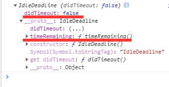

# Background Tasks API

## window.requestIdleCallback()

该方法会将在浏览器闲置时将一个即将被调用的回调函数加入任务执行队列。这允许开发者能在`event loop`中执行一些低优先级的任务。函数们都会按先进先出的顺序被执行；但是，指定有`timeout`的函数可能会不按顺序调用，因为**如果回调函数制定了超时时间，为了在超时时间前执行某个函数可能会打乱原队列中的顺序**。

我们可以使用`requestIdleCallback(callback [, options])`并传入一个回调函数，使其在下一次`event loop`之前被调用。该回调函数被调用时，会将一个`IdleDeadline`对象作为参数传入。这个参数可以获取当前剩余的空闲时间(通过调用`IdleDeadline.timeRemaing()`函数获取)以及回调函数是否在超时时间前就已经被执行(`didTimeout`)。

`options`为可选对象参数，具有一个`timeout`字段，表示超时时间，**如果回调函数在该时间后还未执行，那么回调函数会放入`event loop`中进行执行**。

### IdleDeadline 对象

`IdleDeadline`对象除具有一个告知是否超时的字段外还具有一个`IdleDeadline.timeRemaing()`方法。该方法用于获取当前空闲时段还有多少预估的剩余时间。通过这个方法，可以让我们知道我们是否还继续执行当前的回调函数。



当其值为`0`时，建议该回调函数在下一个事件循环中来进行执行。当超时时，该值会置为`0`。

### 指定超时时间

在某些必要的场景下，建议指定`timeout`参数，指定了`timeout`参数保证了其尽快在空闲时间执行并且在其超时时间内执行，但不执行该参数，其会回调可能会在几秒后才执行。

### 取消任务

该函数的返回值为一串任意的数字`ID`，我们可以将其传入`window.cancelIdleCallback(ID)`来取消回调函数的调用。

### 降级方案

目前该`API`目前仅支持除`Safari/IE`外的浏览器。为了在全浏览器上体验到这个功能我们可以通过`setTimeout()`函数来模拟其操作，但这并不会在空闲时段执行。

```js
window.requestIdleCallback =
    window.requestIdleCallback ||
    function (handler) {
        let startTime = Date.now()

        return setTimeout(function () {
            handler({
                didTimeout: false,
                timeRemaining: function () {
                    return Math.max(0, 50.0 - (Date.now() - startTime))
                }
            })
        }, 4)
    }
```

这个函数首先会记录我们调用的具体时间，并将其填充到`timeRemaining()`函数的返回值中，让每个函数的执行不超过`50ms`。(这也是原上限)

### 注意事项

空闲回调旨在为代码提供一种与事件循环协作的方式，以确保系统充分利用其潜能，不会过度分配任务，从而导致延迟或其他性能问题，因此您应该考虑如何使用它。

-   **对于非高优先级的任务使用空闲回调队列。**如果你对高优先级的代码使用了空闲回调(并未指定`timeout`)，那么如果出现用户系统繁忙、回调多等情况，那么你的任务可能一直都不会被执行。
-   **空闲回调函数应尽可能不超过分配的时间。**尽管即使你超出了规定的时间上限，通常来说浏览器、代码、网页也能继续正常运行，这里的时间限制是用来保证系统能留有足够的时间去完成当前的事件循环然后进入下一个循环，而不会导致其他代码卡顿或动画效果延迟。目前，`timeRemaining()` 有一个 `50 ms` 的上限时间，但实际上你能用的时间比这个少，因为在复杂的页面中事件循环可能已经花费了其中的一部分，浏览器的扩展插件也需要处理时间，等等。
-   **避免在空闲回调函数中改变 DOM。**空闲回调执行的时候，当前帧已经结束绘制了，所有布局的更新和计算也已经完成。如果你做的改变影响了布局， 你可能会强制停止浏览器并重新计算，而从另一方面来看，这是不必要的。 如果你的回调需要改变 `DOM`，它应该使 indow.requestAnimationFrame()`来调度它。
-   **避免运行时间无法预测的任务。** 你的空闲回调必须避免做任何占用时间不可预测的事情。比如说，应该避免做任何会影响页面布局的事情。你也必须避免执行`Promise` 的`resolve`和`reject`，因为这会在你的回调函数返回后立即引用`Promise`对象对`resolve`和`reject`的处理程序。
-   **在你需要的时候要用 timeout。** 但记得只在需要的时候才用。 使用 `timeout` 可以保证你的代码按时执行，但是在剩余时间不足以强制执行你的代码的同时保证浏览器的性能表现的情况下，`timeout` 就会造成延迟或者动画不流畅

Reference:

[MDN requestIdleCallback()](https://developer.mozilla.org/zh-CN/docs/Web/API/Window/requestIdleCallback)

[MDN Background Tasks API](https://developer.mozilla.org/zh-CN/docs/Web/API/Background_Tasks_API#example)

## window.requestAnimationFrame(callback)

`window.requestAnimationFrame()`告诉浏览器你希望执行一个动画，并要求浏览器在下次重绘之前调用回调函数来更新动画。该函数接受一个回调函数作为参数，该回调函数会在浏览器下一次重绘之前执行。

> 注意：若你想在浏览器下次重绘之前继续更新下一帧动画，那么回调函数自身必须再次调用`window.requestAnimationFrame()`

回调函数会被传入`DOMHighResTimeStamp`参数，`DOMHighResTimeStamp`指示当前被 `requestAnimationFrame()` 排序的回调函数被触发的时间。在同一个帧中的多个回调函数，它们每一个都会接受到一个相同的时间戳，即使在计算上一个回调函数的工作负载期间已经消耗了一些时间。该时间戳是一个十进制数，单位毫秒，最小精度为 `1ms`(`1000μs`)。
