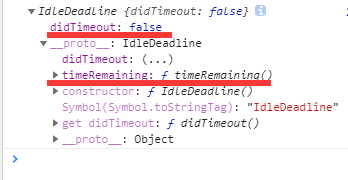

# window.requestIdleCallback()

该方法会将在浏览器闲置时将一个即将被调用的回调函数加入任务执行队列。这允许开发者能在`event loop`中执行一些低优先级的任务。函数们都会按先进先出的顺序被执行；但是，指定有`timeout`的函数可能会不按顺序调用，如果有需要在它们超时之前调用它们。

我们可以使用`requestIdleCallback(callback, options)`并传入一个回调函数，使其在下一次`event loop`之前被调用。该回调函数被调用时，会将一个`IdleDeadline`对象作为参数传入。这个参数可以获取当前的空闲时间(`IdleDeadline.timeRemaing()`)以及回调函数是否在超时时间前就已经被执行(`didTimeout`)。

`options`为可选对象参数，具有一个`timeout`字段，表示超时时间。



该函数的返回值为一串任意的数字`ID`，我们可以将其传入`window.cancelIdleCallback(ID)`来取消回调函数的调用。

>目前该`API`只支持`Chrome`浏览器。

同理`setTimout()`的原理就是如此，我们可以推测出它其实就是：

```js
setTimout(() => {

}, 300);

// 等价于
window.requestIdleCallback(() => {

}, {
    timeout: 300
});
```