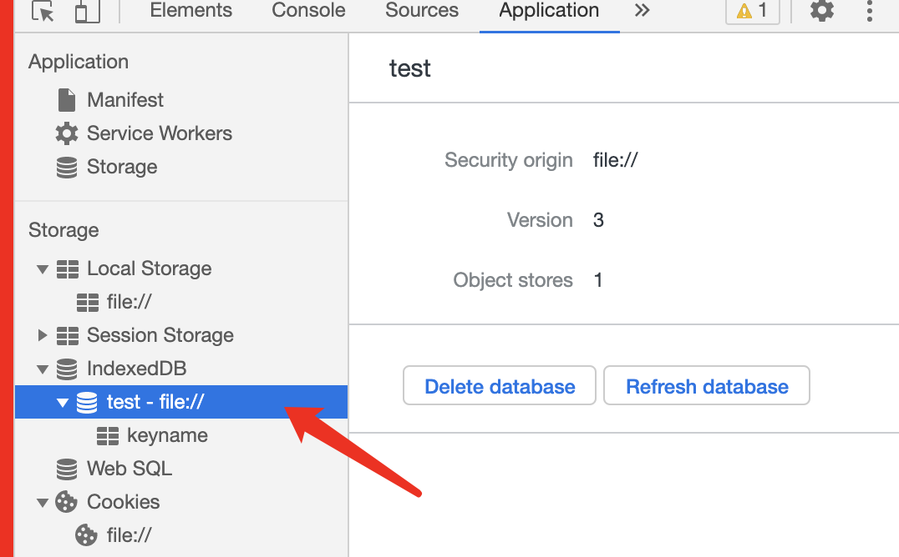
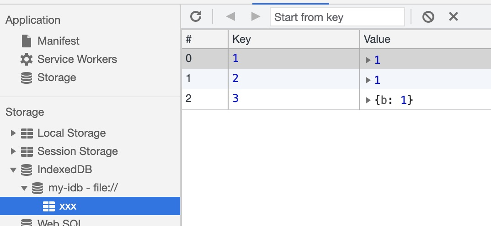
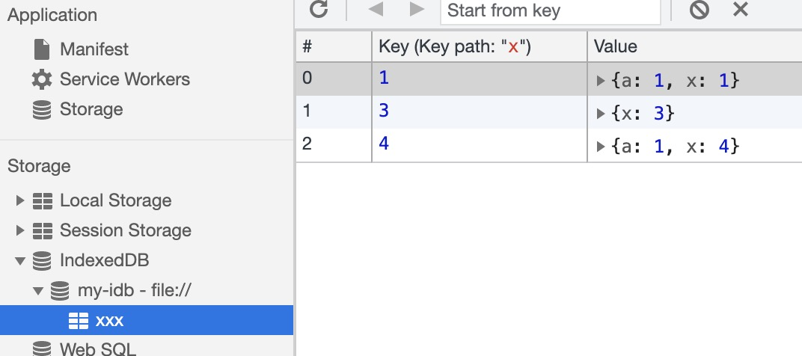
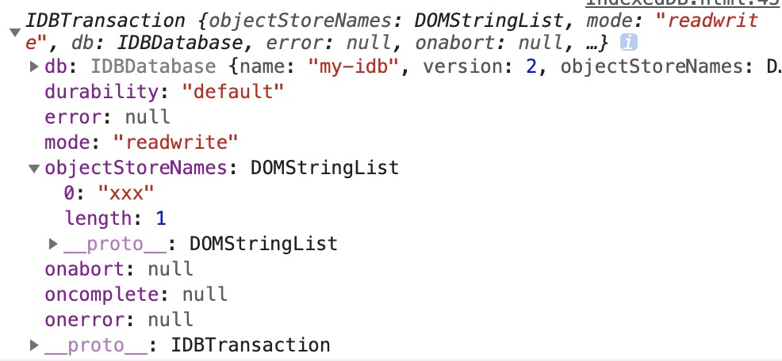
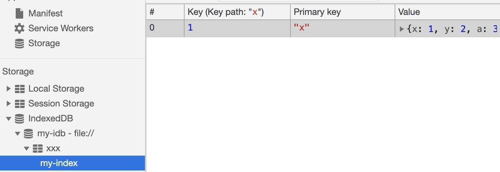

# IndexedDB - Indexed Database

当我们打开浏览器控制台的`Application - Storage(Chrome)/Storage(Firefox)`选项时，我们可以从存储类型中看到一个名为`IndexedDB`的选项。点击后我们可以看到一个类似表格的数据信息，这就是`IndexedDB`。

> 当我们打开控制台的对应表格时，查看的是当时生成的一个快照。`IndexedDB`是浏览器中保存结构化数据的一种数据库。（为了兼容最好使用浏览器前缀）。以前，`IE10`中为`msIndexedDB`，`Firefox`中为`mozIndexedDB`，`Chrome`中为`webkitIndexedDB`

`IndexedDB`就是一个数据库，最大特色是使用**对象**保存数据，而不是使用表来保存。一个`Indexed`数据库就是一组位于相同命名空间下的对象的集合。

> `IndexedDB`的大多数操作都是**异步**的，一个对数据库的操作对应一个请求，所以我们需要用类似事件订阅的方式来进行数据库操作。

每个数据库都具有以下的信息：

-   数据库名称(`Database Name`)
-   数据库存储类型(`Storage`)
-   数据库源头(`Origin`)
-   数据库版本(`Version`)
-   数据库存储空间集合(`Object Stores`) — 一个或多个对象存储空间

当我们选择一个数据库时(图中为名为`test`的数据库)，关于这个数据库的信息就会显示在右侧：



当我们选择具体的存储空间时(图中为`keyname`的存储空间)，一个对象命名空间会有如下信息：

-   对象命名空间名称(`Object Store Name`)
-   键名(`Key`) — 命名空间的键地址(`keyPath`)
-   自动递增(`Auto Increment`) — 是否允许键名自动递增
-   索引(`Indexes`) — 对对象仓库某个键名(`key`)的存储

一个对象仓库如下下图，下面有一个名为`keyPath`的对象仓库


当我们创建一个索引时，会以当前索引的`key`来简历一个集合，下面为名为`keyPath`的对象仓库创建了一个以`x`为键名的索引：


对比上下图我们可以看到排除了不具有`x`字段的键值对。

## 链接/创建数据库

使用`IndexedDB`的第一步是把要打开的数据库名传给`indexedDB.open(name, version)`，如果传入的数据库已经存在，就会发送应该打开它的请求，第二个参数为版本号(可选，版本号默认为`1`，传入非整数版本号时，会转化为整数)，传入新的版本号是会升级数据库; 如果传入的数据库不存在，就会发送一个**创建**并打开它的请求。

总之，调用`indexedDB.open()`返回一个`IDBRequest`对象，在这个对象上可以添加`onerror`（打开数据库失败）和`onsuccess`（成功打开）事件处理程序来查看是否打开或创建成功。

```js
const indexedDB =
    window.indexedDB ||
    window.msIndexedDB ||
    window.mozIndexedDB ||
    window.webkitIndexedDB,
    request,
    database

// 向数据库发送打开的请求
request = indexedDB.open('admin')

request.onerror = function ({
    target: {
        errorCode
    }
}) {
    console.log('发生了意外')
}

request.onsuccess = function ({ target: { result } }) {
    // result为返回的数据库对象
}
```

使用`success`事件时，`event.target.result`中将有一个数据库实例对象(`IDBDatabase`)，
`error`事件时，`event.target.errorCode`中保存着一个错误码，以下为可能的错误码：

-   `IDBDatabaseException.UNKNOWN_ERR(1)`：意外错误，无法归类
-   `IDBDatabaseException.NON_TRANSIENT_ERR(2)`：操作不合法
-   `IDBDatabaseException.NOT_FOUND_ERR(3)`：未发现要操作的数据库
-   `IDBDatabaseException.CONSTRAINT_ERR(4)`：违反了数据库约束
-   `IDBDatabaseException.DATA_ERR(5)`：提供给失误的数据不能满足要求
-   `IDBDatabaseException.NOT_ALLOWED_ERR(6)`：操作不合法
-   `IDBDatabaseException.TRANSACTION_INACTIVE_ERR(7)`：试图重用已完成的事务
-   `IDBDatabaseException.ABORT_ERR(8)`：请求中断，未成功
-   `IDBDatabaseException.READ_ONLY_ERR(9)`：试图在只读模式下写入或修改数据
-   `IDBDatabaseException.TIMEOUT_ERR(10)`：在有效时间内未完成操作
-   `IDBDatabaseException.QUOTA_ERR(11)`：磁盘空间不足

### 数据库版本升级

一个数据库的版本就决定了当前数据库的结构，即数据库中对象存储空间及其内部结构。

当调用`indexedDB.open()`方法传入版本号大于当前数据库的版本号就会触发`upgradeneeded`事件，我们**需要(也只能)在该事件中决定数据库的结构**。

```js
request.onupgradeneeded = function ({ target: { result: database } }) {
    // 现在你可以创建该数据库的对象存储空间和索引

    // 创建了一个名为name的对象存储空间
    const store = database.createObjectStore('name')

    // 又为该store创建了一个名为a的索引
    store.createIndex('a', 'x')
}
```

在某次数据库升迁事件中，都会**保留**老版本的原有对象存储空间(`Store`)。所以如果你要变动(指对其配置的变动，比如改变其`keyPath`)原有对象存储空间，那么你需要先将原有空间删除然后在进行创建。(当然你需要自行处理里面的数据)

> 这同时说明了你不能创建同名的对象存储空间

当`upgradeneeded`事件执行成功后，才会执行`success`时间，所以你不用担心它们的先后顺序。

## 对象存储空间

在`indexedDB`中使用对象存储空间(`Store`)而不是表来存储数据。一个数据库可以包含任意数量的对象存储空间(体积大于`50MB`时需要向用户申请权限)

### 创建对象存储空间

我们可以通过`IDBDatabase.createObjectStore()`来创建对象存储空间。每当一个值被存入对象存储空间时，其会与一个`key`关联，这个`key`根据对象存储空间的创建模式不同，具有不同的形式。

在我们创建对象存储空间时，支持传入一个配置对象：

```js
database.createObjectStore(name, { keyPath?, autoIncrement? })
```

这个配置对象可以支持两个字段，第一个为`keyPath`，它表示当前对象仓库的主键(官网称呼为内键, `in-line key`)，可以为一个数组。如果你**不指定**该参数则当前对象存储空间使用外键(`out of line key`)为作为`key`。当其为外键时，你可以将其理解为对象的键值对。

```js
// #1
const store = database.createObjectStore('my-idb')

// 存入一个键名为a，值为1
store.add(1, 'a')

// 报错，外键类型写入必须指定key
store.add(1)
```

当我们指定了`keyPath`时，必须存入对象，且该对象必须要有对应`keyPath`的键名，其值也不能重复。(此时我们存入值时不需要指定键名，指定了也默认不生效)

```js
// #2
// 创建一个对象存储空间，指定x为主键
const store = database.createObjectStore('my-idb', { keyPath: 'x' })

// 那么我们存储时，只能存入对象，且必须包含x这个键名，每个x的键值也不能重复
store.add({ x: 1, y: 2 })

// 报错，主键值重复
store.add({ x: 1, y: 3 })
```

指定多个主键`keyPath`时，必须每一个都传入值。

```js
// #3
const store = database.createObjectStore('my-idb', { keyPath: ['x', 'y'] })

store.add({ x: 1, y: 1 })

// 由于主键y未生成值，所以报错
store.add({ x: 1, b: 2 })
```

另一个参数为`autoIncrement`，它表示自动为我们生成一种有序键值。如果不指定该属性，那么你在向对象存储空间存入数据时必须要指定键名`key`(上面的例子都说明了)。

```js
// #4
const store = database.createObjectStore('my-idb', { autoIncrement: true })

store.add(1)

// 不会报错，因为键生成器生成不同的主键值了
store.add(1)
store.add({ b: 1 })
```

上面的代码的效果如下：



同理，在同时指定`keyPath`时，其也可以不用指定其键值，其会按有序数列自动生成。

```js
const store = database.createObjectStore('my-idb', {
    keyPath: 'x',
    autoIncrement: true
})

// 生成 x: 1
store.add({ a: 1 })

// 生成  x: 3
store.add({ x: 3 })

// 生成 x: 4
store.add({ a: 1 })
```

实际效果如下图:



注意每次自动生成键值时，其会取**最后存入的有序数值**的值加`1`来新生产新的键值。所以我推荐如果使用`autoIncrement`属性时，对于要指定其值的`keyPath`，自始至终都为其指定值，不要让其自动生成，否则可能会产生键值冲突。

综上所述，按照不同的配置产生了如下的效果:
keyPath|autoIncrement|描述
:-:|:-:|:-:
不使用|不使用|可以添加**任意类型**的值，但必须指定`key`，且`key`必须不同，可以理解为**向对象添加键值对**。
使用|不使用|**只能添加对象类型值**，且对象必须具有指定`keyPath`的值，且不能重复
不使用|使用|可以添加**任意类型**的值，且不用指定`key`，可以理解为**向数组添加元素**。
使用|使用|**只能添加对象类型值**，可以不用指定`keyPath`中字段的值。(建议指定时行为统一)

现在我们暂时不关注如何去向对象存储空间插入数据，先根据顺序来查看其事务，因为数据读写基于事务操作。

## 事务

在数据库对象上调用`database.transaction()`方法可以创建事务。**任何时候想要读取或修改数据，都要通过事务来组织所有操作**。

使用该方法时必须指定操作的命名空间的名称(可以用数组指定多个)，还可指定操作模式(只读`readonly`或读写`readwrite`)。调用后会返回一个事务对象(`IDBTransaction`)。

> 实际上该函数还有第三个参数，用于权衡数据库操作的质量与速度，详细可以参考[IDBDatabase.transaction()
> ](https://developer.mozilla.org/en-US/docs/Web/API/IDBDatabase/transaction)

下面创建一个事务

```js
// 指定名为users的存储空间的读写事务
const dbTransaction = database.transaction('users', 'readwrite')
```

实际结果为:



上述信息你都不需要去了解，因为不太重要，我们只需要关注该对象上的`IDBTransaction.objectStore()`方法。它用于访问当前事务操作中的对象存储空间，调用后会返回对应的对象存储空间(`IDBObjectStore`)。

```js
// 获取到users的对象存储空间
const store = dbTransaction.objectStore('users')
```

### 向对象存储空间插入/删除数据

当我们通过事务操作获取到想要操作的对象存储空间时，就可以向其写入数据。

写入数据需调用`IDBObjectStore.add()`或`IDBObjectStore.put()`方法，两者的区别就是后者会在写入已存在键值时，重新其数据，而不是报错。(所以完全用`put()`代替`add()`)

两者的参数都一致，第一个参数表示写入的值，第二个为写入的键名(可选，这样我们在写入自生成键值时就不用指定了)。

```js
const request = store.add({
    username: '007',
    firstName: 'James',
    password: 'foo'
})
```

同打开数据库一样，我们需要进行事件订阅来查看此次写入是否成功(具体的写入时规则之前详细说明过，[点击跳转](#创建对象存储空间)):

```js
request.onsuccess = () => {}
request.onerror = () => {}
```

当你想删除一个键值时，可以通过`IDBObjectStore.delete()`方法，其会删掉指定的一个键值(或键名，具体看起是否指定`keyPath`，指定时为其键值，未指定时则为键名)或键值范围(`keyRange`，等会会讲到)

```js
// 创建两个keyPath的store
const store = db.createObjectStore('my-store', { keyPath: ['x', 'y'] })

// 省略操作事务访问存储空间步骤
// 写入数据
store.add({ x: 1, y: 2 })

// 假设行为是同步的
// 删除时，我们需要按keyPath顺序加值来删除，就像路径一样
store.delete([1, 2]) // 此时就删除了上述值

// 同理
store.add({ x: 'x', y: 'y' })
store.delete(['x', 'y']) // 删除成功
```

删除一个未指定`keyPath`的数据只需要指定其`key`即可，就像删除对象的某个键一样。(**注意删除具有多个`keyPath`的值时，需要指定每个`keyPath`的值**)

```js
const store = db.createObjectStore('my-store')

// 省略操作事务访问存储空间步骤
// 写入数据
store.add({ x: 1, y: 2 }, 'x')

// 删除成功
store.delete('x')
```

当然你也可以直接调用`IDBObjectStore.clear()`清空当前对象存储空间。

[MDN IDBObjectStore](https://developer.mozilla.org/zh-CN/docs/Web/API/IDBObjectStore#delete)

### 读取对象存储空间的数据

读取操作稍微复杂一点，因为我们要获取其读取的结果，同样的其调用`IDBObjectStore .get()`方法来读取数据，用法和`IDBObjectStore.delete()`一样(说明就在上面一点点，我这里就不重复了)

```js
database.createObjectStore('users', { keyPath: 'x' })
const store = database.transaction('users').objectStore('users')

// 假设为同步操作
store.add({ x: 1, y: 2 })

const request = store.get(1)
request.onsuccess = ({ result }) => {
    // result上为查询到的数据
}
```

#### 通过索引查找

除了直接通过键查找外，对象存储空间还可以通过索引来进行查找。

在查找之前，我们需要在**数据库版本升迁阶段**就为其创建好对应的索引，此时我们才可以在事务操作中进行查找。

```js
request.onupgradeneeded = function ({ target: { result: database } }) {
    // 现在你可以创建该数据库的对象存储空间和索引

    // 创建了一个名为users的对象存储空间
    const store = database.createObjectStore('users')

    // 又为该store创建了一个名为my-index的索引，当前索引会收集键名(对象时为键值)为x的数据
    store.createIndex('my-index', 'x')
}
```

上述代码通过，`IDBObjectStore.createIndex(name, indexName, { unique?, multiEntry? })`创建了一个名为`my-index`的索引，该函数可以传入三个参数，第一个表示创建的索引名称，第二个表示收集的数据的键名(指定`keyPath`时则为其`keyPath`的键值，可以为数组)，第三个参数为一个可选的配置对象，其中`unique`表示是否允许收集的键值重复；`multiEntry`表示当我们指定的`keyPath`为一个数组时，是否为其每个数组元素都创建一条索引数据。

[MDN IDBIndex](https://developer.mozilla.org/en-US/docs/Web/API/IDBIndex/multiEntry)
[IndexedDB: MultiEntry Explained](https://dzone.com/articles/indexeddb-multientry-explained)

创建后返回一个`IDBIndex`对象，结构如下，就包含一些创建时的信息:


现在根据上面的索引，我们插入两条数据：

```js
// 省略了操作事务的过程
store.add(
    {
        x: 1,
        y: 2,
        a: 3
    },
    'x'
)
store.add(1, 'y')
```

那么在浏览器控制台中可以看到这样的效果：




下面我用一个例子来解释`multiEntry`(`unique`就不用解释了，就是是否允许索引字段值重复):

```js
// 假设创建一个如下的store
const store = database.createObjectStore('xxx', { keyPath: 'x' })

// 指定其有多入口
store.createIndex('my-index', 'x', { multiEntry: true })

// 随后我们在事务中插入这样两条数据
store.add({
    x: [1, 2, 3],
    y: 2,
    a: 3
})
store.add({
    x: 2,
    y: 3,
    a: 4
})
```

那么上述代码会产生如下的索引数据


若我们不指定`multiEntry`那么它产生的索引数据为:


可以看到其相对于解构了`keyPath`为数组的值。

当然我们可以指定一个将第二个参数指定为包含多个键名的数组:

```js
// 假设创建一个如下的store
const store = database.createObjectStore('xxx', { keyPath: 'x' })

// 指定其有多入口
store.createIndex('my-index', ['y', 'z'])

// 随后我们在事务中插入这样两条数据
store.add({
    x: [1, 2, 3],
    y: 2,
    z: 3
})
store.add({
    x: 2,
    y: 3,
    z: 4
})
```

那么其会将产生以下效果:


注意此时不能指定`multiEntry`属性，否则会报错，数组形式的索引`key`不能与其共同使用。(不然就处理起来就复杂了)

咳咳，终于进入正题了，现在我们就用创建的索引来查找数据。由于我们基本上不会在数据库升迁事件中来查找数据
，所以第一步我们需要找到我们在之前创建的索引：`IDBObjectStore.index()`方法，该方法接收一个参数，表示要查找的索引的名称，返回一个`IDBIndex`索引对象。

找到我们的索引对象后

TODO

### 利用游标遍历并操作表格

遍历表格所有记录，要使用指针对象`IDBCursor`,可以通过对象存储空间的`openCursor()`方法创建游标，游标会指向结果中的第一项。
该方法可以接收两个参数，第一个表示一个范围的`IDBKeyRange`实例（没有则为`null`），第二个参数表示游标的方向。（此处的游标对象必须在`onsuccess`中监听）

```js
res2.openCursor().onsuccess = function (e) {
    //异步调用，必须监听success事件
    var cursor = e.target.result
    if (cursor) {
        console.log(cursor.key, cursor.value)
    }
}
```

此为指针对象的属性：

-   `direction`属性表示游标移动的方向，默认为`next`表示下一项，还可以有`nextunique`表示下一个不重复的项，`prev`从尾开始遍历，`prevunique`从尾开始遍历不重复，可以通过`openCursor()`方法传入第二个参数来指定（第一个参数为`null`，一旦指定了就不能改变）。
-   `key`：表示对象的键值。
-   `value`：表示实际的表格对象
-   `primaryKey`：表示游标使用的键。

指针对象查找的值处于`event.target.result`中

可以使用`update()`方法用指定的对象来更新当前的游标的`value`:

```js
var IDBCursorWithValue1 = e.target.result
var obj = IDBCursorWithValue1.value
obj.password = 'wowowo' //修改password值
var updateRequest = IDBCursorWithValue1.update(obj) //请求保存更新
updateRequest.onsuccess = function () {
    //处理成功之后的操作
}
```

同时也可以调用`delete`方法，用于删除当前项

```js
IDBCursorWithValue1.delete()
```

如果当前事务*没有修改对象存储空间的权限*，`update()`和`delete()`会抛出错误

默认情况每个游标只能发起一次请求。要想发起另一个请求，必须调用下面的一个方法,**调用后再次触发指针对象的事件**：

-   `continue(key)`：移动到结果集中的下一项。参数`key`可选，不填时默认下一项，指定这个参数移动到指定位置。（无返回值，直接在调用对象上变动）
-   `advance(count)`：向前移动`count`指定的项数。（无返回值，直接在调用对象上变动）

#### 游标范围控制

键范围：为使用游标增添了一些灵活性，指定游标范围。键范围由`IDBKeyRange`实例表示，共有 4 个定义键范围的方式:

-   `IDBKeyRange.only()`：创建一个`IDBKeyRange`对象,该函数接收一个参数表示想要取得的对象的主键。

```js
onlyRange = IDBKeyRange.only('007') //返回一个仅包含007的IDBKeyRange对象
```

-   `IDBKeyRange.lowerBound(name,boolean)`：指定结果集的下界。下界表示游标开始的位置。然后向前移动知道最后个对象。如果想直接从下一个对象开始，可以在第二个参数传入`true`（不填默认`false`）。

-   `IDBKeyRange.upperRange(name，boolean)`：同上，表示从上界开始，也就是游标不能超过哪个键。指定后可以保证游标从头开始，直到键位指定的对象终止。（不想有指定键值第二个值传入`true`）

-   `IDBKeyRange.bound()`：接收 4 个参数分别表示下界的键，上届的键和跳过下界的布尔值，跳过上界的布尔值。有如下的例子：

```js
IDBKeyRange.lowerBound('007') //指定007为下界并开始搜索
IDBKeyRange.bound('007', 'ace') //从007开始到ace。
IDBKeyRange.bound('007', 'ace', true) //从007的下一个开始到ace
IDBKeyRange.bound('007', 'ace', true, true) // 从007下一个开始到ace前一个
```

在定义了以上方法后在将它作为第一个参数传给`openCursor()`方法，就能得到一个符合相应约束条件的游标。

#### 通过索引创建游标

在索引上调用`openCursor()`方法也可以创建新的游标，除了将索引键而非主键保存在`event.result.key`之外，其他与在对象存储空间上调用一样。(接下来的内容会介绍游标的内容)

在索引上调用`openKeyCursor()`方法可以创建一个特殊的只返回每条记录主键的游标。
这种情况下`event.result.key`中保存着索引键，而`event.result.value`保存则是主键，而不是整个对象。

还可以直接从索引中取出一个对象，只需使用`get()`方法

```js
var res1 = database.transaction('users', 'readwrite')
var res2 = res1.objectStore('users').index('username')
request = res2.get('007')
```

要根据给定的索引键取得主键，可以使用`getKey()`。这个方法中`event.result.value`等于主键的值，而不是包含整个对象。
在任何时候通过`IDBIndex`对象的下列属性都可以获取有关索引的相关信息。

-   `name`：索引的名字
-   `keyPath`：传入`createIndex()`中的属性路径
-   `objectStore`：索引的对象存储空间
-   `unique`：表示索引键是否唯一的布尔值

另外通过对象存储对象的`indexName`属性可以访问到该空间建立的所有索引。
在对象存储空间上调用`deleteIndex()`方法并传入索引的名字可以删除索引

### 数据添加与删除

与之前的添加删除操作一样,通过存储空间的`put()`,`add()`,`delete()`三个方法来进行操作

## 并发问题

`IndexedDB`提供的是异步 API。但有时也有并发操作，当两个不同的标签页打开了同一个页面，那么一个页面试图更新另一个页面尚未准备就绪的数据库的问题就有可能发生。

处理这个问题就是刚打开数据库时，记得指定`onversionchange`事件，并在事件中关闭数据库。调用`close()`方法。
当正要更新版本但另一个标签页已经打开数据库的情况下，就会触发`onblocked`事件，此时最好通知用户关闭其他标签页。

## 完整例子

```js
var request = indexedDB.open('新建', 4)

request.onsuccess = function (e) {
    var db = e.target.result
    var transaction = db.transaction('米寒', 'readwrite')
    var store = transaction.objectStore('米寒')
    var request = store.get('峰哥') //查找峰哥这个对象
    var keyRange = IDBKeyRange.bound('峰哥', '米寒', false, false)
    //创建峰哥到米寒这个范围的对象
    // var request=store.add({niconame:'峰哥',sex:"girl"})

    var IDBRequest = store.openCursor(keyRange)
    IDBRequest.onsuccess = function (e) {
        //游标对象必须在该事件中监听
        var cursor = e.target.result //确定游标

        var currentObj = cursor.value //当前游标对象
        currentObj.hobby = '玩耍' //添加兴趣值
        cursor.update(currentObj).onsuccess = function (e) {
            //上传保存数据并查看
            console.log(e)
        }
        if (cursor) {
            //查看当前游标是否是最后一个
            cursor.continue() //游标移动至下一项（无返回值，不要赋值）
        } else {
            console.log('没有更多了')
        }
    }
    var index1 = store.index('索引名称1') //查找索引1
}

request.onupgradeneeded = function (e) {
    //创建数据仓库和索引
    var db = e.target.result //数据库实例
    var store = db.createObjectStore('米寒', { keyPath: 'niconame' })
    console.log(store)
    store.createIndex('索引名称1', '索引值1', { unique: true })
    store.createIndex('索引名称2', '索引值2', { unique: false })
    store.add(person) //添加初始对象
}
var person = {
    niconame: '米寒',
    name: 'fengJJ',
    age: '18',
    sex: 'boy'
}
```

Reference

1. Javascript 高级教程
2. [MDN IndexedDB](https://developer.mozilla.org/en-US/docs/Tools/Storage_Inspector/IndexedDB)
