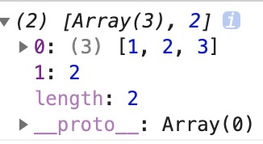
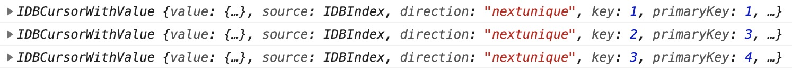
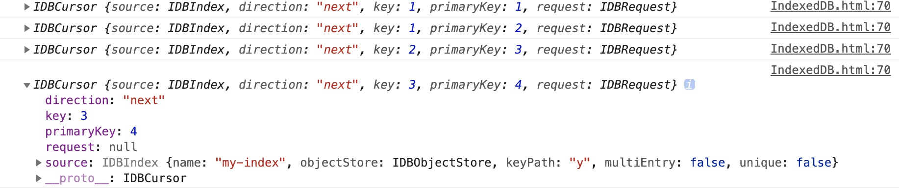

# IndexedDB - Indexed Database

`IndexedDB`在很久以前就已经存在了，但由于其较为底层和兼容性问题，最近才慢慢被人们开始使用。相当于常规的`Web Storage`来说，它的存储容量更大(前者`5MB`)且存储和查询功能更完善。它是一个面向对象数据库，一个数据库中所有的数据以对象存储空间的形式存在(常规的为表)，并且它存储的数据是`Javascript`原生类型数据，并且还可以存储`Blob`类型数据。一般来说，它常被用于一些离线存储来使用。

> [`Indexed Database API 3.0`草案](https://www.w3.org/TR/IndexedDB/#accessibility)已经发布了

快速目录

-   [从控制台查看数据库](#从控制台查看数据库)
-   [连接/创建数据库](#连接创建数据库)
-   [对象存储空间](#对象存储空间)
-   [事务](#事务)
-   [实际应用中的问题](#实际应用中的问题)

## 从控制台查看数据库

当我们打开浏览器控制台的`Application - Storage(Chrome)/Storage(Firefox)`选项时，我们可以从存储类型中看到一个名为`IndexedDB`的选项。点击后我们可以看到一个类似表格的数据信息，这就是`IndexedDB`。

> 当我们打开控制台的对应表格时，查看的是当时生成的一个快照。`IndexedDB`是浏览器中保存结构化数据的一种数据库。（为了兼容最好使用浏览器前缀）。以前，`IE10`中为`msIndexedDB`，`Firefox`中为`mozIndexedDB`，`Chrome`中为`webkitIndexedDB`

`IndexedDB`就是一个数据库，最大特色是使用**对象**保存数据，而不是使用表来保存。一个`Indexed`数据库就是一组位于相同命名空间下的对象的集合。

> `IndexedDB`的大多数操作都是**异步**的，一个对数据库的操作对应一个请求，所以我们需要用类似事件订阅的方式来进行数据库操作。

每个数据库都具有以下的信息：

-   数据库名称(`Database Name`)
-   数据库存储类型(`Storage`)
-   数据库源头(`Origin`)
-   数据库版本(`Version`)
-   数据库存储空间集合(`Object Stores`) — 一个或多个对象存储空间

当我们选择一个数据库时(图中为名为`test`的数据库)，关于这个数据库的信息就会显示在右侧：


当我们选择具体的存储空间时(图中为`keyname`的存储空间)，一个对象命名空间会有如下信息：

-   对象命名空间名称(`Object Store Name`)
-   键名(`Key`) — 命名空间的键地址(`keyPath`)
-   自动递增(`Auto Increment`) — 是否允许键名自动递增
-   索引(`Indexes`) — 对对象仓库某个键名(`key`)的存储的集合

一个对象仓库如下下图，下面有一个名为`keyPath`的对象仓库


当我们创建一个索引时，会以当前索引的`key`来简历一个集合，下面为名为`keyPath`的对象仓库创建了一个以`x`为键名的索引：


对比上下图我们可以看到排除了不具有`x`字段的键值对。

## 连接/创建数据库

使用`IndexedDB`的第一步是把要打开的数据库名传给`indexedDB.open(name, version)`，如果传入的数据库已经存在，就会发送应该打开它的请求，第二个参数为版本号(可选，版本号默认为`1`，传入非整数版本号时，会转化为整数)，传入新的版本号是会升级数据库; 如果传入的数据库不存在，就会发送一个**创建**并打开它的请求。

总之，调用`indexedDB.open()`返回一个`IDBRequest`对象，在这个对象上可以添加`onerror`（打开数据库失败）和`onsuccess`（成功打开）事件处理程序来查看是否打开或创建成功。(基本上所有的数据库操作都是通过请求来进行的，这也就是异步的原因，异步请求的结果也基本上会定义在`event.target.result`上)

```js
const indexedDB =
    window.indexedDB ||
    window.msIndexedDB ||
    window.mozIndexedDB ||
    window.webkitIndexedDB,
    request,
    database

// 向数据库发送打开的请求
request = indexedDB.open('admin')

request.onerror = function ({
    target: {
        errorCode
    }
}) {
    console.log('发生了意外')
}

request.onsuccess = function ({ target: { result } }) {
    // result为返回的数据库对象
}
```

使用`success`事件时，`event.target.result`中将有一个数据库实例对象(`IDBDatabase`)，
`error`事件时，`event.target.errorCode`中保存着一个错误码，以下为可能的错误码：

-   `IDBDatabaseException.UNKNOWN_ERR(1)`：意外错误，无法归类
-   `IDBDatabaseException.NON_TRANSIENT_ERR(2)`：操作不合法
-   `IDBDatabaseException.NOT_FOUND_ERR(3)`：未发现要操作的数据库
-   `IDBDatabaseException.CONSTRAINT_ERR(4)`：违反了数据库约束
-   `IDBDatabaseException.DATA_ERR(5)`：提供给失误的数据不能满足要求
-   `IDBDatabaseException.NOT_ALLOWED_ERR(6)`：操作不合法
-   `IDBDatabaseException.TRANSACTION_INACTIVE_ERR(7)`：试图重用已完成的事务
-   `IDBDatabaseException.ABORT_ERR(8)`：请求中断，未成功
-   `IDBDatabaseException.READ_ONLY_ERR(9)`：试图在只读模式下写入或修改数据
-   `IDBDatabaseException.TIMEOUT_ERR(10)`：在有效时间内未完成操作
-   `IDBDatabaseException.QUOTA_ERR(11)`：磁盘空间不足

### 数据库版本升级

一个数据库的版本就决定了当前数据库的结构，即数据库中对象存储空间及其内部结构。

当调用`indexedDB.open()`方法传入版本号大于当前数据库的版本号就会触发`upgradeneeded`事件，我们**需要(也只能)在该事件中决定数据库的结构**。

```js
request.onupgradeneeded = function ({ target: { result: database } }) {
    // 现在你可以创建该数据库的对象存储空间和索引

    // 创建了一个名为name的对象存储空间
    const store = database.createObjectStore('name')

    // 又为该store创建了一个名为a的索引
    store.createIndex('a', 'x')
}
```

在某次数据库升迁事件中，都会**保留**老版本的原有对象存储空间(`Store`)。所以如果你要变动(指对其配置的变动，比如改变其`keyPath`)原有对象存储空间，那么你需要先将原有空间删除然后在进行创建。(当然你需要自行处理里面的数据)

> 这同时说明了你不能创建同名的对象存储空间，没关系你可以通过`IDBDatabase.objectStoreNames`来获取当前数据库上全部存在的对象存储空间名称，它是一个类数组对象

当`upgradeneeded`事件执行成功后，才会执行`success`时间，所以你不用担心它们的先后顺序。

## 对象存储空间

在`indexedDB`中使用对象存储空间(`Store`)而不是表来存储数据。一个数据库可以包含任意数量的对象存储空间(体积大于`50MB`时需要向用户申请权限)

### 创建对象存储空间

我们可以通过`IDBDatabase.createObjectStore()`来创建对象存储空间。每当一个值被存入对象存储空间时，其会与一个`key`关联，这个`key`根据对象存储空间的创建模式不同，具有不同的形式。

在我们创建对象存储空间时，支持传入一个配置对象：

```js
database.createObjectStore(name, { keyPath?, autoIncrement? })
```

这个配置对象可以支持两个字段，第一个为`keyPath`，它表示当前对象仓库的主键(官网称呼为内键, `in-line key`)，可以为一个数组。如果你**不指定**该参数则当前对象存储空间使用外键(`out of line key`)为作为`key`。当其为外键时，你可以将其理解为对象的键值对。

```js
// #1
const store = database.createObjectStore('my-idb')

// 存入一个键名为a，值为1
store.add(1, 'a')

// 报错，外键类型写入必须指定key
store.add(1)
```

当我们指定了`keyPath`时，必须存入对象，且该对象必须要有对应`keyPath`的键名，其值也不能重复。(此时我们存入值时不需要指定键名，指定了也默认不生效)

```js
// #2
// 创建一个对象存储空间，指定x为主键
const store = database.createObjectStore('my-idb', { keyPath: 'x' })

// 那么我们存储时，只能存入对象，且必须包含x这个键名，每个x的键值也不能重复
store.add({ x: 1, y: 2 })

// 报错，主键值重复
store.add({ x: 1, y: 3 })
```

指定多个主键`keyPath`时，必须每一个都传入值。

```js
// #3
const store = database.createObjectStore('my-idb', { keyPath: ['x', 'y'] })

store.add({ x: 1, y: 1 })

// 由于主键y未生成值，所以报错
store.add({ x: 1, b: 2 })
```

另一个参数为`autoIncrement`，它表示自动为我们生成一种有序键值。如果不指定该属性，那么你在向对象存储空间存入数据时必须要指定键名`key`(上面的例子都说明了)。

```js
// #4
const store = database.createObjectStore('my-idb', { autoIncrement: true })

store.add(1)

// 不会报错，因为键生成器生成不同的主键值了
store.add(1)
store.add({ b: 1 })
```

上面的代码的效果如下：


同理，在同时指定`keyPath`时，其也可以不用指定其键值，其会按有序数列自动生成。

```js
const store = database.createObjectStore('my-idb', {
    keyPath: 'x',
    autoIncrement: true
})

// 生成 x: 1
store.add({ a: 1 })

// 生成  x: 3
store.add({ x: 3 })

// 生成 x: 4
store.add({ a: 1 })
```

实际效果如下图:


注意每次自动生成键值时，其会取**最后存入的有序数值**的值加`1`来新生产新的键值。所以我推荐如果使用`autoIncrement`属性时，对于要指定其值的`keyPath`，自始至终都为其指定值，不要让其自动生成，否则可能会产生键值冲突。

综上所述，按照不同的配置产生了如下的效果:
keyPath|autoIncrement|描述
:-:|:-:|:-:
不使用|不使用|可以添加**任意类型**的值，但必须指定`key`，且`key`必须不同，可以理解为**向对象添加键值对**。
使用|不使用|**只能添加对象类型值**，且对象必须具有指定`keyPath`的值，且不能重复
不使用|使用|可以添加**任意类型**的值，且不用指定`key`，可以理解为**向数组添加元素**。
使用|使用|**只能添加对象类型值**，可以不用指定`keyPath`中字段的值。(建议指定时行为统一)

现在我们暂时不关注如何去向对象存储空间插入数据，先根据顺序来查看其事务，因为数据读写基于事务操作。

## 事务

在数据库对象上调用`database.transaction()`方法可以创建事务。**任何时候想要读取或修改数据，都要通过事务来组织所有操作**。

使用该方法时必须指定操作的命名空间的名称(可以用数组指定多个)，还可指定操作模式(只读`readonly`或读写`readwrite`)。调用后会返回一个事务对象(`IDBTransaction`)。

> 实际上该函数还有第三个参数，用于权衡数据库操作的质量与速度，详细可以参考[IDBDatabase.transaction()
> ](https://developer.mozilla.org/en-US/docs/Web/API/IDBDatabase/transaction)

下面创建一个事务

```js
// 指定名为users的存储空间的读写事务
const dbTransaction = database.transaction('users', 'readwrite')
```

实际结果为:


上述信息你都不需要去了解，因为不太重要，我们只需要关注该对象上的`IDBTransaction.objectStore()`方法。它用于访问当前事务操作中的对象存储空间，调用后会返回对应的对象存储空间(`IDBObjectStore`)。

```js
// 获取到users的对象存储空间
const store = dbTransaction.objectStore('users')
```

### 向对象存储空间插入/删除/更新数据

当我们通过事务操作获取到想要操作的对象存储空间时，就可以向其写入数据。

写入数据需调用`IDBObjectStore.add()`或`IDBObjectStore.put()`方法，两者的区别就是后者会在写入已存在键值时，重新其数据，而不是报错。(所以完全用`put()`代替`add()`)

两者的参数都一致，第一个参数表示写入的值，第二个为写入的键名(可选，这样我们在写入自生成键值时就不用指定了)。

```js
const request = store.add({
    username: '007',
    firstName: 'James',
    password: 'foo'
})
```

同打开数据库一样，我们需要进行事件订阅来查看此次写入是否成功(具体的写入时规则之前详细说明过，[点击跳转](#创建对象存储空间)):

```js
request.onsuccess = () => {}
request.onerror = () => {}
```

当你想删除一个键值时，可以通过`IDBObjectStore.delete()`方法，其会删掉指定的一个键值(或键名，具体看起是否指定`keyPath`，指定时为其键值，未指定时则为键名)或键值范围(`keyRange`，等会会讲到)

```js
// 创建两个keyPath的store
const store = db.createObjectStore('my-store', { keyPath: ['x', 'y'] })

// 省略操作事务访问存储空间步骤
// 写入数据
store.add({ x: 1, y: 2 })

// 假设行为是同步的
// 删除时，我们需要按keyPath顺序加值来删除，就像路径一样
store.delete([1, 2]) // 此时就删除了上述值

// 同理
store.add({ x: 'x', y: 'y' })
store.delete(['x', 'y']) // 删除成功
```

删除一个未指定`keyPath`的数据只需要指定其`key`即可，就像删除对象的某个键一样。(**注意删除具有多个`keyPath`的值时，需要指定每个`keyPath`的值**)

```js
const store = db.createObjectStore('my-store')

// 省略操作事务访问存储空间步骤
// 写入数据
store.add({ x: 1, y: 2 }, 'x')

// 删除成功
store.delete('x')
```

当然你也可以直接调用`IDBObjectStore.clear()`清空当前对象存储空间。

[MDN IDBObjectStore](https://developer.mozilla.org/zh-CN/docs/Web/API/IDBObjectStore#delete)

### 读取对象存储空间的数据

读取操作稍微复杂一点，因为我们要获取其读取的结果，同样的其调用`IDBObjectStore .get()`方法来读取数据，用法和`IDBObjectStore.delete()`一样(说明就在上面一点点，我这里就不重复了)

```js
database.createObjectStore('users', { keyPath: 'x' })
const store = database.transaction('users').objectStore('users')

// 假设为同步操作
store.add({ x: 1, y: 2 })

const request = store.get(1)
request.onsuccess = ({ result }) => {
    // result上为查询到的数据
}
```

#### 通过索引(Index)查找

除了直接通过键查找外，对象存储空间还可以通过索引来进行查找。

在查找之前，我们需要在**数据库版本升迁阶段**就为其创建好对应的索引，此时我们才可以在事务操作中进行查找。

```js
request.onupgradeneeded = function ({ target: { result: database } }) {
    // 现在你可以创建该数据库的对象存储空间和索引

    // 创建了一个名为users的对象存储空间
    const store = database.createObjectStore('users')

    // 又为该store创建了一个名为my-index的索引，当前索引会收集键名(对象时为键值)为x的数据
    store.createIndex('my-index', 'x')
}
```

上述代码通过，`IDBObjectStore.createIndex(name, indexName, { unique?, multiEntry? })`创建了一个名为`my-index`的索引，该函数可以传入三个参数，第一个表示创建的索引名称，第二个表示收集的数据的键名(指定`keyPath`时则为其`keyPath`的键值，可以为数组)，第三个参数为一个可选的配置对象，其中`unique`表示是否允许收集的键值重复；`multiEntry`表示当我们指定的`keyPath`为一个数组时，是否为其每个数组元素都创建一条索引数据。

[MDN IDBIndex](https://developer.mozilla.org/en-US/docs/Web/API/IDBIndex/multiEntry)
[IndexedDB: MultiEntry Explained](https://dzone.com/articles/indexeddb-multientry-explained)

创建后返回一个`IDBIndex`对象，结构如下，就包含一些创建时的信息:


现在根据上面的索引，我们插入两条数据：

```js
// 省略了操作事务的过程
store.add(
    {
        x: 1,
        y: 2,
        a: 3
    },
    'x'
)
store.add(1, 'y')
```

那么在浏览器控制台中可以看到这样的效果：


下面我用一个例子来解释`multiEntry`(`unique`就不用解释了，就是是否允许索引字段值重复):

```js
// 假设创建一个如下的store
const store = database.createObjectStore('xxx', { keyPath: 'x' })

// 指定其有多入口
store.createIndex('my-index', 'x', { multiEntry: true })

// 随后我们在事务中插入这样两条数据
store.add({
    x: [1, 2, 3],
    y: 2,
    a: 3
})
store.add({
    x: 2,
    y: 3,
    a: 4
})
```

那么上述代码会产生如下的索引数据


若我们不指定`multiEntry`那么它产生的索引数据为:


可以看到其相对于解构了`keyPath`为数组的值。

当然我们可以指定一个将第二个参数指定为包含多个键名的数组:

```js
// 假设创建一个如下的store
const store = database.createObjectStore('xxx', { keyPath: 'x' })

// 指定其有多入口
store.createIndex('my-index', ['y', 'z'])

// 随后我们在事务中插入这样两条数据
store.add({
    x: [1, 2, 3],
    y: 2,
    z: 3
})
store.add({
    x: 2,
    y: 3,
    z: 4
})
```

那么其会将产生以下效果:


注意此时不能指定`multiEntry`属性，否则会报错，数组形式的索引`key`不能与其共同使用。(不然就处理起来就复杂了)

咳咳，终于进入正题了，现在我们就用创建的索引来查找数据。由于我们基本上不会在数据库升迁事件中来查找数据
，所以第一步我们需要找到我们在之前创建的索引：`IDBObjectStore.index()`方法，该方法接收一个参数，表示要查找的索引的名称，返回一个`IDBIndex`索引对象。

> 接下来的例子都以下图的索引结果进行
> 

找到我们的索引对象后，我们就可以通过当前的`IDBIndex`索引对象访问器上面的数据了。对于`IDBIndex`的操作的结果都是通过`IDBRequest`请求的方式返回，所以我们需要在事件中去订阅它的结果。

```js
// 省略通过事务获取对象存储空间的操作
const index = store.index('my-index')

// 获取当前索引中所有数据的数目
const request = index.count()

// 返回的事件对象.target.result就为结果
request.onsuccess = ({ target: { result } }) => result // result 为 2
```

一般来说我们没有必要去查询索引的数据数量，如果需要遍历我们直接调用`IDBIndex.getAll()`拉取所有的数据来进行遍历

```js
// 获取当前索引中所有的数据，返回一个数组
const request = index.getAll()

request.onsuccess = ({ target: { result } }) => result
```

上述的结果如图：


我们还可以为`IDBIndex.getAll()`设置查询的条件和数目上限，它可以接受两个参数，第一个表示当前查询`key`的值(这个`key`值即为索引的`key`的值)；第二个参数表示查询的数据条数，超过时省略。

```js
// 查询keyPath为1的所有数据
const request = index.getAll(2)

request.onsuccess = ({ target: { result } }) => result // 结果为[{ x: 2, y: 3, z: 4 }]，即上图的第2条数据
```

当然我们也可以通过`IDBIndex.get()`来查找对应的某个记录 📝 的值，只需要传入当前索引键名的值即可(具有多条同值数据时返回第一条)：

```js
// 查找索引为y: 2, z: 3的数据
const request = index.get([2, 3])

request.onsuccess = ({ target: { result } }) => result
```

此时返回的结果为


除此之外你还可以通过`IDBIndex.getKey()`来获取对应索引值的`keyPath`值：

```js
// 省略之前的事务操作和之后的事件订阅操作
index.getKey([2, 3]) // [1, 2, 3]
```

或者你可以一口气获取全部索引数据的`keyPath`值集合：

```js
index.getAllKeys()
```

结果如下：



当然`IDBIndex.getAllKeys()`还可以传入查询的条件，这里就不多提了，自行了解

[MDN IDBIndex.getAllKeys()](https://developer.mozilla.org/en-US/docs/Web/API/IDBIndex/getAllKeys)

#### 通过游标指针(Cursor)查找

除了通过索引来查询数据之外，我们还可以通过游标指针来查询数据，毕竟我们不是所有数据都通过索引进行管理，可能还有一些其他数据需要来查找。

> 接下来这部分的游标都是基于对象存储空间创建的

通过`IDBObjectStore.openCursor()`即可创建一个`IDBCursor`游标对象，该函数接受两个**可选**参数，第一个表示游标查询的范围，它可以是一个查询的键值或者`IDBKeyRange`，不传时认为要查询全部数据；第二个参数表示游标的移动方向，可以为如下值

-   `next`: 表示下一项(默认)
-   `nextunique`: 表示下一个不重复的项(即重复的只会遍历第一个)
-   `prev`: 从尾开始遍历
-   `prevunique`: 从尾开始遍历不重复

该函数的结果同样是返回一个`IDBRequest`对象。

```js
// 假设创建一个如下的store
const store = database.createObjectStore('xxx', { keyPath: 'x' })

// 随后我们在事务中插入这样两条数据(省略事务操作)
store.add({
    x: [1, 2, 3],
    y: 2,
    z: 3
})
store.add({
    x: 2,
    y: 3,
    z: 4
})

store.add({
    x: 6,
    y: 6
})

// 创建一个查询全部数据的游标
const request = store.openCursor()

request.onsuccess = ({ target: { result } }) => result
```

调用后会返回一个`IDBCursorWithValue`对象(`IDBCursor`对象的子类)，结构如下：


可以看到游标类似于一个迭代器，需要通过不断的迭代来获取下一条数据的值。在当前游标中，`value`表示当前的数据，`key`表示当前游标查询的键值，如果没有指定，那么其和`primaryKey`一样是`keyPath`的键值。

> 注意`IDBObjectStore.openCursor()`的第一个参数，**当你不使用`IDBRange`对象时，其为当前的`keyPath`(使用通过`IDBObjectStore`创建的游标时)或索引的`key`(使用通过索引创建的游标时)的值**，文档写的是键，任意理解为键名，然而不是

当我们为`IDBObjectStore.openCursor()`指定第一个参数时，它相当于定向查找一个值(类似于索引的`get()`)

```js
// 意思就是查找 keyPath为6的值
const request = store.openCursor(6)

request.onsuccess = ({ target: { result } }) => result
```

继续遍历我们需要调用`IDBCursorWithValue.continue()`方法，调用后，下一次个数据的结果会同样通过刚才的事件订阅进行通知，直到遍历完毕时，`event.target.result`会返回`null`:

```js
// 创建一个查询全部数据的游标
const request = store.openCursor()

request.onsuccess = ({ target: { result } }) => {
    // ...do something

    // 继续遍历
    result?.continue()
}
```

`IDBCursorWithValue.continue()`方法也可以传入一个键值，来在下次迭代时跳过其他值直接查找指定值，但是注意一旦查找到后，再次查找就会报错：

```js
// 创建一个查询全部数据的游标
const request = store.openCursor()

request.onsuccess = ({ target: { result } }) => {
    console.log(result)

    // 直接查找 keyPath 值为 6 的数据(在上图的第二个位置)
    result?.continue(2)
}
```

上述的结果遍历出来应该会打印两次，在第三次遍历时报错，因为我们已经找到对应值为`keyPath: 2`的数据：


如果你想每次进行固定间隔的迭代，那么你可以使用`IDBCursorWithValue.advance(count)`，它的效果和`IDBCursorWithValue.continue()`一样，不过其可以传入一个每次迭代的跨度作为参数：

```js
const request = store.openCursor()

request.onsuccess = ({ target: { result: cursor } }) => {
    // 每次迭代跳过1个
    // 如第一次访问第一个，第二次访问第三个
    cursor?.advance(2)
}
```

由于通过游标查询到的当前数据都是只读的，如果我们想要修改数据库的这条数据那么我们可以调用`IDBCursorWithValue.update()`传入要修改的数据即可(同样的，该方法返回修改的请求，所以需要事件去订阅)。

```js
const request = store.openCursor()

request.onsuccess = ({ target: { result: cursor } }) => {
    // 将当前游标指向数据修改值为222
    cursor.update(222)
}
```

当然你也可以调用`IDBCursorWithValue.delete()`去删除这条数据。

[MDN IDBObjectStore.openCursor](https://developer.mozilla.org/zh-CN/docs/Web/API/IDBObjectStore/openCursor)

##### 基于索引创建的游标

在索引集合中查找数据时，我们还可以通过索引来查找数据，现在我们构建一个如下的数据库：

```js
// 创建对象存储空间(伪代码)
const store = database.createObjectStore('xxx', { keyPath: 'x' })

// 创建索引(索引的值可以重复)
store.createIndex('my-index', 'y')

// 添加几条数据(后期通过事务添加的哈)
store.add({
    x: 1,
    y: 1
})
store.add({
    x: 2,
    y: 1
})
store.add({
    x: 3,
    y: 2
})
store.add({
    x: 4,
    y: 3
})
```

那么其在会产生如图所示的索引内容：


现在我们通过索引来创建游标来遍历：

```js
const request = index.openCursor()

request.onsuccess = ({ target: { result: cursor } }) => {
    cursor.continue()
}
```

返回的单个游标有值对象为：


可以看到此时`IDBCursorWithValue.key`对应的是索引的`key`值。(这只是论证了上面对于`openCursor()`第一个参数的描述)

除此之外，刚刚我们并没有介绍`openCursor()`的第二个参数，因为在对象存储空间创建的游标时，其键值是不会重复的，所以方向中的`prevunique/nextunique`两个没有意义等同于`prev/next`；但在通过索引创建的游标中，就可能存在索引值重复的情况(当然你不能钻空子，在创建索引时创建具有`unique`的索引`key`)。

使用上面的索引，我们来使用`nextunique`遍历一次游标：

```js
const request = index.openCursor(void 0, 'nextunique')

request.onsuccess = ({ target: { result: cursor } }) => {
    cursor.continue()
}
```

结果如下图：



可以看到对于具有相同索引`key`值，`keyPath`值为`2`的数据被跳过了，没有被遍历到。

索引除了可以创建数据值指针外，还可以创建单独查询数据键值的指针，通过`IDBIndex.openKeyCursor(range, direction)`方法(参数和上面的那个一样)可以创建用于迭代查询数据键值的指针，每次迭代都会返回`IDBCursor`对象，而不是`IDBCursorWithValue`对象(这也可以看出两者的关系就是后者多了一个`value`属性):

```js
// 还是使用上面的索引
const request = index.openKeyCursor()

request.onsuccess = ({ target: { result: cursor } }) => {
    cursor.continue()
}
```

迭代结果如下：



[MDN IDBIndex.openCursor](https://developer.mozilla.org/zh-CN/docs/Web/API/IDBIndex)

[MDN IDBCursor](https://developer.mozilla.org/zh-CN/docs/Web/API/IDBCursor)

#### 查询范围控制

上面我们在介绍查询时提到，`IDBIndex.getAll()/IDBIndex.getAllKeys()`以及游标在创建时除了可以指定一个`IDBKeyRange`对象来控制遍历或查询的范围。

`IDBKeyRange`对象可以用来控制我们查询键值的上边界和下边界或只查询某个单独的键值，创建一些来控制简单键值范围的范围对象，在进行范围查询时将其作为第一个参数传入上述的方法中即可。

假如我们要指定键值只能在`A-F`之间，那么我们可以通过`IDBKeyRange.bound('A', 'F')`方法创建一个范围，该方法表示创建一个指定了上边界和下边界的`IDBKeyRange`对象，可以传入`4`个参数，分别表示下面的属性，其会返回一个这样的对象：


它的`4`个属性分别表示：

-   `lower`: 键值的下界
-   `upper`: 键值的上界
-   `lowerOpen`: 键值范围中是否**不包含**当前下边界的值，默认为`false`，
-   `upperOpen`: 键值范围中是**不否包**含当前上边界的值，默认为`false`

除了上面的`IDBKeyRange.bound()`外，我们还可以用以下方法创建更细粒的范围：

-   `IDBKeyRange.only()`：接收单个键值作为参数，创建一个范围对象。
-   `IDBKeyRange.lowerBound(name,boolean)`：创建一个只有下边界的范围对象。接受两个参数，第一个表示下边界值，第二个表示是否**不包含**这个下界值。(这样创建出来的范围对象默认不包含上界值)

-   `IDBKeyRange.upperRange(name，boolean)`：创建一个只有上边界的范围对象。接受两个参数，第一个表示上边界值，第二个表示是否**不包含**这个上界值。(这样创建出来的范围对象默认不包含上界值)

`IDBKeyRange`对象可以用于控制一个些简单值的范围，假如此时有以下的对象存储空间和索引：

```js
// 创建对象存储空间(伪代码)
const store = database.createObjectStore('xxx', { keyPath: 'x' })

// 创建索引(索引的值可以重复)
store.createIndex('my-index', 'y')

// 添加几条数据(后期通过事务添加的哈)
store.add({
    x: 1,
    y: 1
})
store.add({
    x: 2,
    y: 1
})
store.add({
    x: 3,
    y: 2
})
store.add({
    x: 4,
    y: 3
})
```

我们设置查询当前索引中索引`key`值在`3-4`(包含边界的值)：

```js
const range = IDBKeyRange(3, 4)

// 省略中图的事务操作，假设我们直接获取到了对象存储空间
const index = store.index('my-index')
index.getAll(range)
```

那么查询的结果为:


[MDN IDBKeyRange](https://developer.mozilla.org/zh-CN/docs/Web/API/IDBKeyRange)

## 实际应用中的问题

### 多页面并发问题

`IndexedDB`提供的是请求式的异步`API`，所以有时会存在并发问题，当两个不同的标签页打开了同一个页面，且一个页面试图更新一个更高级版本的数据库时就会发生冲突，合适的处理这个问题非常重要。

一般来说版本的升迁标志着整个页面的重新发布，此时如果用户仍有老页面存活，那么更高级版本页面的`IndexedDB`就会触发[`blocked`](https://developer.mozilla.org/en-US/docs/Web/API/IDBOpenDBRequest/onblocked)事件阻止本次版本升迁。所以通过订阅该事件来通知用户关闭老页面然后在重载当前页面这才是一个合理的处理。对于老页面，如果有其他页面在升迁更高级的数据库，那么会放出`versionchange`事件，此时你需要在事件中关闭数据库(调用[`IDBDatabase.close()`](https://developer.mozilla.org/en-US/docs/Web/API/IDBDatabase/close)方法将当前的数据库关闭，数据库不会立即关闭，会执行完当前的事务)，并通知用户重新加载该页码。

```js
const request = indexedDB.open('xxx', 1)

// 在打开数据库时，订阅该事件，好在以上情况时通知用户
request.onblocked = () => {
    // 通知用户关闭
}

request.onsuccess = ({ target: { result: database } }) => {
    // 当前网页的其他标签页在升迁数据库版本时，关闭当前页面的数据库，提示用户刷新
    database.onversionchange = () => {
        database.close()

        // ...提示用户
    }
}
```

### 同步化操作

底层的`IndexedDB API`基本上是基于异步实现的，在实际代码书写中非常难看且不便于阅读，你可以动手将其改造为`Promise`版本，你可以查看我的[简单改造版本](./easy-idb.js)，当然我还是推荐一个比较成熟的库—[idb](https://www.npmjs.com/package/idb)，它的用法基本上与原来一致，所以你必须要懂`IndexedDB`的操作！或者一个更简洁的版本—[idb-keyval](https://www.npmjs.com/package/idb-keyval)

### 在另一个线程中使用(Work with Worker)

`indexedDB`除了在常规线程使用之外还可以在单独的`Web Worker`线程中使用，进行独立运算，不会阻塞主线程的操作。

---

Reference

1. `Javascript` 高级教程
2. [MDN IndexedDB](https://developer.mozilla.org/en-US/docs/Tools/Storage_Inspector/IndexedDB)
3. [MDN IndexedDB 基础概念](https://developer.mozilla.org/zh-CN/docs/Web/API/IndexedDB_API/Basic_Concepts_Behind_IndexedDB)
4. [MDN IDBObjectStore](https://developer.mozilla.org/zh-CN/docs/Web/API/IDBObjectStore#createindex)
5. [A quick but complete guide to IndexedDB and storing data in browsers](https://medium.com/free-code-camp/a-quick-but-complete-guide-to-indexeddb-25f030425501)
6. [Improve your cache using the hated IndexedDB](https://blog.canellariccardo.it/improve-your-cache-using-the-hated-indexeddb-adbd0f65cb7c)
7. [Can I use IndexedDB](https://caniuse.com/?search=IndexedDB)
