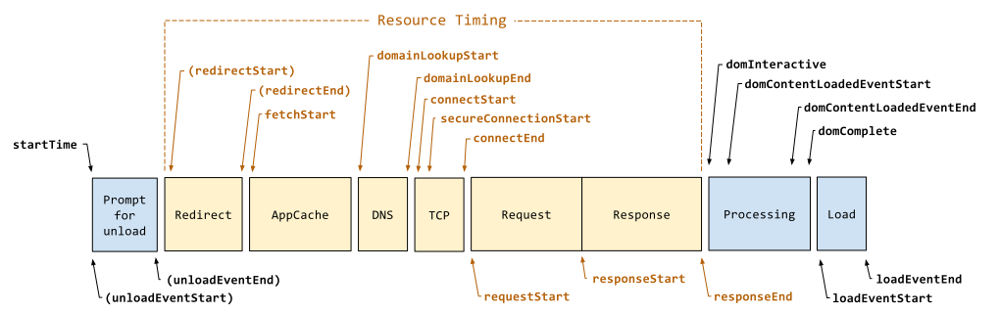
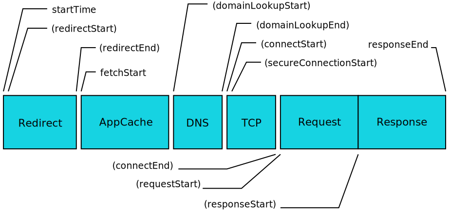

# Web计时/浏览器渲染性能
Web计时机制(渲染性能)的核心是`window.performance`对象，该对象有两个表示对象的属性：
其中一个为`performance.navigation`对象,它有以下属性
+ `redirectCount`：页面加载前的重定向次数
+ `type`：刚刚发生的导航类型：
  + 1: 表示页面重载过
  + 2: 表示通过后退或前进按钮打开的
  + 0: 表示第一次加载

另外一个为`performance.timing`对象，该对象的属性都是时间戳。（从软件纪元开始经过的毫秒数），重点介绍下这一个对象：

## performance.timing
该对象首先拥有以下属性，这些属性包括了从请求页面起到页面加载完成的各个环节的时间戳：

+ `navigationStart`：开始导航到当前页面的时间
+ `unloadEventStart`：前一个页面的`unload`事件开始的时间。但只有在前一个页面与当前页面来自同一个域时这个属性才有值；
+ `unloadEventEnd`：前一个页面`unload`事件结束的时间。
+ `redirectStart、redirectEnd`：到当前页面的重定向开始或结束的时间。但只有在前一个页面与当前页面来自同一个域时这个属性才有值
+ `fetchStart`：开始通过`HTTP GET`取得页面的时间
+ `domainLookupStart、domainLookupEnd`：开始查询当前页面DNS的时间或查询当前页面DNS结束的时间
+ `connectStart、connectEnd`：浏览器尝试连接服务器的时间、服务器成功连接到服务器的时间。
+ `secureConnectionStart`：浏览器尝试以SSL方式连接服务器的时间。
+ `requestStart、responseStart`：浏览器开始请求页面的时间、浏览器接收到页面第一个字节的时间。
+ `resopseEnd`：浏览器接收页面所有内容的时间
+ `domLoading`：`document.readyState`变为`loading`的时间
+ `domInteractive`：`document.readyState`变为`interactive`的时间
+ `domContentLoadedEventStart、domContentLoadedEventEnd`：发生`DOMContentLoaded`事件的时间、`DOMContentLoaded`事件已经发生且执行完所有事件程序的时间

### performance.getEntriesByType(type)
该方法用于返回一个指定type类型的属性获取一个该类型所有性能对象的数组，其中type可以为：
+ `frame/navigation`：返回`performance.timing`对象，包含从输入URL到页面加载完成的时间
+ `resource`：已解析的请求资源的URL对象的数组
+ `mark`：通过调用`performance.mark()`创建标记时使用的名称。
+ `measure`：通过调用`performance.measure()`创建度量时使用的名称
+ `paint`：浏览器绘制到屏幕所需的时间对象

这里我们重点关注一下通过`performance.getEntriesByType('navigation')`获取到的`performance.timing`对象，该对象与直接从`performance.timing`中返回的对象的不同在于，计算时间起点不一样，前者以0为起点，后者以软件纪元的时间为起点。

函数返回的对象具体为：
```js
{
  "connectEnd": 64.15495765894057,
  "connectStart": 64.15495765894057,
  "domainLookupEnd": 64.15495765894057,
  "domainLookupStart": 64.15495765894057,
  "domComplete": 2002.5385066728431,
  "domContentLoadedEventEnd": 2001.7384263440083,
  "domContentLoadedEventStart": 2001.2386167400286,
  "domInteractive": 1988.638474368076,
  "domLoading": 271.75174283737226,
  "duration": 2002.9385468372606,
  "entryType": "navigation",
  "fetchStart": 64.15495765894057,
  "loadEventEnd": 2002.9385468372606,
  "loadEventStart": 2002.7383663540235,
  "name": "document",

  // 在同一个浏览器上下文中，前一个网页（与当前页面不一定同域）unload 的时间戳，如果无前一个网页 unload ，则与 fetchStart 值相等
  "navigationStart": 0,
  "redirectCount": 0,
  "redirectEnd": 0,
  "redirectStart": 0,
  "requestStart": 65.28225608537441,
  "responseEnd": 1988.283025689508,
  "responseStart": 271.75174283737226,
  "startTime": 0,
  "type": "navigate",
  "unloadEventEnd": 0,
  "unloadEventStart": 0,
  "workerStart": 0.9636893776343863
}
```



具体有以下时间段：
+ DNS查询耗时：`domainLookupEnd - domainLookupStart`
+ TCP连接耗时：`connectEnd - connectStart`
+ request请求耗时(直到响应)：`responseEnd - requestStart`
+ 解析DOM树耗时：`domComplete - responceEnd`
+ 白屏时间(从加载到开始插入dom)：`domloadng - navigationStart`
+ 首屏时间：`loadEventEnd - navigationStart`
+ DOMContentLoad事件触发：`domContentLoadedEventEnd - domContentLoadedEventStart`
+ load事件触发事件：`loadEventEnd - loadEventStart`

通过`performance.getEntriesByType('resource')`可以获取资源加载的时间的对象(以数组形式返回)


按照上图就可以算出资源具体加载的时间，这里就不做过多的描述了

## performance.now()
`performance.now()`与`Date.now()`不同的是，返回了以微秒（百万分之一秒）为单位的时间，更加精准。

并且与`Date.now()`会受系统程序执行阻塞的影响不同，`performance.now()`的时间是以恒定速率递增的，不受系统时间的影响（系统时间可被人为或软件调整）。

注意 `Date.now()`输出的是 UNIX 时间，即距离 1970 的时间，而`performance.now()`**输出的是相对于`performance.timing.navigationStart(页面初始化) `的时间**。

使用`Date.now()`的差值并非绝对精确，因为计算时间时受系统限制（可能阻塞）。但使用`performance.now()` 的差值，并不影响我们计算程序执行的精确时间。

## performance.mark()/performance.measure()——计算程序运行时间
先上代码，跟着注释看：
```js
function randomFunc(n) {
    if (!n) {
        // 生成一个随机数
        n = ~~(Math.random() * 10000);
    }
    var nameStart = 'markStart' + n;
    var nameEnd = 'markEnd' + n;

    // 函数执行前做个标记
    window.performance.mark(nameStart);

    for (var i = 0; i < n; i++) {
        // do nothing
    }

    // 函数执行后再做个标记
    window.performance.mark(nameEnd);

    // 记录一个两个标记之间的时间间隔
    var name = 'measureRandomFunc' + n;

    // performance.measure(name, mark1, mark2)：接收三个参数分别为标记名，第一个标记和第二个标记
    window.performance.measure(name, nameStart, nameEnd);
}

randomFunc(5);

// 获取全部标记对象的数组
let marks = window.performance.getEntriesByType('mark');

// 其格式为: 记录了每个标记的开始时间和名称
{
    [
        {
            "duration": 0
            "entryType": "markStart",
            "name": "markStart3459",
            "startTime": 38.229999991017394
            // PerformanceMark对象
        },
        {
            "duration": 0
            "entryType": "markEnd",
            "name": "markStart3459",
            "startTime": 38.229999991017394
        }
    ]
}

// 获取全部刚刚保存的测量对象
let measure = window.performance.getEntriesByType('measure');

// 其格式为： 记录了两个标记之间的时间间隔
{
    [
        {
            "duration": 0.16999999934341758,
            "entryType": "measure",
            "name": "measureRandomFunc3459",
            "startTime": 38.229999991017394
            // PerformanceMeasure对象
        }
    ]
}
```

剩余还有一些方法，按方法名就能理解
+ `performance.getEntriesByName(name)`：获取`name`为`name`的`performance`对象,返回一个数组集合
+ `performance.clearMarks([name])`：接收一个`name`(可选)，清除指定`name`的标记(未传入参数时清空所有)
+ `performance.clearMeasure([name])`: 同上同理

[参考](http://www.alloyteam.com/2015/09/explore-performance/)
