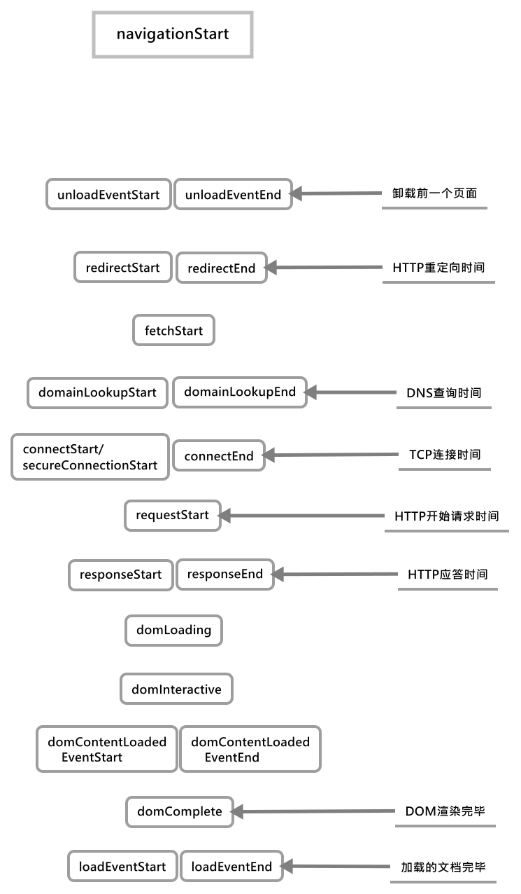
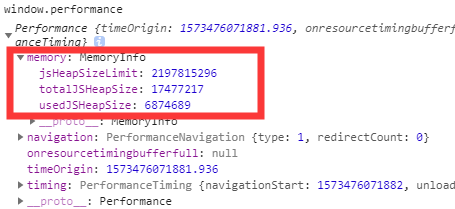
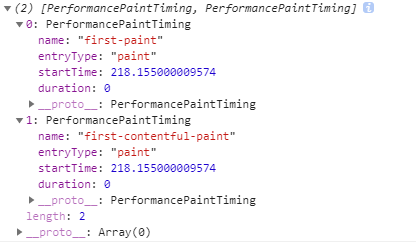

# Web计时/浏览器渲染性能

Web计时机制(渲染性能)的核心是`window.performance`对象，该对象有三个表示对象的属性：

+ [navigation](#performancenavigation%e5%af%bc%e8%88%aa%e5%af%b9%e8%b1%a1)
+ [memory](#performancememory%e6%b5%8f%e8%a7%88%e5%99%a8%e5%a0%86%e6%a0%88%e5%af%b9%e8%b1%a1)
+ [timing](#performancetiming%e7%bd%91%e9%a1%b5%e7%94%9f%e5%91%bd%e5%91%a8%e6%9c%9f)

## performance.navigation——导航对象

其中一个为`performance.navigation`对象,它有以下属性:

+ `redirectCount`：页面加载前的重定向次数
+ `type`：刚刚发生的导航类型：
  + `0`：页面通过点击一个链接、提交一个表单或者直接在地址栏输入`URL`，跳转或定位过来的。
  + `1`: 表示页面重载操作访问的
  + `2`: 表示当前页是通过浏览器历史记录，或后退或前进按钮打开的(即和浏览器历史记录有关的方式跳转的)
  + `255`：上述之外情况访问网页时，都为该值

____
另外一个为`performance.timing`对象，该对象的属性都是时间戳。（从软件纪元开始经过的毫秒数），重点介绍下这一个对象：

## performance.timing——网页生命周期

该对象首先拥有以下属性，这些属性包括了从请求页面起到页面加载完成的各个环节的时间戳：



+ `navigationStart`：开始浏览到当前页面的快照时间，或者为当前浏览器卸载前一个页面，或者不用执行卸载，开始获取新内容时的时间快照。
+ `unloadEventStart`：前一个页面的`unload`事件开始的时间。但只有在前一个页面与当前页面来自同一个域时这个属性才有值；
+ `unloadEventEnd`：前一个页面`unload`事件结束的时间。
+ `redirectStart、redirectEnd`：到当前页面的重定向开始或结束的时间。但只有在前一个页面与当前页面来自同一个域时这个属性才有值，**这两个值的差值即HTTP重定向所消耗的时间**
+ `fetchStart`：浏览器第一次检查用于存储请求资源的缓存时的开始时间，要计算缓存加载的全部时间，即`domainLookupStart - fetchStart`
+ `domainLookupStart、domainLookupEnd`：开始查询当前页面`DNS`的时间或查询当前页面`DNS`结束的时间，**这两个值的差值即DNS查询的完整时间**
+ `connectStart、connectEnd`：浏览器尝试与服务器建立`TCP`连接的时间、服务器与服务器完成`TCP`连接的时间，**这两个值的差值即建立TCP连接的完整时间**。
+ `secureConnectionStart`：浏览器尝试以`SSL`方式连接服务器的开始时间，**该值与`connectEnd`的差值即建立SSL隧道的完整时间**。
+ `requestStart、responseStart`：浏览器发送`HTTP`请求的时间快照或浏览器第一次对服务器的响应进行注册时的时间快照。
+ `responseEnd`：浏览器完成接收服务器发出的响应的时间快照，**`responseEnd - connectStart`即完成一次HTTP往返所花费的总时间(包括建立HTTP请求的时间)**。
+ `domLoading`：`document.readyState`变为`loading`的时间，文档开始加载的时间
+ `domComplete`：文档加载完成的时间快照，**`domComplete - domLoading`即页面渲染所花费的时间**，**`domComplete - navigationStart`即加载页面所花费的时间(第一次请求到页面完全加载完成)**。
+ `domInteractive`：`document.readyState`变为`interactive`的时间，此时用户可以与页面进行交互了。
+ `domContentLoadedEventStart、domContentLoadedEventEnd`：发生`DOMContentLoaded`事件的时间、`DOMContentLoaded`事件已经发生且执行完所有事件程序的时间
+ `loadEventEnd`：页面加载事件完成时触发该事件
+ `loadEventStart`：页面加载事件开始时触发该事件

### performance.getEntriesByType(type)

该方法用于返回一个指定`type`类型的属性获取一个该类型所有性能对象的数组，其中`type`可以为：

+ `frame/navigation`：返回`performance.timing`对象，包含从输入URL到页面加载完成的时间
+ `resource`：已解析的请求资源的URL对象的数组
+ `mark`：通过调用`performance.mark()`创建标记时使用的名称。
+ `measure`：通过调用`performance.measure()`创建度量时使用的名称
+ `paint`：浏览器绘制到屏幕所需的时间对象

这里我们重点关注一下通过`performance.getEntriesByType('navigation')`获取到的`performance.timing`对象，该对象与直接从`performance.timing`中返回的对象的不同在于它获取的是资源请求的时间(不包含`DOM`)且计算时间起点不一样，前者以`0`为起点，后者以软件纪元的时间为起点。

函数返回的对象具体为：

```js
{
  "connectEnd": 64.15495765894057,
  "connectStart": 64.15495765894057,
  "domainLookupEnd": 64.15495765894057,
  "domainLookupStart": 64.15495765894057,
  "domComplete": 2002.5385066728431,
  "domContentLoadedEventEnd": 2001.7384263440083,
  "domContentLoadedEventStart": 2001.2386167400286,
  "domInteractive": 1988.638474368076,
  "domLoading": 271.75174283737226,
  "duration": 2002.9385468372606,
  "entryType": "navigation",
  "fetchStart": 64.15495765894057,
  "loadEventEnd": 2002.9385468372606,
  "loadEventStart": 2002.7383663540235,
  "name": "document",

  // 在同一个浏览器上下文中，前一个网页（与当前页面不一定同域）unload 的时间戳，如果无前一个网页 unload ，则与 fetchStart 值相等
  "navigationStart": 0,
  "redirectCount": 0,
  "redirectEnd": 0,
  "redirectStart": 0,
  "requestStart": 65.28225608537441,
  "responseEnd": 1988.283025689508,
  "responseStart": 271.75174283737226,
  "startTime": 0,
  "type": "navigate",
  "unloadEventEnd": 0,
  "unloadEventStart": 0,
  "workerStart": 0.9636893776343863
}
```


具体有以下时间段：

+ `DNS`查询耗时：`domainLookupEnd - domainLookupStart`
+ `TCP`连接耗时：`connectEnd - connectStart`
+ `request`请求耗时(直到响应)：`responseEnd - requestStart`
+ 解析`DOM`树耗时：`domComplete - responceEnd`
+ 白屏时间(从加载到开始插入`dom`)：`domloadng - navigationStart`
+ 首屏时间：`loadEventEnd - navigationStart`
+ `DOMContentLoad`事件触发：`domContentLoadedEventEnd - domContentLoadedEventStart`
+ `load`事件触发事件：`loadEventEnd - loadEventStart`

通过`performance.getEntriesByType('resource')`可以获取资源加载的时间的对象(以数组形式返回)


按照上图就可以算出资源具体加载的时间，这里就不做过多的描述了

## performance.now()

它表示高分辨率时间，用亚毫米值记录时间，对于获取低于1毫秒的定时数据非常有用。

`performance.now()`与`Date.now()`不同的是，返回了以毫秒为单位，精度为微秒级别（百万分之一秒）。

并且与`Date.now()`会受系统程序执行阻塞的影响不同，`performance.now()`的时间是以恒定速率递增的，**不受系统时间的影响**（系统时间可被人为或软件调整）。

注意 `Date.now()`输出的是 UNIX 时间，即距离 1970 的时间，而`performance.now()`**输出的是相对于`performance.timing.navigationStart(页面初始化)`的时间**。

使用`Date.now()`的差值并非绝对精确，因为计算时间时受系统限制（可能阻塞）。但使用`performance.now()` 的差值，并不影响我们计算程序执行的精确时间。

## performance.mark()/performance.measure()——计算程序运行时间

先上代码，跟着注释看：

```js
function randomFunc(n) {
    if (!n) {
        // 生成一个随机数
        n = ~~(Math.random() * 10000);
    }
    var nameStart = 'markStart' + n;
    var nameEnd = 'markEnd' + n;

    // 函数执行前做个标记
    window.performance.mark(nameStart);

    for (var i = 0; i < n; i++) {
        // do nothing
    }

    // 函数执行后再做个标记
    window.performance.mark(nameEnd);

    // 记录一个两个标记之间的时间间隔
    var name = 'measureRandomFunc' + n;

    // performance.measure(name, mark1, mark2)：接收三个参数分别为标记名，第一个标记和第二个标记
    window.performance.measure(name, nameStart, nameEnd);
}

randomFunc(5);

// 获取全部标记对象的数组
let marks = window.performance.getEntriesByType('mark');

// 其格式为: 记录了每个标记的开始时间和名称
{
    [
        {
            "duration": 0
            "entryType": "markStart",
            "name": "markStart3459",
            "startTime": 38.229999991017394
            // PerformanceMark对象
        },
        {
            "duration": 0
            "entryType": "markEnd",
            "name": "markStart3459",
            "startTime": 38.229999991017394
        }
    ]
}

// 获取全部刚刚保存的测量对象
let measure = window.performance.getEntriesByType('measure');

// 其格式为： 记录了两个标记之间的时间间隔
{
    [
        {
            "duration": 0.16999999934341758,
            "entryType": "measure",
            "name": "measureRandomFunc3459",
            "startTime": 38.229999991017394
            // PerformanceMeasure对象
        }
    ]
}
```

剩余还有一些方法，按方法名就能理解

+ `performance.getEntriesByName(name)`：获取`name`为`name`的`performance`对象,返回一个数组集合
+ `performance.clearMarks([name])`：接收一个`name`(可选)，清除指定`name`的标记(未传入参数时清空所有)
+ `performance.clearMeasure([name])`: 同上同理

[参考](http://www.alloyteam.com/2015/09/explore-performance/)

## performance.memory——浏览器堆栈对象

**Note**：该对象主要只支持`Chrome`浏览器，其他主流浏览器不支持

该对象主要有三个属性，如图：


其中它们分别的含义为：

+ `usedJSHeapSize`：堆中当前所有正在使用的对象所占内存的总量
+ `totalJSHeapSize`：未被对象使用的空闲空间在内的堆的总大小
+ `jsHeapSizeLimit`：堆的最大容量

## 题外话1——defer/async与DOMContenLoaded

基于上述的时间中的`DOMContentLoaded`，它表示文档（`DOM`）被加载和解析完成，在不包含脚本的文档中，它的时间即文档的解析时间；在包含脚本的文档中，脚本会阻塞文档的解析，且脚本需要等待之前的`CSS`解析完毕，待所有的文档解析完毕后才能触发。

此时假设一个脚本具有`defer/async`属性，那么会有什么区别呢？

首先是`defer`属性，它表示脚本会在文档解析完毕后执行，同时它会在解析到该行时在后台进行脚本的下载，文档的解析过程不会中断。那么**此时`DOMContentLoaded`事件会在文档解析完毕后`defer`下载的脚本执行完毕后触发**。

而使用`async`的脚本不会影响`DOMContentLoaded`的触发，它表示解析到该脚本时异步下载脚本，文档的解析过程不中断，但脚本下载完毕后会立即执行。这就意味着，如果在文档解析完毕前下载完成，那么会阻塞文档的解析并执行脚本；如果在文档解析完毕后下载完成，那么与文档的解析和加载就毫无干系了(即`DOMContentLoaded`事件的触发不会受其阻塞)。

## 题外话2——首屏/白屏时间/用户可操作时间

(基于`performance api`)
**白屏**时间指用户输入`URL`到页面出现一点内容之间所用的时间，一般情况它在`domloading - navigationStart`这个时间段，但使用诸如`Vue`这样的框架时，它的时间会被延后到框架挂载对应的`DOM`元素，在`Vue`中我们需要在其根组件来的`Mounted`生命周期来获取。

**首屏**时间指用户输入`URL`到页面的内容完成渲染完成出现的时间(包括资源的下载，比如图片，那么则是最后一张图片加载完成的时间)，针对普通类型的网页来说首屏渲染的事件都可以通过`loadEventStart - navigationStart`，但如果有些渲染逻辑是处于`load`事件中，则可能选取其他值来计算，具体的看实际情况。

针对上面两个时间点，浏览器可以通过`performance.getEntriesByType('paint')`来获取一个更精准的信息。



这里有更精准的时间，但是这会在框架的操作中产生误差。

**用户可操作时间**应该为页面完全加载后即`loadEventEnd - navigationStart`

### 降级处理

在不支持这个`api`的浏览器，我们需要手动来查找首次加载中图片加载最慢的那张图片的加载时间来确认首屏时间。此时我们需要通过遍历所有图片并监听它们的`load`事件来对它们的加载状态和具体的加载完成时间来做处理来计算出最后一张图片的加载时间；如果没有图片则直接`DOMContentLoaded`事件触发的时间。

这种方式的缺点是：

1. 定时器存在最小间隔精度问题，且需要不断执行定时器来获取
2. 背景图片无法计算在内

那么此时涉及到一个首屏图片的检测，来判断哪些被归为首屏图片，一般情况下我们将屏幕中的图片作为首屏图片，所以我们需要检测图片相对于视窗的`offsetTop`来判断，如果图片在此之内则说明为首屏图片。

参考1——[前端性能——监控起步](https://www.cnblogs.com/chuaWeb/p/PerformanceMonitoring.html)
