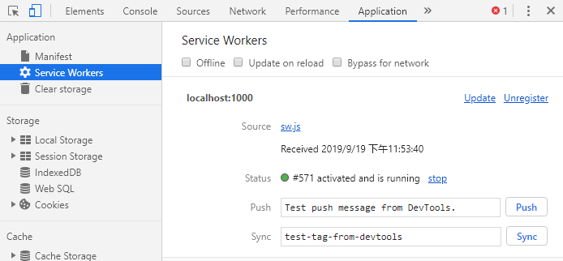
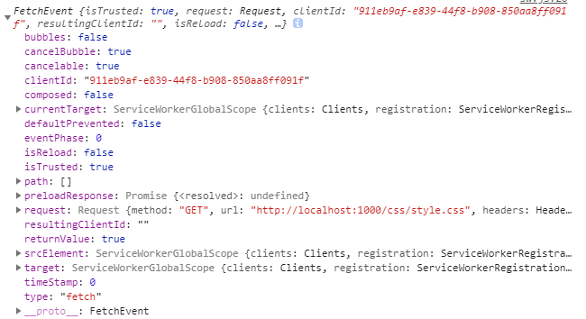
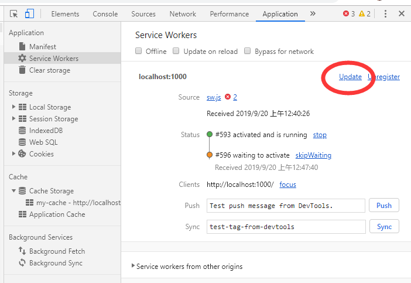

# Service Worker
这篇笔记主要讲一下怎么使用，并且在`app`文件夹下，附带一个完整的例子。进入`app`文件夹, 在该文件夹内打开命令行输入`node app.js`后，可以在地址为`localhost:1000`找到该网址。

## 注册
当我们使用一个`Service Worker`时，我们**首先要对其进行注册**，并且注册后`Service Worker`的有效范围为`Service Worker`文件所在的子目录下。

我们可以通过以下代码来对其进行注册：
```js
// 检查是否支持service Worker
if ('serviceWorker' in navigator) {

    // 通过register函数对worker文件进行注册
    navigator.serviceWorker.register('/sw.js').then(function (registration) {

        // Registration was successful
        console.log('ServiceWorker registration successful with scope: ', registration.scope);
    }).catch(function (err) {

        // registration failed :(
        console.log('ServiceWorker registration failed: ', err);
    });
}
```
在执行完上述操作时，浏览器会找到`sw.js`文件并保存在该访问的域名之下。我们可以在`F12`浏览器工具的`application`中找到：


在这一系列注册中，**`worker`文件夹的路径默认会作为你的`worker`文件夹所作用的范围**————如`/sw.js`代表`/`根目录下, 之后我们便能在`worker`中监听所有在根目录中的请求。除此之外，我们可以显示的声明一个范围：
```js
navigator.serviceWorker.register('/sw.js', { scope: '/js' })
```

这个范围代表在js目录以下的所有目录

具体在`worker`文件夹中，我们要开始监听`Service Worker`生命周期中的各种事件

## 安装
`Install`(安装事件)是我们在第一次注册和`worker`文件发生变化时触发的(浏览器会自动鉴别是否发生改变了)

通过该事件，我们可以在安装阶段来缓存资源：
```js
// 自定义的缓存名称
const CACHE_NAME = 'my-cache';

// 我们想缓存的文件URL路径的数组
let urlsToCache = [
    '/',
    '/css/style.css',
    '/js/main.js'
];

// Set the callback for the install step
self.addEventListener('install', function (event) {
    // Perform install steps

    // 通过caches.open()来打开对应名称的缓存, 然后调用cache.addAll()将文件的数组传入
    // 这里的全部过程都是基于Promise来实现的
    event.waitUntil(caches.open(CACHE_NAME)
        .then(function (cache) {
            console.log('cache Opened');
            return cache.addAll(urlsToCache);
        }))
});
```

这里一笔带过一下`ExtendableEvent.waitUntil() `方法, 它扩展了事件的生命周期。在一个与` install `事件相关联的` EventHandler `被调用时，它延迟将被安装的`worker`视为 `installing `，直到传递的` Promise `被成功地`resolve`。这主要用于确保：worker线程在所有依赖的核心`cache`被缓存之前都不会被安装。

`cache`是一个全局`CacheStorage`对象,用于管理浏览器缓存。我们通过其`open()`方法来获取一个可操作的`Cache`对象

[`cache.addAll()`](https://developer.mozilla.org/zh-CN/docs/Web/API/Cache/addAll) 接收一个`url`数组，对每一个进行请求，然后将响应结果存到缓存里。它以请求的详细信息为键来缓存每一个值。

我们可以在`application`下面的`Cache Storage`中查看


## 拦截请求, 使用缓存
每当网页里产生一个请求，都会触发一个`fetch`事件, 触发时，我们可以通过`worker`来拦截请求，并决定要返回什么————是缓存的数据还是一个实际网络请求的结果。

下面是一个**缓存优先的策略**，命中缓存时就直接返回响应否则就再发送真实的请求
```js
// 缓存优先策略，优先发送缓存，没有时在产生真实请求
self.addEventListener('fetch', function (event) {

    event.respondWith(

        // 匹配缓存
        caches.match(event.request)
        .then(function (response) {

            // 命中缓存就返回响应
            if (response) {
                return response;
            }

            // 否则发送真实请求
            return fetch(event.request);
        })
    );
});
```

`event`对象是一个` FetchEvent `对象，包含请求的详情。它可以用来查找一个匹配的缓存响应结果，其属性如下：


`cache.match() `会尝试为一个请求寻找匹配的缓存值。如果没能找到，这个` promise `会得到` undefined `结果。我们会检查到这种情况，并且如果发生了，就调用一次` fetch() `来产生网络请求。

`event.respondWith() `是一个` FetchEvent `对象里专门用于**向浏览器发送响应结果**的方法。它接受一个最终能解析成网络响应的` promise`。

紧接着，调用` event.waitUntil() `来在SW被终止前执行一个` Promise `异步流程。在这里我们先做一个网络请求然后再将其缓存。这个异步操作完成后，`waitUntil`才会解析完成，整个操作才可以终止。

## 更新worker文件
当你更新你的SW文件`（/sw.js）`，浏览器会检测到并在开发者工具中如下展示：


新更新的`worker`处于*等待激活*状态,当实际的网页关掉并重新打开时，浏览器会将原先的`Service Worker`替换成新的，然后在` install `事件之后触发` activate `事件。如果你需要清理缓存或者针对原来的SW执行维护性操作，`activate `事件就是做这些事情的绝佳时机。

## 延迟响应请求
Sync事件让你可以先将网络相关任务延迟到用户有网络的时候再执行。这个功能常被称作“背景同步”。这功能可以用于保证任何用户在离线的时候所产生对于网络有依赖的操作，最终可以在网络再次可用的时候抵达它们的目标。

[](https://zhuanlan.zhihu.com/p/28461857)