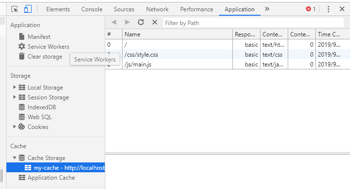

# Service Worker
这篇笔记主要讲一下怎么使用，并且在`app`文件夹下，附带一个完整的例子。进入`app`文件夹, 在该文件夹内打开命令行输入`node app.js`后，可以在地址为`localhost:1000`找到该网址。

## 注册
当我们使用一个`Service Worker`时，我们**首先要对其进行注册**，并且注册后`Service Worker`的有效范围为`Service Worker`文件所在的子目录下。

我们可以通过以下代码来对其进行注册：
```js
// 检查是否支持service Worker
if ('serviceWorker' in navigator) {

    // 通过register函数对worker文件进行注册
    navigator.serviceWorker.register('/sw.js').then(function (registration) {

        // Registration was successful
        console.log('ServiceWorker registration successful with scope: ', registration.scope);
    }).catch(function (err) {

        // registration failed :(
        console.log('ServiceWorker registration failed: ', err);
    });
}
```
在执行完上述操作时，浏览器会找到`sw.js`文件并保存在该访问的域名之下。我们可以在`F12`浏览器工具的`application`中找到：


在这一系列注册中，**`worker`文件夹的路径默认会作为你的`worker`文件夹所作用的范围**————如`/sw.js`代表`/`根目录下, 之后我们便能在`worker`中监听所有在根目录中的请求。除此之外，我们可以显示的声明一个范围：
```js
navigator.serviceWorker.register('/sw.js', { scope: '/js' })
```

这个范围代表在js目录以下的所有目录

具体在`worker`文件夹中，我们要开始监听`Service Worker`生命周期中的各种事件

## 安装
`Install`(安装事件)是我们在第一次注册和`worker`文件发生变化时触发的(浏览器会自动鉴别是否发生改变了)

通过该事件，我们可以在安装阶段来缓存资源：
```js
// 自定义的缓存名称
const CACHE_NAME = 'my-cache';

// 我们想缓存的文件URL路径的数组
let urlsToCache = [
    '/',
    '/css/style.css',
    '/js/main.js'
];

// Set the callback for the install step
self.addEventListener('install', function (event) {
    // Perform install steps

    // 通过caches.open()来打开对应名称的缓存, 然后调用cache.addAll()将文件的数组传入
    // 这里的全部过程都是基于Promise来实现的
    event.waitUntil(caches.open(CACHE_NAME)
        .then(function (cache) {
            console.log('cache Opened');
            return cache.addAll(urlsToCache);
        }))
});
```

这里一笔带过一下`ExtendableEvent.waitUntil() `方法, 它扩展了事件的生命周期。在一个与` install `事件相关联的` EventHandler `被调用时，它延迟将被安装的`worker`视为 `installing `，直到传递的` Promise `被成功地`resolve`。这主要用于确保：worker线程在所有依赖的核心`cache`被缓存之前都不会被安装。

`cache`是一个全局`CacheStorage`对象,用于管理浏览器缓存。我们通过其`open()`方法来获取一个可操作的`Cache`对象

[`cache.addAll()`](https://developer.mozilla.org/zh-CN/docs/Web/API/Cache/addAll) 接收一个`url`数组，对每一个进行请求，然后将响应结果存到缓存里。它以请求的详细信息为键来缓存每一个值。

我们可以在`application`下面的`Cache Storage`中查看


## 拦截请求, 使用缓存
每当网页里产生一个请求，都会触发一个`fetch`事件, 触发时，我们可以通过`worker`来拦截请求，并决定要返回什么————是缓存的数据还是一个实际网络请求的结果。

下面是一个**缓存优先的策略**，命中缓存时就直接返回响应否则就再发送真实的请求
```js
// 缓存优先策略，优先发送缓存，没有时在产生真实请求
self.addEventListener('fetch', function (event) {

    event.respondWith(

        // 匹配缓存
        caches.match(event.request)
        .then(function (response) {

            // 命中缓存就返回响应
            if (response) {
                return response;
            }

            // 否则发送真实请求
            return fetch(event.request);
        })
    );
});
```

`event`对象是一个` FetchEvent `对象，包含请求的详情。它可以用来查找一个匹配的缓存响应结果，其属性如下：


`cache.match() `会尝试为一个请求寻找匹配的缓存值。如果没能找到，这个` promise `会得到` undefined `结果。我们会检查到这种情况，并且如果发生了，就调用一次` fetch() `来产生网络请求。

`event.respondWith() `是一个` FetchEvent `对象里专门用于**向浏览器发送响应结果**的方法。它接受一个最终能解析成网络响应的` promise`。

紧接着，调用` event.waitUntil() `来在SW被终止前执行一个` Promise `异步流程。在这里我们先做一个网络请求然后再将其缓存。这个异步操作完成后，`waitUntil`才会解析完成，整个操作才可以终止。

### 缓存新的响应
当我们在`fetch`事件中未命中缓存时，可以将新的请求添加到缓存中去：
```js
self.addEventListener('fetch', function (event) {

    let res = event.respondWith(

        // 匹配缓存
        caches.match(event.request)
        .then(function (response) {

            // 命中缓存就返回响应
            if (response) {
                return response;
            }

            let fetchRequest = event.request.clone();

            // 否则发送真实请求, 并对其响应进行缓存
            return fetch(fetchRequest).then(response => {

                // 如果返回不成功或状态码不为200或请求不是自身发送则不进行缓存
                if (!response || response.status !== 200 || response.type !== 'basic') {
                    return response;
                }

                let responseToCache = response.clone();

                // 打开缓存表更替资源
                caches.open(CACHE_NAME).then(cache => {
                    cache.put(event.request, responseToCache);
                });

                return response;
            });
        })
    );
});
```

这里做了以下操作：
1. 在`fetch`请求中成功回调中：
   1. 确保响应有效
   2. 确保响应为`200`
   3. 确保响应类型为`basic`(不为第三方请求)
2. 如果通过检查，则克隆响应。 这样做的原因在于，**该响应是数据流， 因此主体只能使用一次**。 由于我们想要返回能被浏览器使用的响应，并将其传递到缓存以供使用，因此需要克隆一份副本。我们将一份发送给浏览器，另一份则保留在缓存。
## 更新worker文件
当你更新你的SW文件`（/sw.js）`，浏览器会检测到并在开发者工具中如下展示：


并附有以下过程
1. 当新的`worker`文件与之前的文件存在字节的差异时，就会被视为新的`worker`
2. 新的`worker`会启动，且会触发`install`
3. 此时旧的`worker`仍控制着当前页面，因此新的`worker`会进入`waiting`状态
4. 当当前页面关闭或刷新时，旧的`worker`会被终止，新的`worker`会取得控制权
5. 新的`worker`取得控制权后会触发`activate`事件

### activate事件
出现在` activate `回调中的一个常见任务是缓存管理。 您希望在` activate `回调中执行此任务的原因在于：如果您在安装步骤中清除了全部旧缓存，则所有控制当前页面的任何旧` Service Worker `将无法从缓存中提供文件，此时我们可以通过`activate`事件来将其添加到不清除的白名单的缓存来避免清除

>比如说我们有一个名为 `'my-site-cache-v1'` 的缓存，我们想要将该缓存拆分为一个页面缓存和一个博文缓存。 这就意味着在安装步骤中我们创建了两个缓存：`'pages-cache-v1' `和 `'blog-posts-cache-v1'`，且在激活步骤中我们要删除旧的` 'my-site-cache-v1'`。

以下代码将执行此操作，具体做法为：遍历` Service Worker `中的所有缓存，并删除未在缓存白名单中定义的任何缓存。

```js
// 在activate事件中将白名单之外的缓存去掉
self.addEventListener('activate', event => {

    // 缓存的白名单，不进行删除
    let cacheWhiteList = urlsToCache;

    event.waitUntil(
        caches.keys().then(cacheNames =>
            Promise.all(
                cacheNames.map(cacheName => {
                    if (cacheWhiteList.indexOf(cacheName) === -1) {
                        return caches.delete(cacheName);
                    }
                })
            ))
    )
});
```

## 延迟响应请求
`Sync`事件让你可以先将网络相关任务延迟到用户有网络的时候再执行。这个功能常被称作“背景同步”。这功能可以用于保证任何用户在离线的时候所产生对于网络有依赖的操作，最终可以在网络再次可用的时候抵达它们的目标。

首先我们需要在浏览器中注册为该`ServiceWorkerRegistration `对象注册一个自定义名称的`sync`事件事件
```js
navigator.serviceWorker.ready
    .then(registration => {
        document.getElementById('submit').addEventListener('click', () => {
        registration.sync.register('submit').then(() => {
            console.log('sync registered!');
        });
    });
});
```

之后我们需要在`worker`文件中，给`worker`注册一个`sync`事件, 所有注册的`sync`事件都会在这里触发，此时我们需要通过判断事件对象的`tag`属性(即我们自定义的名称)，来执行相应的逻辑
```js
self.addEventListener('sync', function (event) {
    if (event.tag === 'submit') {
        console.log('sync!');
    }
});
```

**注意：即使我们触发多次同一个名称的sync事件，在联网后，也只会触发一次**

### sync事件触发的时机
当网络通畅时，`sync`事件会立即触发并执行我们自定义的任务;而如果用户离线了，`sync `事件会在网络恢复后第一时间触发。(`Chrome`开发者工具的`Network`选项卡里模拟网络断开是不会触发` sync `事件的)


## 消息推送
在`worker`中，可以通过`push`事件以及浏览器的`Push API`来实现消息的推送。

### 消息提醒
实现消息的推送首先要在浏览器中注册以下事件：
```js
// 向用于请求推送的权限
Notification.requestPermission(permission => {
    console.log('permission:', permission);
});

// 然后通过以下操作来实现消息的推送
// 显示消息提醒
function displayNotification() {
    if (Notification.permission == 'granted') {
        navigator.serviceWorker.getRegistration()
            .then(registration => {
                registration.showNotification('this is a notification!');
            });
    }
}
```

同时我们可以在worker中注册以下事件来查看用户的点击情况：
```js
// sw.js
self.addEventListener('notificationclick', event => {
    // 消息提醒被点击的事件
    console.log('mention');
});

self.addEventListener('notificationclose', event => {
    // 消息提醒被关闭的事件
    console.log('infoClose');
});
```
你需要先向用户寻求让你的网页产生消息提醒的权限。之后，你就可以弹出提示信息，然后处理某些事件，比如用户把消息关掉的事件。

## 缺点
+ **如果安装失败，也不会显示**
    如果` Worker`注册后未在` chrome://inspect/#service-workers `或 `chrome://serviceworker-internals `中显示，则有可能是引发错误或向` event.waitUntil() `发送被拒绝的 `promise `而导致无法安装。

    要解决该问题，请转至 `chrome://serviceworker-internals `并勾选`“Open DevTools window and pause JavaScript execution on service worker startup for debugging”`，然后将调试程序语句置于安装事件开始处。 这与未捕获异常中的暂停共同揭露问题。
+ **fetch()方法默认不携带凭证**

[参考1](https://zhuanlan.zhihu.com/p/28461857)
[参考2](https://developers.google.cn/web/fundamentals/primers/service-workers/)