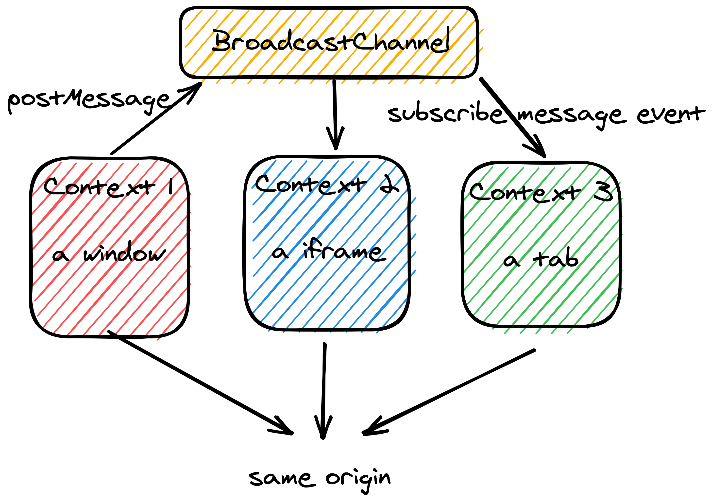
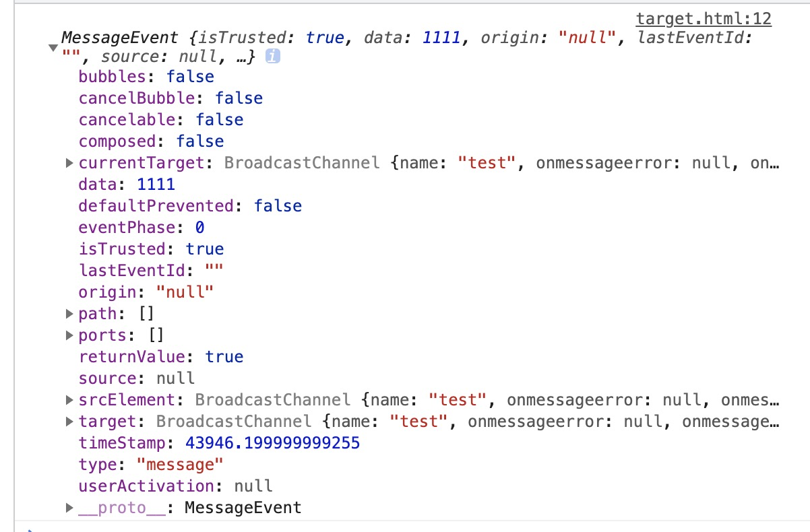

# 信道通信-MessageChannel&BroadcastChannel

目录

-   [Channel Messaging API](#channel-messaging-api)
-   [Broadcast Channel API](#broadcast-channel-api)

## Channel Messaging API

`Channel Messaging API`允许两个运行在同一文档的不同浏览器上下文(比如同一个文档的两个`iframe`，文档和其内部的`iframe`，文档中的两个`Web Worker`、当前打开的窗口等等)直接进行通信，它们各自维护一个端口，然后通过该**双向**频道进行通信，该管道是不受跨域限制的，但如何将管道转交给跨域站点需要考虑。

### 使用双向信道来进行通信

通过`MessageChannel`构造函数，我们可以创建一个信道，其返回值会包含两个`MessagePort对象`，它们就代表当前信道的两个端口，通过两个通信主体各自持有一个，那么它们就能进行双向通信:


假如我们当前窗口要与一个当前文档中`name`为`target`的`iframe`进行通信，那么我们需要将其中一个端口的所属权转交给它：

```js
// 此为主文档视角
const { port1, port2 } = new MessageChannel(),
    // 这里有多种方式获取iframe的window对象
    target =
        // 文档中使用的iframe会自动注册到window.frames中
        frames['target'] ||
        // 且如果其具有name还会将name注册到对应位置
        frames[1] ||
        // 通过对于元素然后反问属性获取
        document.querySelector('iframe').contentWindow

// 通过window.postMessage()可以将信道转交给对应目标
target.postMessage('init', '*', [port2])
```

上述代码在文档中，创建了两个端口，并获取到了文档中`iframe`的`window`对象，之后通过[`window.postMessage()`](https://developer.mozilla.org/zh-CN/docs/Web/API/Window/postMessage)方法将端口转发给该文档。

你需要关注`window.postMessage()`的第三个参数，它表示一个[`Transferable Object`](https://developer.mozilla.org/zh-CN/docs/Web/API/Transferable)可以在不同可执行上下文中互相传递对象，目前来说有三中对象`ArrayBuffer`、`MessagePort`、`ImageBitMap`。一旦传递完成，那么其的所属权就不属于当前`window`了。

在`iframe`窗体中，我们需要订阅`message`事件来获取这个端口：

```js
// iframe视角
let teleport = null

window.addEventListener('message', ({ ports }) => {
    teleport = ports[0]

    // 为端口订阅事件，从端口1发送的信息会在这里接受，开始通信
    teleport.onmessage = () => {
        /* ...开始进行通信 */
    }
})
```

从上面的代码可以看到，获取到端口之后，我们通过为端口订阅`message`事件来获取从另一个端口发送的信息。

同样的主文档视角下，也需要订阅`message`事件来接受传入的消息：

```js
// 主文档视角
// 发送过来的信息存放在data中
port1.onmessage = ({ data }) => data
```

端口与端口间发送信息通过[`MessagePort.postMessage()`](https://developer.mozilla.org/en-US/docs/Web/API/MessagePort/postMessage)来进行，该函数接受两个参数，第一个表示要发送的数据，可以是任何数据类型；第二个参数是一个可选`Transferable Object`(可为一个数组)，表示将其所有权转交给通信的上下文环境。

### 控制信道信息的传送

`MessagePort`信道对象不仅仅可以用来传送数据，也可以控制来选择是否允许接收和传送数据。

通过`MessagePort.start()`方法，我们可以通知当前端口开始发送消息，这在使用`MessagePort.onmessage`注册事件是默认调用的，但是如果你通过`MessagePort.addEventListener`注册事件时，需要你手动去启动它，此时信息才会开始进行发送，这意味着你通过信道发送的消息实际是存在一个缓冲区域的，它不会丢失，直到你发送他为止。

> 当你想通过手动控制打开信道时，你也不能去通过`MessagePort.onmessageerror`去注册错误事件，它同样也会自动调用`MessagePort.start()`方法

开启后，你可以通过`MessagePort.close()`去关闭信道的通信，注意该方法是一次性的，调用后讲永久的关闭通信。

[本目录下存在一个 live example](./live)

### 其他用途

`Channel Messaging API`除了上述使用场景之外还可以同于普通的组件通信：

```js
const { port1, port2 } = new MessageChannel()

// port1分配给组件1
port1.onmessage = ({ data }) => console.log(data)
port1.postMessage('Hello Blink182')

// port2分配给组件2
port2.onmessage = ({ data }) => console.log(data)
```

除此之外我们还可以将端口作为事件的订阅媒介来使用，但只能在当前端口上生效(因为`MessagePort`对象为`EventTarget`子类)：

```js
const { port1, port2 } = new MessageChannel()
port1.addEventListener('custom-event', () => {})

// 触发的事件
port1.dispatchEvent(new Event('custom-event'))
```

---

Reference

1. [MDN 使用 Channel Messaging](https://developer.mozilla.org/zh-CN/docs/Web/API/Channel_Messaging_API/Using_channel_messaging)
2. [MDN MessagePort](https://developer.mozilla.org/zh-CN/docs/Web/API/MessagePort)
3. [How to establish two-way communication using MessageChannel](https://javascript.plainenglish.io/message-channels-f94de3488b1a)

## Broadcast Channel API

`Broadcast Channel API`可以实现**同源**情况下，浏览器不同窗口、标签页、`iframe`之间的通信。

通过创建一个监听某个频道(`channel`)下的`BroadcastChannel`对象。我们可以接收发送给该频道的所有信息，并实现全双工通信。



通过`BroadcastChannel`构造函数可以创建一个`BroadcastChannel`对象，此时就代表一个客户端加入了某个指定的频道。

```js
// 接受一个表示频道名称的参数
const bc = new BroadcastChannel('test-channel')
```


之后通过`BroadcastChannel.postMessage()`边可以通过广播信道向其他主体发送消息，该函数接受一个任意类型的参数。

在广播信道的另一头，我们需要订阅`message`事件来处理这些信息。

```js
// 另一个页面，发送一个信息
bc.postMessage(1111)

// 另一个页面接收
bc.onmessage = ({ data }) => data
```



上述事件对象中部分字段代表的含义如下：

-   `data`: 发送数据携带的参数
-   `origin`: 发送数据的源地址
-   `lastEventId`: 当前事件的唯一`id`

之后可以通过`Broadcast.close()`方法来断开与频道的链接，此时之前创建的广播信道对象就可以被垃圾回收 ♻️

```js
bc.close()
```

---

Reference

[MDN Broadcast Channel API](https://developer.mozilla.org/zh-CN/docs/Web/API/Broadcast_Channel_API)
[How to Send Messages with the Broadcast Channel API](https://javascript.plainenglish.io/sending-messages-with-the-broadcast-channel-api-214435dba4ff)
