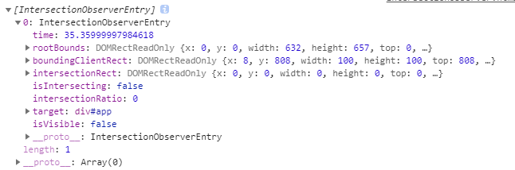

# Intersection Observer API

该API提供了一种**异步**观察目标元素与`viewport`产生交集的变换的方法。

## 使用场景

一直以来，检测元素的可视状态或者两个元素的相对可视状态都不是一种容易的事，毕竟大部分解决方案并非完全可靠，且极易影响网站性能。然而随着网页发展，对上述检测的需求也随之增加，很多情况下都需要用到元素间交集变化的信息，比如：

- 页面滚动时，懒加载图片或其他内容
- 实现“可无限滚动的网站”，也就是用户滚动网页时直接加载更多的内容，无需翻页。
- 为计算广告利益，检测其广告元素的曝光情况
- 根据用户是否已滚动到相应区域来灵活开始执行任务或动画

`Intersection Observer API`会注册一个回调方法，每当期望被监视的元素进入或者退出另一个元素的时候(或者浏览器的视口)该回调方法将会被执行，或者两个元素的交集部分大小发生变化的时候回调函数也会被执行。通过这种方式，网站不需要为了监听两个元素的交集变化而在主线程里面做任何操作，并且浏览器可以帮助我们优化和管理两个元素的交集变化。

`Intersection Observer API`并不能告诉我们两个重叠的元素的重叠部分的准确像素个数，或者重叠的像素属于哪个元素。

## 使用方法与概念

### IntersectionObserver构造函数

`IntersectionObserver`允许我们配置一个回调函数，每当目标元素与设备视窗或者其他指定元素发生交集时，该回调函数就会执行。`viewport`或其他元素我们称它为根元素或根。

通过`IntersectionObserver`构造函数并传入一个回调函数与相应参数可以创建一个`IntersectionObserver`对象。该回调函数将会在目标元素和根元素的交集超过阈值(`threshold`)规定的大小时候被执行。

```js
var options = {
    root: null,
    rootMargin: '0px',
    threshold: 1.0
};
var observer = new IntersectionObserver(callback, options);
```

以上阈值`1.0`表示，目标元素完全出现在`root`指定元素上时，该函数会被调用。

具体的`options`项有如下：

- `root`：指定根(容器)元素，用于检查目标的可见性。必须为目标元素的**祖先级元素**。如果未指定或为`null`，则默认为`viewport`。
- `rootMargin`：`root`元素的外边距。类似于CSS的`margin`属性。如果指定`root`参数，那么`rootMargin`也可以使用百分比来取值。该属性值用来作为`root`元素与`target`发生交集时计算交集的区域范围，使用该属性可以控制`root`元素每一边的收缩或者扩张。默认值为`0`。
- `threshold`：当`target`元素和`root`元素相交的程度达到该值时，就会触发被注册的回调函数。该参数可以为一个数值(`Number`类型)也可以为一个数组(数组元素为`Number`类型)，每一个数值的取值范围为`0~1`，表示两个元素交集的占比。如`0.5`表示目标元素与`root`相交的面积超过目标元素面积的`50%`时；当指定一个数组如`[0, 0.25, 0.75]`时，则表示每超过一个值时触发一次回调函数。默认值为`0`。

### 实例方法——观察一个目标——observe API

通过`IntersectionObserver.prototype.observe(target)`便可以给观察者对象配置一个被观察的目标：

```js
// 这里以刚才的代码片段为例
var target = document.querySelector('#app');

// 观察该target对象
observer.observe(target);
```

每当目标满足观察者对象`observer`指定的阈值(`threshold`)时，就会调用注册的回调函数，该回调函数会被传入两个参数：一个`IntersectionObserverEntry`对象数组与当前的观察者对象。这里我们可以看到一个`observer`可以观察多个目标，但只有一个根(容器)元素和阈值。

这个`IntersectionObserverEntry`对象数组表示当前在观察者对象注册的所有满足当前触发条件的目标

那么`IntersectionObserverEntry`这个对象是什么呢？

### IntersectionObserverEntry——交集信息对象

在网页中，所有的区域其实都被看作为一个矩形，即使元素是不规则的图像，也会被看成一个包含元素所有区域的最小矩形，相似的，如果元素发生交集的部分不是一个矩形，也会被当作一个矩形看待。

而`IntersectionObserverEntry`对象就是来描述目标与`root`之间的交集的。它有以下属性：



分别表示为：

属性名|描述
-|-
`time`|发生交叉的时间，返回一个高密度值([`DOMHighResTimeStamp`](https://developer.mozilla.org/zh-CN/docs/Web/API/DOMHighResTimeStamp))
`rootBounds`|描述根(容器)元素的位置信息的Rect对象
`boundingClientRect`|描述目标元素的位置信息的Rect对象
`intersectionRect`|描述上面两个元素交集部分的位置信息的Rect对象
`isIntersecting`|返回一个布尔值，表示当前两个元素当前发生交集的趋势：`true`表示，现在(用户)的操作行为导致两个元素相交；`false`表示现在(用户)的操作行为导致两个元素分离(不相交)。(这里的相交也要满足阈值(`threshold`)条件)
`intersectionRatio`|交集占目标元素的比例，同样也是`intersectionRect/boundingClientRect`的比例

### 其余的API

#### IntersectionObserver.prototype.unobserve(target)

停止对一个元素的观察，接收一个元素作为参数(可选)。

```js
IntersectionObserver.unobserve(target);
```

该参数如果没有提供也不会做任何事情，也不会报出异常

#### IntersectionObserver.prototype.disconnect()

停止当前的观察者对象对所有目标元素的观察。(无参数)

#### IntersectionObserver.prototype.takeRecords()

在学习这个API之前，先了解一个东西：[`window.requestIdleCallback()`](../../BOM/requestIdleCallback&#32;API/REAMDE.md)。那么这和`IntersectionObserver`有什么关系呢？在两个元素的交集发生时，其实并不会立即执行我们定义的回调函数，它会调用`window.requestIdleCallback()`将我们的回调函数加入队列来异步调用(且规定了最大的超时时间为`100ms`)，这也就相当于浏览器会在发生交集时执行以下代码：

```js
window.requestIdleCallback(() => {
    if (entries.length > 0) {
        callback(entries, observer)
    }
}, {
    timeout: 100
});
```

我们的回调函数可能在`1~100ms`这期间执行，但我们想立即(即在这个回调还没自动调用前)知道这个观察者对象有没有捕捉到产生交集的情况，那么我们就需要`takeRecords()`这个方法，它会同步返回若干个`IntersectionObserverEntry`对象组成的数组(即发生交集的那些对象信息)，当然如果此时并没有观察到交集的动作，则返回空数组。

注意：对于同一个交集信息来说，同步的`takeRecords()`和异步的回调函数是互斥的，如果回调先执行了，那么你手动调用`takeRecords()`就必然会拿到空数组，如果你已经通过`takeRecords()`拿到那个相交信息了，那么你指定的回调就不会被执行了(`entries.length > 0`是`false`)。

## 其他问题

`Intersection Observer API`的工作原理就是检测目标元素与根元素之间相交率的变化。每个观察者实例都为每个目标元素维护着一个**上次相交率**(`previousThreshold`)字段，在执行`observe()`的时候就会将其初始化化为`0`，然后每次检测到新的相交率满足(达到或超过)了阈值(`threshold`)时，且阈值与当前的`previousThreshold`值不同时，就会触发回调，并将新的值赋予给`previousThreshold`，如此往复。

清楚了这个概念那么我们来看下下面几个问题：

### 贴边的情况的特例

假设我们滚动得很慢超级慢，当目标元素和根元素恰好相交时(设`threshold`为`0`)，那么此时相交率就为`0`，但却触发了回调函数。

### 目标元素宽度或高度为0

假如我们有一个目标元素的宽高为`0`，那么渲染出的矩形面积就为`0`，那么在计算面积时就会出现除以`0`这种非法操作，即使在`Javascript`中除以`0`等于`Infinity`，所以这种情况必须要特殊处理：

`0`面积的目标元素的相交率要么为`0`要么为`1`。无论是贴边还是移动到根元素内部，相交率都是`1`，其它情况都是`0`。`1`到`0` 会触发回调，`0`到`1`也会触发回调，就这两种情况。所以`0`面积的目标元素设置阈值是没有任何意义的。

### 初始化observer后立即触发了回调函数

在执行`observe()`的时候，浏览器会将 `previousThreshold`初始化成`0`，而不是初始化成当前真正的相交率，然后在下次相交检测的时候就检测到相交率变化了，所以这种情况不是特殊处理。

### 浏览器何时进行交集检测，多久一次？

我们常见的显示器都是`60hz`的，就意味着浏览器每秒需要绘制`60`次（`60fps`），大概每`16.667ms`绘制一次。如果你使用 `200hz` 的显示器，那么浏览器每`5ms`就要绘制一次。

>计算方式 `1秒 / 每秒hz = fps

我们把`16.667ms`和`5ms`这种每次绘制间隔的时间段，称之为`frame`（帧，`fps`）。浏览器的渲染工作都是以这个帧为单位的，下图是`Chrome`中每帧里浏览器要干的事情（我在原图的基础上加了`Intersection Observations`阶段)：


可以看到，相交检测（`Intersection Observations`）发生在`Paint`之后`Composite`之前(紫色部分)，多久检测一次是根据显示设备的刷新率而定的。但可以肯定的是，每次绘制不同的画面之前，都会进行相交检测，不会有漏网之鱼。

### 多个阶段的阈值，是怎么触发回调的？

如果滚动得慢，那么每到达一个阈值就会触发回调；如果滚动快，那么会在触发停止滚动后最近的阈值。

### 如何判断当前是否相交

首先按之前的情况来看，肯定不能完全使用`entry.intersectionRatio > 0`来判断，因为在刚刚[贴边的情况](#%e8%b4%b4%e8%be%b9%e7%9a%84%e6%83%85%e5%86%b5%e7%9a%84%e7%89%b9%e4%be%8b)下，缓慢滚动时，`intersectionRatio`的值在发生交集时(边缘情况)，是为`0`的，之后就不会在触发回调了。但在这种情况下，我们可以通过给`threshold`设置一个较小的值来解决，如`threshold: 0.000001`，这就使得相交时必定会有值的变化。

当然还可以用`IntersectionObserverEntry`对象上的`isIntersecting`属性。

部分参考:
[IntersectionObserver API 详解篇](https://www.zhangshengrong.com/p/rG1V6Zr139/)