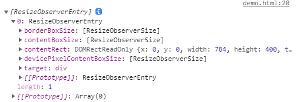

# ResizeObserver API

`ResizeObserver` 接口可以监听到 `Element` 的内容区域或 `SVGElement`的边界框改变。内容区域则需要减去内边距`padding`。（有关内容区域、内边距资料见[盒子模型](https://developer.mozilla.org/docs/Learn/CSS/Introduction_to_CSS/Box_model)）

`ResizeObserver` 避免了在自身回调中调整大小，从而触发的无限回调和循环依赖。它仅通过在后续帧中处理 DOM 中更深层次的元素来实现这一点。**如果（浏览器）遵循规范，只会在绘制前或布局后触发调用**。(这和`IntersectionObserver API`一样)

通过下面`new ResizeObserver(callback)`我们可以创建一个其实例。当被观察元素发生尺寸变化时，其就会触发传入的回调函数，并传入一个`ResizeObserverEntry`对象数组作为参数。

## ResizeObserverEntry

一个`ResizeObserverEntry`对象具有如下属性：

具体每个属性含义为：

-   `contentRect`：对改变尺寸大小的元素的 `DOMRectReadOnly` 引用（包含 `x,y,width,height,top,right,bottom,left` 属性，即调用`Element.getBoundingClientRect()`获取的矩形）。
-   `target`：对改变尺寸大小的元素的引用
-   `contentBoxSize`：`ResizeObserverSize`对象数组，其表示改变尺的元素的内容区域尺寸信息。
-   `devicePixelContentBoxSize`：`ResizeObserverSize`对象数组，其表示改变尺的元素的内容区域尺寸信息(以设备像素为单位)。
-   `borderBoxSize`：`ResizeObserverSize`对象数组，其表示改变尺的元素的除外边距外大小的信息尺寸信息。

`ResizeObserverSize`对象具有两个字段，`blockSize`表示高度，`inlineSize`：表示宽度。(实际根据`writing-mode`可能相反)

注意该`API`并未全浏览器支持，具体使用时请查询`can I use`。本目录下有一个 `demos` 可以直接使用查看。

Reference:

[MDN ResizeObserver](https://developer.mozilla.org/zh-CN/docs/Web/API/ResizeObserver)
[MDN ResizeObserverEntry](https://developer.mozilla.org/zh-CN/docs/Web/API/ResizeObserverEntry)
[MDN contentBoxSize](https://developer.mozilla.org/en-US/docs/Web/API/ResizeObserverEntry/contentBoxSize)
