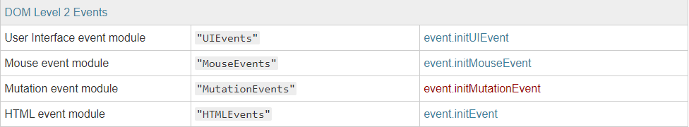
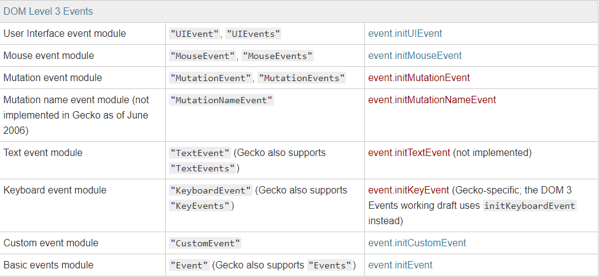

# DOM 模拟事件

目录：

-   [前记](#%e5%89%8d%e8%ae%b0)
-   [创建模拟事件](#%e5%88%9b%e5%bb%ba%e6%a8%a1%e6%8b%9f%e4%ba%8b%e4%bb%b6)
-   [初始化模拟事件](#%e5%88%9d%e5%a7%8b%e5%8c%96%e6%a8%a1%e6%8b%9f%e4%ba%8b%e4%bb%b6)

## 前记

以前不知道模拟事件是哪来干什么的，以为没用，直到阅读 Vue 源码时，发现可以用来触发指定元素的某个类型的事件，其中的源码为：

```js
function trigger(el, type) {
    const e = document.createEvent('HTMLEvents')
    e.initEvent(type, true, true)
    el.dispatchEvent(e)
}
```

使用该函数后，会立即触发该`el`元素上指定`type`的事件。

于是我对之前的笔记整理了一下。

---

创建模拟事件的步骤

1. [创建 `event` 事件对象](#%e5%88%9b%e5%bb%ba%e6%a8%a1%e6%8b%9f%e4%ba%8b%e4%bb%b6)
2. [初始化 `event` 事件对象信息](#%e5%88%9d%e5%a7%8b%e5%8c%96%e6%a8%a1%e6%8b%9f%e4%ba%8b%e4%bb%b6)
3. [触发目标的该事件](#%e8%b0%83%e7%94%a8%e6%a8%a1%e6%8b%9f%e4%ba%8b%e4%bb%b6)

## 创建模拟事件

使用`document.createEvent(type)`可以创建一个`event`对象，该函数接受一个参数，表示创建事件的类型的字符串（这些字符串为`UIEvents`、`MouseEvents`、`MutationEvents`、`HTMLEvents`等，只能传递这些**指定值**！）

在`DOM2`二级规范中，可用的值就为上述几个值：



在`DOM3`三级规范中，明显其范围得到了扩大：



**有些事件可以使用两种事件类型参数**，这是因为`DOM Level 3 Events`将事件类型参数更改为单数形式，但是仍然支持老的复数形式以向后兼容。

更多类型[参考 MDN Document.createEvent()](https://developer.mozilla.org/zh-CN/docs/Web/API/Document/createEvent)

### Event 构造函数

现在我们可以用`Event`构造函数来代替`document.createEvent(type)`方法，而且它更加方便，无需接下来我们要将的初始化阶段便可以直接使用。所以我们可以直接传入某个 DOM 事件类型来直接初始一个事件如：

```js
// 创建并初始化一个点击事件
new Event('click')

// 相当于如下操作
let e = document.createEvent('HTMLEvents')
e.initEvent('click')
```

`Event`构造函数接收两个参数，一个表示事件类型，一个表示事件对象的属性，而此时的**事件类型的值则不受任何限制**；第二个参数接收三个可选值`bubbles`(是否可以冒泡)、`cancelable`(是否可以取消默认行为)、`composed`(是否能从`shadow dom`中触发事件)，是那个值默认都为`false`：

```js
new Event(typeArg, eventInit)

// 如，创建一个冒泡的事件对象
new Event('look', { bubbles: true, cancelable: false })
```

唯一**缺点**就是：`IE`任何版本都不支持

[Event 构造函数相关阅读](https://developer.mozilla.org/zh-CN/docs/Web/API/Event/Event)

## 初始化模拟事件

在通过`document.createEvent(type)`创建完事件对象后，我们必须通过`initEventName(参数)`来初始化事件对象的相关信息（如`initMouseEvent()`、`initEvent()`）

> 虽然该方法已经废弃，并不推荐使用，推荐使用我们刚刚说的`Event`构造函数，但我们可以看到`Event`构造函数并非兼容所有浏览器，所以还是推荐使用该方法。

假如我们当初创建的事件类型为`HTMLEvents`，那么现在调用的初始化函数为`event.initEvent(type, bubbles, cancelable);`(其他初始化函数也一样)，它接收三个参数：

-   `type`：事件的类型，即`event.type`
-   `bubbles`：事件是否冒泡，即`event.bubbles`(默认值`false`)
-   `cancelable`：事件是否可以取消默认行为，即`event.cancelable`(默认值`false`)

举个例，初始化一个点击事件的`event`对象(并未触发)：

```js
var event = document.createEvent('Event') // 这里的Event同HTMLEvents

// 使其初始化为点击事件
event.initEvent('click')
```

接下来我们便可以用该事件对象来触发某个目标的点击事件了，并且**被触发的事件传入的事件对象就为该对象**！

## 调用模拟事件

利用`dispatchEvent(事件对象)`来触发事件，它会向指定的事件目标派发一个事件对象，并触发其上该事件对象同等类型的所有的事件(同步调用)，当然事件触发的流程还是和普通的`DOM`事件一样

```js
let cancelled = target.dispatchEvent(event)
```

调用该方法后会有一个返回值，表示当该事件对象为可取消默认行为(`cancelled = true`)时且所有被触发的事件中如果有一个事件中调用`Event.preventDefault()`阻止了默认行为，则返回`false`；否则返回`true`。

一个完整的流程下来则为：

```js
var e = document.createEvent('HTMLEvents')
e.initEvent('click')

var div = document.querySelector('div')

div.addEventListener(
    'click',
    function (event) {
        console.log(event === e) // true
    },
    false
)

div.dispatchEvent(e)
```

如果我们使用`Event`构造函数则为：

```js
var e = new Event('click')

var div = document.querySelector('div')

div.addEventListener(
    'click',
    function (event) {
        console.log(event === e) // true
    },
    false
)

div.dispatchEvent(e)
```

### 自定义事件——CustomEvent

该类继承与`Event`构造函数，是其子类。用于创建一个自定义`CustomEvent`事件对象，可以传入两个参数，其中`typeArg`为一个字符串，表示事件名称；`customEventInit`为一个**可选**的对象，该对象可以包含以下字段`detail`、`bubbles`、`cancelable`，这其中只有`detail`需要说明下，它默认为`null`，你可以将其想象为一个接收参数的属性，在其上定义的任何值都会挂载到生成的`event.detail`上：

```js
var event = new CustomEvent(typeArg, customEventInit)
```

目前为止其和`Event`构造函数的表现是一样的，用于也一样，都能创建任意名称的自定义事件。

但如果要在之前的`document.createEvent('CustomEvent')`创建则需要传入`"CustomEvent"`字段，待调用`event.initCustomEvent()`初始化时便能传入任意名称的事件名。
自定义 `DOM` 事件(`IE9+`支持)(目前不推荐该方式创建，推荐使用构造函数)

### IE10 及其以下中的事件模拟

这里就不啰嗦了，直接`document.createEventObject()`创建对象，返回一个 `event` 对象。然后手动为这个对象添加各种信息，然后在用`el.fireEvent(事件名称，事件event对象)`调用事件，但要注意这里传入的事件名称要带有`on`，其次，我测试貌似触发事件的条件和生成的`event`没有什么关系，所以出现了下面代码的情况：

```js
var e = document.createEventObject('cccclick')
var div = document.querySelector('div')

div.attachEvent(
    'onclick',
    function (event) {
        console.log(event === e) // true
    },
    false
)

div.fireEvent('onclick', e)
```

依然触发了事件，且事件类型`type`为`''`
