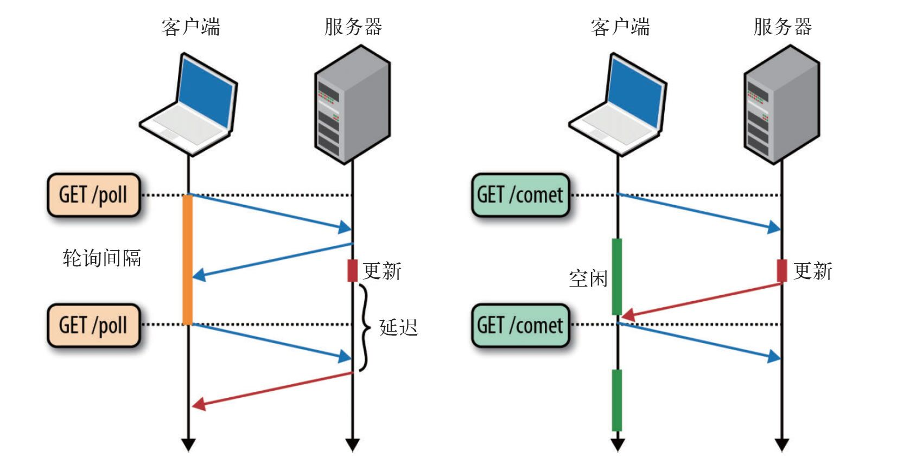

# Comet

基于`http`长连接的“服务器推”技术便被`hack`出来。这种技术被命名为`Comet`,

`Ajax`是一种从页面向服务器请求数据的技术，而`Comet`则是一种服务器向页面推送数据的技术。

`Comet`能够让信息近乎实时地被推送到页面上，非常适合处理体育比赛分数和股票报价。

## Comet的实现

基于`Comet`的实现有两种方法：

1. 基于`Ajax`的长轮询`(long-polling)`方式
2. 基于`Iframe`及`htmlfile`的流(`http streaming`)方式

### 基于Ajax的长轮询

在短轮询的基础上做一些改进, 在将要返回的数据没有变化时, 不进行返回响应, 等到数据有更新时, 才进行响应的返回：当客户端向服务器发送`Ajax`请求时, 服务器收到请求后会挂起, 直到有数据更新后在将返回响应并关闭连接。

可以通过如下实现：

```js
function polling () {
    let xhr = new XMLHttpRequest();
    xhr.open('get'  , URL, true);
    xhr.onreadystatechange = function () {
        if (xhr.readyState === 4) {
            let status = xhr.status;
            if (status >= 200 && status < 300 && status === 304) {
                // dosomethings, 之后继续发送下一个请求
                polling();
            } else {
                // ...
            }
        }
    }
}
```



### 基于http流的长轮询

通过在`HTML`页面里面嵌入一个隐藏的`<iframe>`, 然后给该标签的`src`属性指定一个长连接请求, 服务器端则可以不停地返回数据，相对于第一种方式，这种方式跟传统的服务器推则更接近。

在第一种方式中，浏览器在收到数据后会直接调用JS回调函数，但是这种方式该如何响应数据呢？可以通过在返回数据中嵌入JS脚本的方式，如`<script type="text/javascript">js_func('data from server')</script>`，服务器端将返回的数据作为回调函数的参数，浏览器在收到数据后就会执行这段JS脚本。

缺点：`IE`、`Morzilla Firefox` 下端的进度栏都会显示加载没有完成，而且 IE 上方的图标会不停的转动，表示加载正在进行。`Google` 的天才们使用一个称为“`htmlfile`”的 `ActiveX` 解决了在 `IE` 中的加载显示问题，并将这种方法应用到了 `gmail+gtalk` 产品中。

## Websocket：一个独立的持久连接上提供全双工、双向通信网络技术

>Websocket是一个全新的、独立的协议，基于TCP协议，与http协议兼容、却不会融入http协议。

在创建`Web Socket`之后，会有一个`HTTP`请求发送到浏览器以发起连接。在取得服务器响应后，建立的连接会使用`HTTP`升级从`HTTP`

协议交换为`Web Socket`协议。
此时URL协议会有不同：未加密的连接是`ws：//`；加密的连接为`wss：//`。

```js
var socket = new WebSocket("ws://www.example.com/server.php");
```

**注意必须给WebSocket构造函数传入绝对URL且它不受同源策略的限制**。

实例化`WebSocket`对象后，浏览器会马上尝试创建连接。同XHR类似，它也有一个表示当前状态的`readyState`属性：

+ `WebSocket.OPENING (0)`：正在建立连接。
+ `WebSocket.OPEN (1)`：已经建立连接。
+ `WebSocket.CLOSING (2)`：正在关闭连接。
+ `WebSocket.CLOSE (3)`：已经关闭连接。

要关闭`WebSocket`可以在任何时候调用`close()`方法。

要向服务器发送数据，使用`send()`方法并传入任意的字符串即可，该方法只能发送**纯文本**数据，对于复杂的数据必须进行序列化(`JSON.stringify()`)。

>当服务器向客户端发来信息时，WebSocket对象就会触发`message`事件，在事件的`event.data`属性中保存着返回的数据（字符串）。

它还拥有其他三个事件：（只能通过DOM 0级指定事件处理程序）

+ `open`：在成功建立连接时触发
+ `error`：在发生错误时触发，连接不能持续
+ `close`：在连接关闭时触发。

在三个事件中仅`close`事件的`event`对象有额外的属性, 它们分别且含义为：

+ `wasClean`：表示连接是否已经明确地关闭
+ `code`：服务器返回的数值状态码
+ `reason`：一个字符串，包含服务器发回的消息。

## SSE(Server-Sent Event，服务端推送事件)

用于创建到服务器的单向连接，服务器通过这个连接可以发送任意数量的数据。服务器响应的MIME类型必须是`text/event-stream`。SSE支持轮询和HTTP流，而且能在断开连接时自动确定何时重新连接。（IE不支持）

要预定新的事件流，首先要创建一个新的`EventSource`对象

```js
var source = new EventSource("myevents.php");
```

传入的URL必须与创建对象的页面同源（相同的URL模式、域及端口）

### SSE事件处理

该实例有一个`readyState`属性，0表示正在连接到服务器，1表示打开了连接，2表示关闭了连接。

此外拥有三个事件：

+ `open`：在建立连接时触发
+ `message`：在从服务器接收到新数据时触发
+ `error`：在无法建立连接时触发

服务器发回的数据以字符串形式保存在`event.data`中

默认情况下，`EventSource`对象会保持与服务器的活动连接。如果连接断开还会重新连接。这意味着SSE适合长轮询和HTTP流。如果要强制断开连接并且不再重新连接，可以调用`close()`方法来强制断开连接。

```js
source.close();
```

所谓的服务器事件会通过一个持久的HTTP响应发送，这个响应的MIME类型为`text/event-stream`。响应的格式是**纯文本**，最简单的情况是每个数据项都带有前缀`data：*`，例如：

```js
data：foo

data：bar

data：foo
data：bar
```

#### 数据的接收

在`message`事件`event.data`属性存放服务器作为该事件的负载发送的任何字符串; `event.type`属性，默认值为`message`，事件源可以修改这个值。

>`onmessage`事件处理程序接收从一个给定的服务器事件源发出的所有事件，如果有必要，也可以根据`type`属性派发一个自定义事件。

对于以上响应而言，事件流中的第一个`message`事件返回的`event.data`值为`foo`; 第二个`message`事件返回的`event.data`为`bar`; 第三个为`foo\nbar`（中间为换行符）。

>对于多个连续的以`data：*`开头的数据行，将作为多段数据解析，每个值之间以一个换行符分隔（`\n`）。只有在包含`data：*`的数据行后有空行时，才会触发`message`事件。

通过id：前缀可以给特定的事件指定一个关联的ID，这个ID行位于data：行前面或后面皆可：
```js
data：foo
id：1
```

设置ID后，`EventSource`对象会跟踪上一次触发的事件。如果连接断开，会向服务器发送一个包含名为`Last-Event-ID`的特殊HTTP头部的请求，以便服务器知道下一次该触发哪个事件。

## SSE与Websocket之间的对比
+ Websocket能做的事SSE也能做到, 但两种各有千秋。相比Websocket, SSE更加简洁便利(学习成本低);

+ Websocket相比与SSE存在的优势在于WebSocket是二进制协议，而SSE是文本协议（通常使用UTF-8编码）。当然，我们可以通过SSE连接传输二进制数据：在SSE中，只有两个具有特殊意义的字符，它们是CR和LF，而对它们进行转码并不难。但用SSE传输二进制数据时数据会变大，如果需要从服务端到客户端传输大量的二进制数据，最好还是用WebSocket。

+ Websocket相较于SSE在最大优势在于其是双向流通的, 无论从哪一端发送数据的开销都一样;用SSE时，一般通过一个独立的Ajax请求从客户端向服务端传送数据，所以开销会多一点。在频率不高的通信中两种区别不大。

[参考](http://www.52im.net/thread-334-1-1.html)