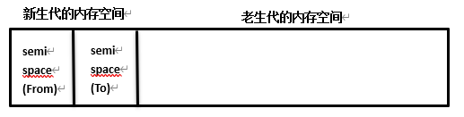
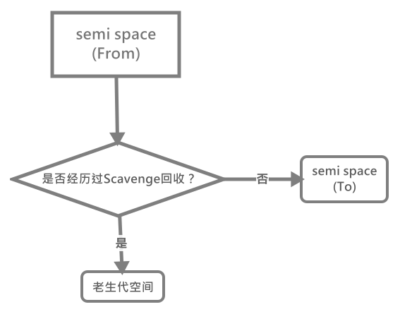
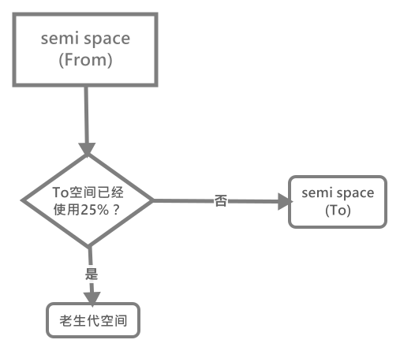
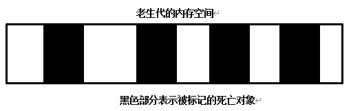
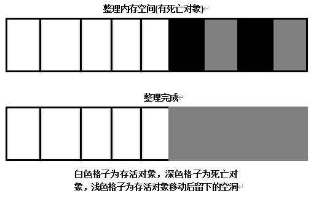

# 浏览器内存管理

这里的内存管理主要指其在垃圾回收方面，这里我们主要学习`V8`(即浏览器端`Chrome`或`NodeJs`)的垃圾回收机制。

## 内存分配

首先在`V8`中，所有的对象都**通过堆来进行分配**。当我们在代码中声明变量并赋值时，所在对象的内存就会分配到堆中。如果已申请的堆空闲内存不够分配新的对象，那么就会继续申请堆内存直到堆内存的上限。堆内存总体按两个空间进行划分：

- 新生代空间(`new space`)
- 老生代空间(`old space`)

顾名思义，**新生代空间即指那些刚加入内存或存活时间不太久的对象；老生代即指那些存活时间较长的对象**。

>默认情况下，在`64`位操作系统中，`V8`堆内存的最大值为`1464MB`(`1400MB`老生代与`64MB`新生代)；在`32`位操作系统中，`V8`堆内存的最大值为`732MB`(`700MB`老生代与`32MB`新生代)

在新生代空间中，其又被平分为两个空间，`from space`和`to space`，前者用来存放**刚加入内存**中的对象，而后者则用于存放在**一次垃圾回收算法后仍存活**的对象。

那么空间的划分就到此为止，接下来对垃圾回收的过程进行学习。

## V8的垃圾回收机制

V8的垃圾回收策略是基于**分代式垃圾回收机制**的。原因是因为针对每个生代空间的对象各自的生命周期长短不一：新生代存活时间较短，老生代存活时间较长。只有分别针对它们进行处理才能使垃圾回收更加高效。

### 新生代空间

首先新生代空间是基于`Scavenge`算法进行垃圾回收，`Scavenge`算法的具体实现采用了`Cheney`算法。`Cheney`算法是一种采用复制的方式实现的垃圾回收算法。它将新生代空间的堆内存一份为二，每一部分空间都被称为`semispace`。在这两个`semispace`中，**只有一个处于使用中，而另一个则处于限制状态**。处于使用中的空间被称为`from semispace`，处于限制的空间被称为`to semispace`。

对象内存空间的分配和垃圾回收按以下顺序执行：

1. 首先对象在`From`空间中进行分配。
2. 待开始垃圾回收开始时，首先将`From`空间仍存活的对象复制至`To`空间，把非存活的对象释放掉。
3. 复制完成后，交换`From`空间和`To`空间的对象

从上述的过程我们可以看到，`To`空间内永远只包含了每次垃圾回收后的存活对象。

>`Scavenge`算法的**缺点**是只能使用新生代内存空间的一半。但由于生命周期较短的存活对象只占其中较少的部分，所以(释放这部分对象)其时间效率高。

### 老生代空间

当一个对象经过了多次复制后依然存活时，它将会被认为是生命周期较长的对象。这种生命周期较长的对象之后会被移动到老生代空间，用新的算法进行管理，这个转移的过程被称为**晋升**。

#### 存活对象晋升的方式

在`Scavenge`算法中，`From`空间的存活对象会被复制到`To`空间，然后两者进行互换。**晋升**则是在分代式垃圾回收的前提下，`From`空间的存活对象在**被复制**到`To`空间**之前**时，首先要进行检查，如果满足以下两个条件**其中一个**，那么将存活周期长的对象就移至老生代空间：

- 该对象经历过`Scavenge`回收
- `To`空间存活对象占比超过限制

情况1：在默认情况下，`V8`的对象分配只要发生在`From`空间。当对象从`From`空间复制到`To`空间时，首先会检查该对象的内存地址来查看其是否经历过`Scavenge`回收。

情况2： 当进行`Scavenge`算法时，要从`From`空间复制存活对象至`To`空间，如果`To`空间的空间使用占比已经超过`25%`，那么直接将其晋升老生代空间。

设置该限制的原因是因为当这次`Scavenge`回收完成后，这个`To`空间将变为`From`空间，接下来的内存空间的分配将在这个`To`空间进行，如果此时内存空间占比过高，那么会影响后续的内存分配。

#### 老生代垃圾回收管理

对于老生代空间中的对象，由于其存活对象的占比大，如果进行采用`Scavenge`算法那么会出现两个问题：

- 复制效率低，由于存活对象较多
- 空间浪费，由于只能使用一半的空间

所以针对老生代空间，`V8`采用`Mark-Sweep`与`Mark-Compat`相结合的方式来进行垃圾回收。

##### Mark-Sweep 标记清除

相信大家对这个词语并不陌生，该算法就如名字所说，使用两个阶段进行处理：

1. 标记阶段：遍历堆中所有对象，并标记存活的对象
2. 清除阶段：清除没有被标记的对象

可以看出它与`Scavenge`算法的区别：`Scavenge`算法只复制存活的对象，`Mark-Sweep`算法只清除死亡的对象，**存活对象在新生代中占用一小部分内存，死亡对象在老生代中也只占用一小部分内存**，这就是这两种算法高效的原因。

当然这种算法最大的问题在于其在进行一次标记清除回收后，**内存空间会出现不连续**的状态。这种内存碎片会对后续的内存分配造成问题，当分配一个较大对象时，所有的碎片空间不足以完成此处分配，就会提前触发一次不必要的垃圾回收。

##### Mark-Compat 标记整理

为了解决上述问题，`Mark-Compat`算法被提出，它由`Mark-Sweep`演变而来，它们之间的区别在于，**当对象被标记死亡后，在整理的过程中，将存活的对象往一端移动，移动完成后，直接清理掉边界外的内存**。

完成移动后，就可以直接清除最右边的存活对象后面的内存区域完成回收。

### 三种算法的对比

回收算法|Mark-Sweep|Mark-Compat|Scavenge
:-|:-|:-|:-
速度|中等|最慢|最快
空间开销|少(有碎片)|少(无碎片)|双倍空间(无碎片)
是否移动对象|否|是|是

从上表我们可以看到，在速度上由于`Mark-Compat`要移动对象，所以速度不可能很快，所以在取舍上，**`V8`主要使用`Mark-Sweep`，在空间不足以对从新生代晋升过来的对象进行分配时，才使用`Mark-Compat`**。

### 改进

为了避免Javascript应用逻辑与垃圾回收器看到的不一致的情况，所以在进行以上三种垃圾回收时都要将应用逻辑暂停下来，待执行完垃圾时再恢复执行应用逻辑，这种行为被称为**全停顿**(`stop-the-world jojo`)

在`V8`的分代式垃圾回收中，一次小垃圾回收即使进行全停顿的影响也不会很大，因为新生代默认配置较小，且其中的存活对象较少。但`V8`的老生代通常配置得较大，且存活对象较多，全堆垃圾回收的标记、清除、整理等造成的全停顿的影响就较大。

#### Incremental Marking 增量标记

为了降低全堆回收带来的停顿时间，V8从标记阶段入手，将原本一口气停顿完成的标记阶段改为**增量标记**，也就是拆分为多步，每做完一步，就让应用逻辑执行一会儿，**垃圾回收与应用逻辑交替执行直到标记阶段完成**。

>经过改进后，垃圾回收的最大停顿事件可以减少到原来的`1/6`。

`V8`后续还引入延迟清理(`lazy sweeping`)与增量式整理(`incremental compaction`)，同时引进并行标记与并行清理。

## 内存泄漏排除

那么了解了一个具体的垃圾回收机制后，我们还需要清除如何去排查是否存在一个内存泄漏的情况。一般来说，当你的页面在重复执行某个步骤后越来越卡，那么可能就存在内存泄漏的情况，但是具体还是要借助浏览器的`Memory API`来进行确诊。

[内存泄漏的排查](./内存泄漏排查/README.md)
