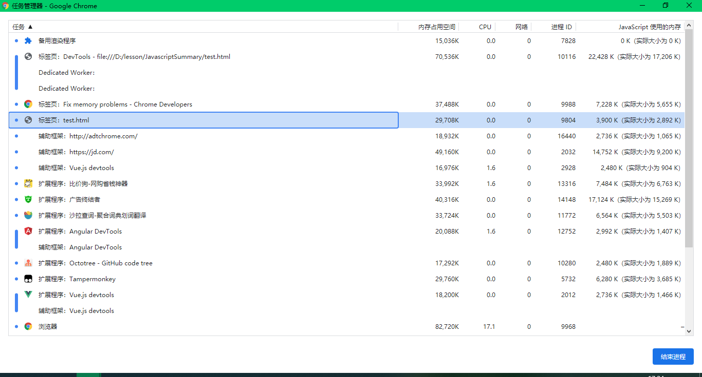
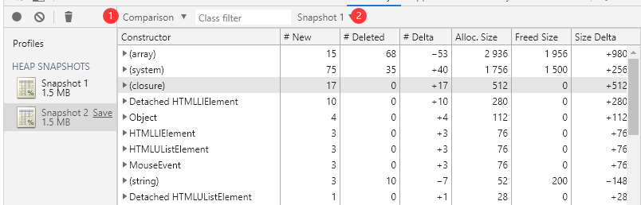

# 内存泄漏的排查

内存泄漏的排查是基于`Chrome Devtool`的`Memory`来进行实现的，它能记录某个时间点页面`JS`线程内存使用情况的快照，也能记录一段时间中页面`JS`线程内存使用的情况，并且我们可以根据它们来获取到具体这一时间段中增加或删除(回收)了哪些对象。

## 具体的内存问题

在内存问题中，具体的性能问题为如下几种：

- **页面的性能随着时间的延长越来越差**。 这可能是**内存泄漏**的症状。 内存泄漏是指，页面中的错误导致页面随着时间的延长使用的内存越来越多。
- **页面的性能一直很糟糕**。 这可能是**内存膨胀**的症状。 内存膨胀是指，页面为达到最佳速度而使用的内存比本应使用的内存多。
- **页面出现延迟或者经常暂停**。 这可能是**频繁垃圾回收**的症状。 垃圾回收是指浏览器收回内存。 浏览器决定何时进行垃圾回收。 回收期间，所有脚本执行都将暂停。因此，如果浏览器经常进行垃圾回收，脚本执行就会被频繁暂停。

### 关于内存膨胀如何来界定

内存膨胀的界定比较困难，相比内存泄漏来说，内存泄漏比较容易确定，只要网站使用的内存越来越多则说明发生了内存泄漏。而内存膨胀需要根据具体的设备上的运行情况来界定。(感觉还是比较含糊)

### 常见的内存泄漏问题

最常见的内存泄漏问题可能就是`DOM`节点的引用问题了。只有页面的`DOM`树或`JavaScript`代码不再引用`DOM`节点时，`DOM`节点才会被作为垃圾进行回收。 如果某个节点已从`DOM`树移除，但某些`JavaScript`仍然引用它，我们称此节点为“已分离”。已分离的`DOM`节点是内存泄漏的常见原因。

## 查询页面的内存实时使用情况

对于页面的使用情况，我们可以通过`Chrome`浏览器的更多工具中的任务管理器来查看各个页面内存使用情况，如图：


打开后为：



对某一个进程鼠标右键可以查看具体的线程的内存使用情况。在这些列表中比较重要的两个为：

- `Memory`(内存占用空间)，表示`DOM`节点存储在原生内存中。 如果此值正在增大，则说明正在创建`DOM`节点。
- `Javascript`(使用的内存)，表示 `JS` 堆。此列包含两个值。 您感兴趣的值是实时数字（括号中的数字）。 实时(实际大小)数字表示您的页面上的可到达对象正在使用的内存量。 如果此数字在增大，要么是正在创建新对象，要么是现有对象正在增长。

____
那么我们现在看看具体如何使用`Momery`

## 使用Devtool Momery

按下`F12`，选择`Memory`我们就可以选择其具体的模式：


通过该工具我们能查找到那些影响页面性能的内存问题，包括内存泄漏、内存膨胀和频繁的垃圾回收。

那么我们具体的例子以本目录下的`demo.html`为例，每次我们点击添加按钮时就会创建`10`个`DOM`节点，但这`10`个`DOM`节点并为在`DOM`树中，而是靠`JS`来引用它们。

现在我们打开页面与`Devtool Momery`，然后点击添加按钮，并使用`Head snapshot`进行一次快照的提取，如图：


得出的快照如下图：


那么下面对其中的信息进行一个解读：

### 字段说明

首先是快照左边(标记1)的内存，它表示`JS`线程中**可到达对象的大小**

>只有可到达对象才会包含到快照中。此外，拍摄快照始终从垃圾回收开始。意思就是**每次我们取快照前都会进行一次垃圾回收**

其次是(标记2)上方的一个视图的选择(默认为`Summary`)，它共有三个值分别表示：

- `Summary`视图：显示按构造函数分组的对象。我们可以根据对应构造函数下的对象来了解其内存的使用情况。(此视图适合用来跟踪DOM泄漏)
- `Containment`视图允许您探索堆内容。此视图提供了一种更好的对象结构视图，有助于分析全局命名空间 (`window`) 中引用的对象。使用此视图可以分析闭包以及在较低级别深入了解您的对象。
- `Comparison`：视图可以显示两个快照之间的不同。使用此视图可以比较两个（或多个）内存快照在某个操作前后的差异。检查已释放内存的变化和参考计数让您可以确认是否存在内存泄漏及其原因。
- `Statistics`：针对于`Summary`的饼图。

那么如图上所示我们还能看到有4个标号的字段，它们的含义分别为：

- `Constructor`：表示使用该构造函数创建的所有对象，后面的`x?`就表示具体的实例数目。
- `Distance`：显示使用节点最短简单路径时距根节点的距离。
- `Shallow Size`：列显示通过特定构造函数创建的所有对象浅层大小的总和。浅层大小是指对象自身占用的内存大小（一般来说，数组和字符串的浅层大小比较大）
- `Retained Size`：列显示同一组对象中最大的保留大小。某个对象删除后（其依赖项不再可到达）可以释放的内存大小称为保留大小。

### Comparison视图——对比视图

那么我们经常使用的就是对比视图，我们可以通过多个快照，来查找泄漏的对象，具体可以按以下步骤：

1. 执行任何操作前拍摄一个快照
2. 执行操作(某种你认为可能造成内存泄漏的交互)
3. 执行反向操作(执行反向交互并重复多次)
4. 拍摄第二个快照，将视图设置为`Comparison`(图标1)并指向之前的那个视图(图标2)

如图，图为触发事件前后的对比：



通过对比其中的字段，我们就能知道这两个快照之间实例的增删情况。

### 使用快照来排查

下面有两个使用快照来排查内存泄漏的例子：

#### 实例1——闭包泄漏

当我们创建闭包时，如果闭包函数为命名函数或赋值给某个变量，那么我们可以通过快照中的`closure`来找到对面命名的闭包函数(或者对应赋值变量)，例如`closure.html`中的代码：

```js
function createLargeClosure() {
    var largeStr = new Array(1000000).join('x');

    var lC = function lC() { // this IS a named function
        return largeStr;
    };

    detachedNodes = lC;
}
```

我们每次会创建一个`lC`闭包函数，此时我们通过快照对应的板块能找到该函数，如图：


#### 实例2——发现DOM泄漏

当一个`DOM`元素脱离`DOM`树后，如果我们还对其保有引用，那么它会出现`detached`字段中，通过该字段，我们就可以看到哪些`DOM`节点已经不再`DOM`树中但仍被引用。(对应`dom.html`)，代码如下：

```js
function create() {
    var ul = document.createElement('ul');
    for (var i = 0; i < 10; i++) {
        var li = document.createElement('li');
        ul.appendChild(li);
    }
    detachedTree = ul;
}
```

在触发该函数前后获取快照并选择对比视图，筛选`detached`字段，结果如下图


从图中我们可以看到，不在`DOM`树中的节点有`11`个(`1`个`ul`，`10`个`li`)

#### 特殊的DOM泄漏

在以下的代码中，可能会发生特殊的`DOM`的不可见泄漏，假设`leaf`为`tree`的子节点：

```js
var select = document.querySelector;
var treeRef = select("#tree");
var leafRef = select("#leaf");
var body = select("body");

// 现在#tree不能被垃圾回收，因为还保持着引用
body.removeChild(treeRef);

//#tree 不能进行垃圾回收，因为它仍被leaf元素引用(因为它为它的父元素)
treeRef = null;

// 现在#tree可以被垃圾回收了
leafRef = null;
```

它们有如图所示的结构：


`#leaf`可以维持对其父级(`parentNode`)的引用，并以递归方式返回`#tree`，因此，只有 `leafRef`被作废后，`#tree`下的整个树才会成为`GC`的候选。

所以`DOM`泄漏有时往往比我们看见的更大。

### 使用分配时间线来排查

除了使用快照外，我们还可以选择使用`Allocation instrumentation timeline`来排查内存泄漏。考虑下面这个例子：

```js
var x = [];

function grow() {
    x.push(new Array(1000000).join('x'));
}

document.getElementById('grow').addEventListener('click', grow);
```

每次点击按钮，就会向`x`中添加一个字符串，此时我们选择`Allocation instrumentation timeline`，然后开始记录，之后执行我们怀疑有内存泄漏的操作。完成后点击停止记录，等待分析的结果，在`timeline.html`中得出的结果为下(点击三次按钮)：


图中的蓝色竖线表示新内存的分配，通过选择对应蓝色竖线，我们可以看到其具体创建的东西：


通过下面的`Object`，我们能查看到其具体被分配的位置。

#### 发现频繁的垃圾回收

您可以使用`Chrome`任务管理器或者`Timeline`内存记录发现频繁的垃圾回收。 在任务管理器中，`Memory` 或 `JavaScript Memory`值频繁上升和下降表示存在频繁的垃圾回收。在 `Timeline` 记录中，`JS`堆或节点计数图表频繁上升和下降指示存在频繁的垃圾回收。

[参考Chrome指南](https://developers.google.com/web/tools/chrome-devtools/memory-problems#%E4%BD%BF%E7%94%A8%E5%88%86%E9%85%8D%E6%97%B6%E9%97%B4%E7%BA%BF%E7%A1%AE%E5%AE%9A_js_%E5%A0%86%E5%86%85%E5%AD%98%E6%B3%84%E6%BC%8F)