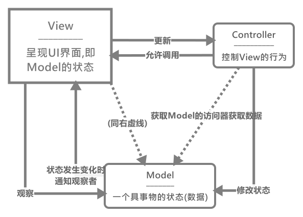
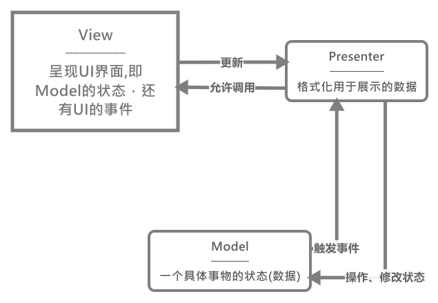
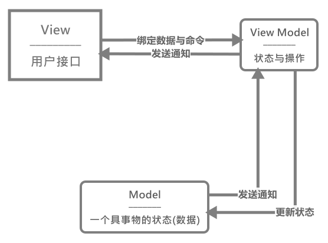

# MV*模式

这里我们主要是学习三个常见但重要的架构模式：`MVC`(模型-视图-控制器)和`MVP`(模型-视图-表示器)和`MVVM`(模型-视图-视图模型)，那么首先来了解一下关于它们的基础知识。

## MVC

`MVC`是一种架构设计模式，它通过关注点分离鼓励改进应用程序组织。它强调将业务数据(`Model`)与用户界面(`View`)隔离，第三个组件(`Controller`)管理逻辑和用户输入。

最初一个被称为分离表示的概念被用作在领域对象和表示对象之间做清晰划分的方法，领域对象在现实世界中塑造概念(如一张图片、一个人)，表示对象将具体画面呈现给用户。之后，`Smalltalk`进一步延伸了这一概念，在其中新增了一个从用户界面分离出应用程序逻辑的目的组件，它的目的在于解耦应用程序的这些部分，并同时将其应用程序的其他接口实现`Model`(模块)复用。在这个阶段，`MVC`的主要构成为以下部分：

- `Model`代表特定于领域的数据，不了解用户界面(`View`(视图)和`Controller`(控制器))。当一个`Model`(模型)改变时，它会通知它的观察者。
- **`View`描绘的是`Model`的当前状态**，即当前展示给用户的视图。`Observer`模式用于让`View`了解`Model`什么时候更新或修改。
- `Presentation`由`View`关注，但不只是单个`View`(视图)和`Controller`(控制器)，**屏幕上显示的每个部分或者元素都需要`View-Controller`对**。
- **`Controller`在这个`View-Controller`对中的作用是处理用户交互**，为`View`做决定。

在该模式中，`View`观察到`Model`，当`Model`发生变化时，`View`立即做出反应。这里我们可以清楚的看出其用到了`Observer`模式，在此，**为了让应用程序变得有用，在`Model`中对数据的任何更改都应该使`View`立即刷新**。

### Model(模型)

`Model`管理应用程序的数据。`Model`不涉及用户界面，也不涉及表示层，而是代表应用程序可能需要的独特形式的数据。**当`Model`(模型)改变时(如它更新时)，它通常会通知它的观察者(如`View`(视图))**

**一个`Model`(模型)可能存在多个观察它的`View`(视图)**。比如上述的图片包含3个元数据，图片的`URL`、标题和是否显示，对于前两个部分，完全可以单独提供两个`View`(视图)来对其进行显示。

这里一个`Model`就涉及(或拥有)一个管理应用程序状态`state`(即里面的数据)，它们主要和业务数据有关。

### View(视图)

**视图则是`Model`(模型)的可视化表示**，表示当前`Model`的`state`(状态)下的视图。

**在`Javascript`中`View`是关于构建和维护一个`DOM`元素**，一个`View`(视图)通常检测一个`Model`(模型)，并在`Model`(模型)更改时通知，时`View`(视图)本身能够相应的更新。

用户可以与`View`(视图)交互，包括读取和编辑`Model`(模型)，即在`Model`(模型)中获取或设置相应的属性。但是，**当用户编辑`Model`时，更新`Model`的实际任务其实是在`Controller`(控制器)上完成的**。(实际的事件添加在该组件中完成)

#### 模版

在支持`MVC/MV*`的`Javascript`框架上下文中，都会涉及一个`Javascript`模版。这里有两个经典的模版解决方案(`Handlebars.js`和`Mustache`)，它们通常是用于将`View`模版定义为包含模版变量的标记，并可以使用特殊的变量语法来对变量进行定界(例如`{{name}}`就表示一个变量`name`)。同样，框架可以接收`JSON`形式的数据(`Model`模型实例可以被转换为这种形式，这样我们就可以独立的专注于编写`Model`与模版，它们之间的数据绑定工作就交给框架来完成。

但是注意模版本身并不是`View`(视图)，`View`是一个用于检测`Model`并保持可视化表示更新的对象。模版可能是一种指定部分或甚至所有`View`对象的**声明方式**。

### Controller(控制器)

`Controller`(控制器)是`Model`(模型)和`View`(视图)之间的中介，当用户操作`View`(视图)时，它通常负责更新`Model`(模型)。

例如，在一个图片库应用中，`Controller`(控制器)将负责处理用户对特定图片`View`(视图)的编辑更改，当用户完成编辑后，更新一个特定的图片`Model`(模型)。

### MVC为我们提供了什么

`MVC`中的这种关注点分离有利于进一步简化应用程序功能的模块化，并能够实现：

- **整体维护更容易。**
- **解耦`Model`(模型)和`View`(视图)**，这意味着它能够更直接地编写业务逻辑的单元测试。
- 在整个应用程序中，底层`Model`(模型)和`Controller`(控制器)**代码的重复被消除**了。

### 总结MVC模式中组件关系

从上面的描述中我们可以得出三个组件的以下关系：

1. `View`负责展示当前`Model`的`State`(数据/状态)
2. `Model`数据发生改变，通知`View`更新视图
3. 用户操作`View`，之后的业务逻辑由`Controller`决定是否执行
4. `Controller`可以更改`Model`中的`State`

此时可以看放在最上面的图片，帮助理解，下面给出个具体的代码实例

[MVC一个例子](./MVC/MVC.html)

## MVP

模型-视图-表示器(`MVP`)是`MVC`设计模式的一种衍生模式，专注于改进表示逻辑。

### Model、View和Presenter

`MVP`中的`P`代表表示器。**这是一个包含用于`View`(视图)的用户界面业务逻辑的组件**。与`MVC`不同，来自`View`的调用将委托给表示器，表示器是从`View`中解耦，通过接口与它对话。

与`MVC`模式不同的是，在`MVP`中，当`Model`(模型)变化时，监控`Model`和更新`View`。`P`将`Model`效地绑定至`View`，这是以前在`MVC`中`Controller`的责任。

**由`View`进行请求，表示器执行任何与用户请求有关的工作，并将数据回传给它们**。在这方面，它们检索数据并操作数据，并确定应如何在`View`中显示这些数据。`Model`可能会触发事件，表示器的角色是订阅它们，这样就可以更新`View`。(这里由`Presenter`来订阅`Model`)在这种被动架构中，没有直接数据绑定的概念。**`View`暴露了`setter`设置器，表示器可以用它来设置数据**。

### MVP模式优点

MVP模式的优点是能够提高应用程序的可测试性，在`View`和`Model`之间提供更清晰的分离。但同时也带来了一个问题——没有`Model-View`的数据绑定，所以要单独关注这个任务。

### 总结MVP模式中组件关系

从上面的描述中我们可以得出三个组件的以下关系：

1. `View`和`Model`组件分离，不产生直接关系。
2. `View`暴露一个变量接口，提供`Presenter`来设置视图上的这些变量。
3. 业务逻辑还是由`Presenter`来接管。
4. `Model`的改变要由`Presenter`来呈现到`View`组件上。

此时回过头去看最初的图，是否有更直观的理解。

[代码示例](./MVP/index.html)

## MVVM

`MVVM(`模型——视图——视图模型)是一种基于`MVC`和`MVP`的架构模式，它试图更清晰地将用户界面(`UI`)开发从应用程序的业务逻辑与行为中分离。为此，很多这种模式的实现都要利用声明式数据绑定来实现将`View`工作从其他层分离。

这有助于在同一个代码库中`UI`和开发工作的同时进行。`UI`开发人员在其文档标记(`HTML`)内编写到`ViewModel`的绑定，其中的`Model`和`ViewModel`都由研究应用程序逻辑的开发人员来进行维护。

### Model

同其他的架构模式一样，`MVVM`中的`Model`(模型)也表示一个特定的对象(比如一个用户账户，一张照片等等)

**`Model`保存着信息**，但通常不处理行为。它们不会格式化信息或影响数据在浏览器中显示的方式，因为这不是它们的责任。**数据格式化应由`View`来处理，而行为是业务逻辑应该封装在`ViewModel`中**。

### View

与`MVC`一样，`View`实际上仅是与用户进行交互的应用程序的一部分。它是一个交互式`UI`，描绘`ViewModel`的状态。`MVVM`的主动`View`包含数据绑定、事件和行为。但是要注意的是，`View`并不负责处理状态；它仅仅是让状态与`ViewModel`保持同步。

在这里`View`显示来自`ViewModel`的信息，向它传递命令并在`ViewModel`的状态变化时进行更新。

### ViewModel

可以将`ViewModel`作为一个专门的`Controller`，充当数据转换器。**它将`Model`信息转变为`View`信息，还将命令从`View`传递到`Model`**。

`ViewModel`位于`UI`层的后面。它暴露`View`所需的数据(从`Model`那里)，可以被视为`View`数据和操作的源头。

### 小结View与ViewModel

**`View`和`ViewModel`之间通过数据绑定和事件进行通信。`Model`和`ViewModel`上的属性通过双向绑定进行同步和更新**。

### 小结Model与ViewModel

`ViewModel`似乎是完全负责`MVVM`中的`Model`。**`ViewModel`为了数据绑定而暴露`Model`或`Model`属性，也可以包含接口，用于获取和操作在`View`中暴露的属性**。

### 总结MVVM模式中组件关系

从上面的描述中我们可以得出三个组件的以下关系：

1. `View`与`ViewModel`进行数据绑定，包括其事件、行为等等，`ViewModel`与`Model`进行数据的双向绑定。
2. `View`使用的`Model`的数据是通过`ViewModel`格式化后的`Model`的子集(当然也可以为原数据)
3. `Model`仍保留原数据信息

对比之前的图片，加深理解。

[MVVM实例](./MVVM/index.html)

## MVC、MVP与MVVM

`MVP`与`MVVM`均为`MVC`的衍生品。`MVC`与其他衍生品之间的主要区别是每一层对其他层的依赖，以及它们是如何紧密地互相绑定的。

在`MVC`中，`View`位于架构之上，与``Controller``相邻。`Model`位于`Controller`之下，因此`View`了解`Controller`，`Controller`了解`Model`。**在这里，`View`能够直接访问`Model`**。但是，想`View`暴露完整的`Model`可能会带来安全性和性能成本，这取决于应用程序的复杂性。

在`MVP`中，`Controller`的作用被`Presenter`所替代。表示器与`View`位于同一位置，监听`View`和`Model`的事件，并调解它们之间的行动。与`MVVM`不同，它没有使用将`View`绑定至`ViewModel`的机制，因此我们转而依赖每个`View`来实现用于让`Presenter`与`View`进行交互的接口。

因此，`MVVM`允许我们创建`Model`的特定于`View`的子集，它们可以包含状态和逻辑信息，无需向`View`暴露整个`Model`。与`MVP`的`Presenter`不同，引用`View`时不需要`ViewModel`。View可以绑定到`ViewModel`的属性上，而属性会将`Model`所包含的数据暴露给`View`。
