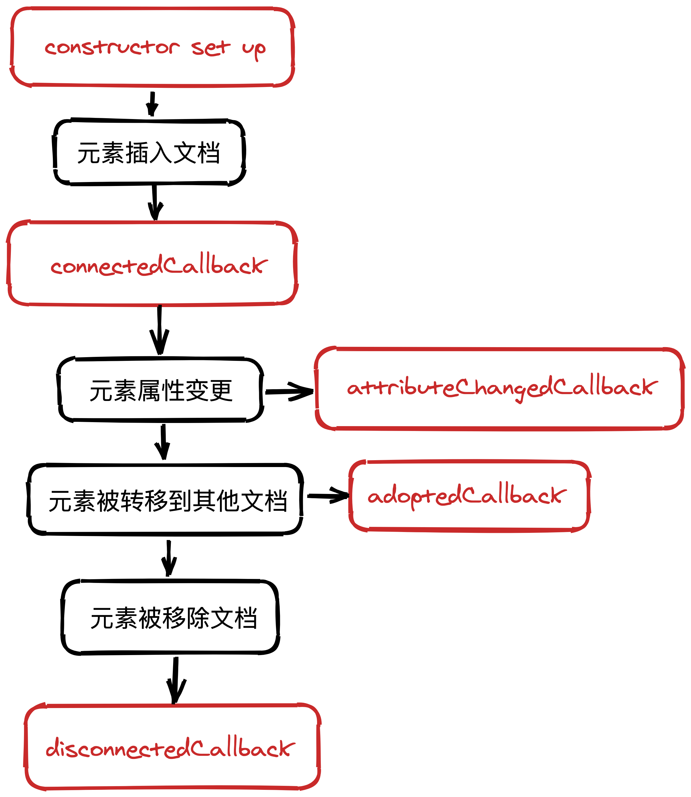
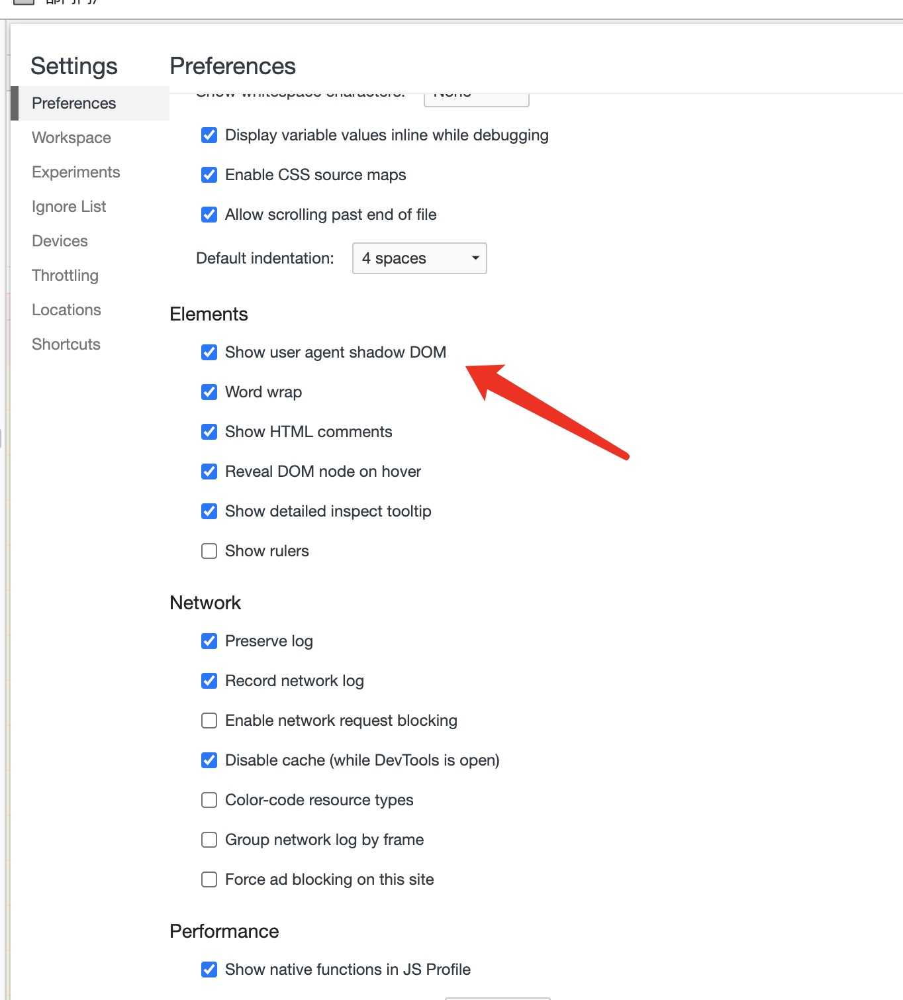
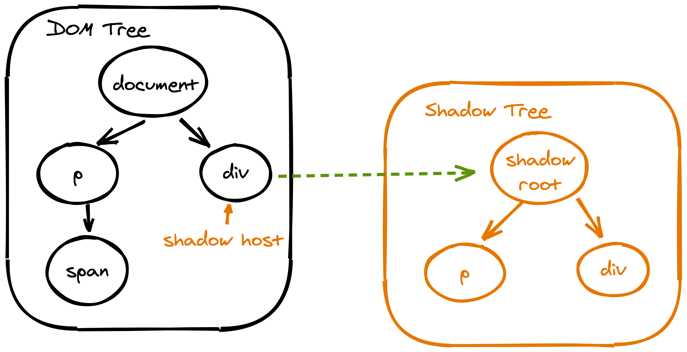
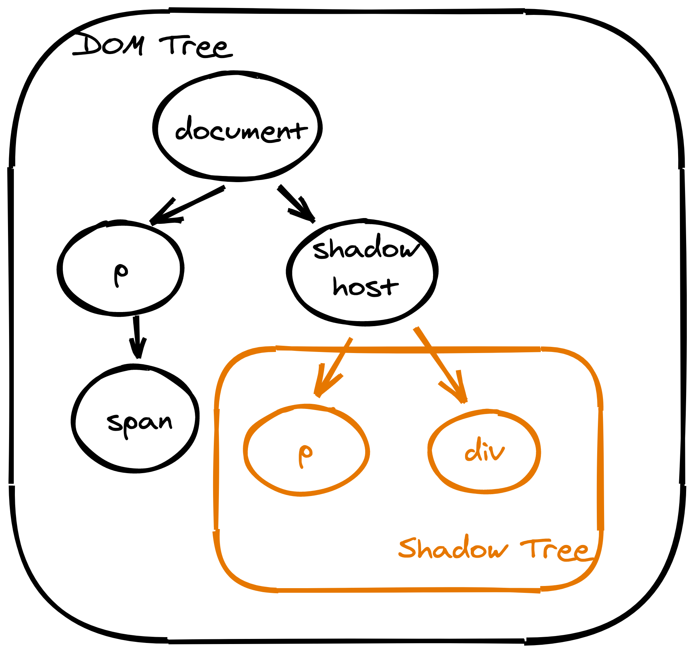
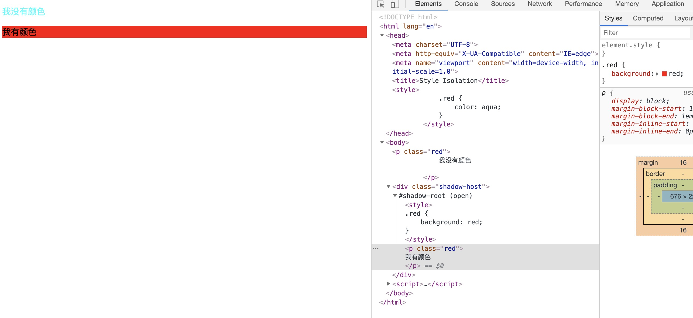
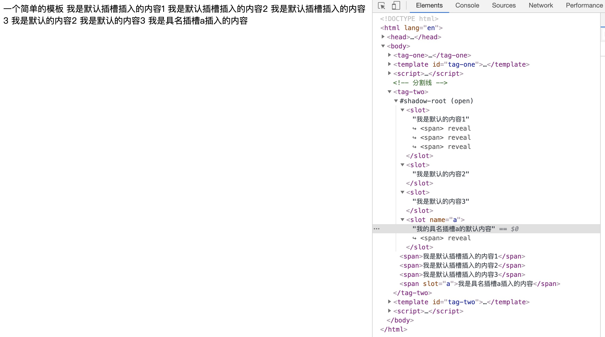

# Web Components(页面组件)

`Web Components`由 4 个部分组成：

-   `CustomElements`自定义元素
-   `ShadowDOM`影子`DOM`
-   `HTML Template/Slot`插槽与模板
-   `ES Module`模块

一个常用的`Web Component`的制作方法通常为以下步骤

1. 通过`Template/Slot`书写组件的`HTML`模板
2. 通过`CustomElement`来注册当前自定义元素，并定义其行为
3. 将`HTML`模板定义到`ShadowDOM`中，并附着到注册的自定义元素上
4. 立即使用它！

下面将这些组成页面组件的组件拆分别分别讲解，最后在通过一个例子来查看它们相互合作的方式。

## CustomElements — 自定义元素

`Web Components`中一个特性就是允许用户将一个`HTML`页面封装为一个自定义元素，这样用户可以通过该自定义元素来直接使用其封装好的功能。

自定义元素一共分为两种：

-   独立的新元素(`Autonomous custom elements`)，不基于浏览器内建(`build-in`)的`HTML`元素
-   继承于浏览器内建的`HTML`元素(`Customized built-in elements`)

根据它们性质的不同，它们的使用方式也有区别，接下来会分别针对进行区分。

### 创建自定义元素

目前自定义元素仅能通过继承`HTMLElement`的方式来创建，同时，你还需要在`CustomElementRegistry`创建的实例中来注册该元素。

> `window.customElements`即其创建的实例。

`customElements.define(name, class[, options ])`函数用于向自定义元素注册器中添加一个自定义元素，接受三个参数，第一个为注册元素的名称，它**必须**是连字符形式的；第二个参数为元素的类，它必须继承于`HTMLElement`类；第三个参数为一个可选参数，它是一个包含`extends`字段的配置对象，它指定了创建的元素会继承于哪个内建元素。

```js
// 注册一个独立元素
customElements.define('my-modal', class extend HTMLElement{
    constructor() {
        super()

        // ...
    }
})

// 注册一个基于内建元素的元素
customElements.define('my-modal', class extend HTMLElement{ ... }, { extends: 'p' })
```

向上面这样，我们就在全局中注册了一个名为`my-modal`的组件，之后通过`HTML`标签或`Javascript API`都能直接使用它。

通过装饰类，我们可以访问到该自定义元素的生命周期，具体如下:



其中上述生命周期函数分别为：

-   `connectedCallback()`: 当自定义元素首次插入文档`DOM`🌲 时调用
-   `disconnectedCallback()`：当自定义元素从文档`DOM`🌲 中被移除时调用(关闭浏览器或`tab`时不会调用)
-   `adoptedCallback()`：当自定义元素被移动到新的文档时，被调用(调用[`document.adoptNode(el)`](https://developer.mozilla.org/zh-CN/docs/Web/API/Document/adoptNode)时触发，你这辈子都用不上)
-   `attributeChangedCallback(attribute, oldVal, newVal)`：当自定义元素的属性发生变动时调用(仅对正在进行监听的属性生效)

通常来说，组件的设置应该推迟到`connectedCallback()`中进行，因为在构造函数执行时相关的元素、属性还未创建。在构造函数中，我们应该只对该组件的一些状态栈与`ShadowDOM`进行初始化。

**注意**，`attributeChangedCallback()`仅对正在监听的属性发生变动时生效，这表示我们必须通过定义一个`observedAttributes getter()`函数来指定监听的字段。该函数必须返回一个包含监听属性字符串的数组，比如：

```js
// 监听width/number属性
static get observedAttributes() {return ['width', 'number'] }
```

### 使用自定义元素

自定义元素的使用根据类型不同有需要注意的地方，不同类型的自定义元素的使用方式不一样。

这里还有一种统一的方式使用自定义元素，那就是直接获取其构造函数来使用:

```js
const ElConstructor = customElements.get('my-modal'),
    el = new ElConstructor()

// 或者下面的方式
```

#### 独立元素

独立元素没有内置元素的特性，在`HTML`中可以通过标签的形式直接使用，或通过`Javascript API`来创建：

```html
<my-component />
```

```js
document.createElement('my-component')
```

#### 继承内置元素

继承自内置元素的自定义元素稍微有一点不同，需要根据`is`属性来指定当前使用自定义元素的标签名称，比如：

```html
// 使用my-component组件
<p is="my-component" />
```

通过`API`创建时也一样

```js
document.createElement('p', { is: 'my-component' })
```

这样创建出来的自定义元素就会继承`p`标签的所有特性。

[MDN CustomElements](https://developer.mozilla.org/zh-CN/docs/Web/Web_Components/Using_custom_elements)

## ShadowDOM — 影子 DOM

`Web Components`的一个重要的特性就是封装——它可以将元素结构、样式和行为隐藏起来，并与其他代码隔离。这主要归功于`ShadowDOM`，`ShadowDOM`可以将一个独立、隐藏的`DOM`结构附着到一个元素上，这样虽然在`DOM`🌲 中期为一个自定义元素，但在其内部(`#shadow-root`)，其具有一个完整的`DOM`结构。

在我们的浏览器中，早已有`ShadowDOM`使用的痕迹，比如`video`元素的控件，通过在控制台设置该选项后，他们就能在`DOM`树中找到它。



现在来谈谈`ShadowDOM`的结构，正如其名字一样，其作为一个影子附着在真实的`DOM`元素上，这个被附着的`DOM`节点被称为`Shadow Host`；而`ShadowDOM`作为一个独立的`DOM`片段，其根节点被称为`ShadowRoot`，在根节点的下方则是任意的元素，没有限制。注意，`ShadowHost`与`ShadowRoot`不是同一个节点，它们存在下图所示关系。



渲染时，它们就以以下结构进行渲染



### 样式隔离与设置

我们可以通过对`DOM`的操作同样来操作`shadowDOM`，而且这些操作不会影响到`shadowDOM`外部的元素，即我们可以将这些行为封装在当前的`shadowDOM`中。这里我们在`DOM`树与`ShadowDOM`树中声明了一个通用的`p`标签且它们都具有`red class`:

```html
    <head>
        <style>
            .red {
                color: aqua;
            }
        </style>
    </head>
    <body>
        <p class="red">
            我没有颜色
        </div>
        <div class="shadow-host"></div>
        <script>
            const host = document.querySelector('.shadow-host')
            const shadowRoot = host.attachShadow({ mode: 'open' })
            shadowRoot.innerHTML = `
<style>
.red {
    background: red;
}
</style>
<p class="red">
我有颜色
</p>
`
        </script>
    </body>
```

而实际上内部和外部样式都没有对彼此的`DOM`元素产生影响:



> 当然你也可以通过`link`元素来引入外部样式，但这不好打断`shadowDOM`的绘制，所以此时可能会出现样式闪烁的问题

[查看完整例子代码](./style.html)

除此之外，如果你要为当前的`ShadowHost`节点从内部设置样式，你可以用`:host`选择器。默认情况下，`ShadowHost`的少部分`CSS`样式会继承自周围的样式，比如`color/font`，如果你想将`ShadowHost`节点的样式设置为其内部的默认值，则使用下面的样式：

```css
:host {
    all: initial;
}
```

但注意在外部定义在`ShadowHost`上的样式优先级大于内部通过`:host`定义的样式。注意这点，根据这点我们就可以通过预留`CSS`变量来让消费者在外部修改内部的样式：

```html
<style>
    :host {
        --bc: red;
    }
    p {
        color: var(--bc);
    }
</style>
<p>我可以通过外部定义颜色</p>
```

如上述`ShadowDOM`，消费者可以在外部通过为`ShadowHost`重新定义`--bc`变量来重写内部的颜色值。

### 创建 ShadowDOM

通过`Element.attachShadow()`方法，我们可以为一个元素创建一个影子`DOM`，并附着在该`DOM`节点上，根据传入的配置对象，其会决定返回的影子`DOM`是否可以从外部进行访问(获取`ShadowDOM`)。

```js
const el = document.querySelector('div')

// 允许访问内部
const shadowRoot = el.attachShadow({ mode: 'open' })

// 不允许访问内部shadowDOM
const shadowRoot = el.attachShadow({ mode: 'closed' })
```

之后我们可以通过`ShadowHost`节点来访问该`ShadowRoot`(前提是其附着的`ShadowDOM`为`open`模式，否则其会返回`null`)；同样，通过`shadowRoot.host`也可以访问到原附着元素:

```js
const shadowHost = document.querySelector('div'),
    shadowRoot = shadowHost.shadowRoot

shadowRoot.host === shadowHost // true
```

### ShadowDOM 与事件

来自自定义元素的标准事件在默认情况下会从`ShadowDOM`中冒泡出来。无论何时，一个从`ShadowDOM`中传播出来的事件都会发生重定向(_retargeted_)，所以这样事件对象就能表现得是从当前自定义元素发出的。即一旦事件从`ShadowDOM`中传播出来，那么其`event.target`会始终指向当前的`ShadowHost`元素。如果你想知道其具体是从`ShadowDOM`中哪里来，你需要访问其传播的路径`event.composedPath()`来进行追踪。

你可以通过抛出一个自定义事件让用户进行订阅：

```js
document
                .querySelector('my-c')
                .addEventListener('1custom', e =>
                    console.log('message from event:', e)
                )

customElements.define(
    'my-c',
    class extends HTMLElement {
        constructor() {
            super()
            ...
        }

        connectedCallback() {
            this.dispatchEvent(
                new CustomEvent('1custom', {
                    detail: { message: 'a custom event' }
                })
            )
        }
    }
)
```

注意事件的订阅一定要先于元素的注册，不然无法生效。但是如果一个在`ShadowDOM`中的节点想要抛出时间并冒泡到外层`DOM`则需要在创建自定义事件时标记`composed: true`，该属性就表示事[件是否能穿透`ShadowDOM`](https://developer.mozilla.org/zh-CN/docs/Web/API/Event)：

```js
this.shadowRoot.querySelector('p').dispatchEvent(
    new CustomEvent('1custom', {
        detail: { message: 'a custom event' },

        // 必须标志该属性
        composed: true
    })
)
```

[MDN ShadowDOM](https://developer.mozilla.org/zh-CN/docs/Web/Web_Components/Using_shadow_DOM)

## HTML Template/Slot — 插槽与模板

除了直接使用`shadowRoot.innerHTML = ...`这种语句外，我们可以使用`template`来代替。当我们需要在`DOM`中使用重复的`DOM`片段时或模板时，则我们可以通过定义`template`来进行实现。通过`template`元素创建的内容不会呈现在`DOM`中，但我们可以通过`Javascript API`去引用它来进行使用。

下面我们在`HTML`中创建了一个模板，并在新注册的元素中使用了它:

```html
<template id="tag-one">
    <span>一个简单的模板</span>
</template>
<script>
    customElements.define(
        'tag-one',
        class extends HTMLElement {
            constructor() {
                super()
                const templateContent = document.querySelector('#tag-one')
                    .content

                this.attachShadow({ mode: 'open' }).appendChild(
                    templateContent.cloneNode(true)
                )
            }
        }
    )
</script>
```

上面通过`id`获取到`template`元素，并通过其`content`属性获取到其文档片段(`DocumentFragment`)。此时我们通过`appendChild()`将其添加到`ShadowDOM`中。

> 注意上述的`template.cloneNode(true)`，由于使用`appendChild()`时，如果被添加的节点已为`DOM`节点，那么其会移动该节点而不是直接添加。所以我们需要通过`.cloneNode()`先进行复制一次，防止破坏原模板`DOM`片段

### 通过插槽组合影子 DOM — Slot

组合(`Composition`)指将消费者提供的标记与`ShadowDOM`组合起来的这一过程。这一过程是由`slot`元素的参与产生的——当我们在`ShadowDOM`中使用`slot`元素作为占位符，那么消费者就可以提供相关内容在这个部分进行渲染。消费者提供的片段被称为显式`DOM`(`light DOM`)，它会与`Shadow DOM`一起进行组合然后形成要被渲染的`DOM Tree`。

下面是一个使用默认插槽的例子：

```html
<tag-two>
    <span>我是默认插槽插入的内容</span>
</tag-two>
<template id="tag-two">
    <slot>我是默认的内容</slot>
</template>
<script>
    customElements.define(
        'tag-two',
        class extends HTMLElement {
            constructor() {
                super()
                const templateContent = document.querySelector('#tag-two')
                    .content

                this.attachShadow({ mode: 'open' }).appendChild(
                    templateContent.cloneNode(true)
                )
            }
        }
    )
</script>
```

它的用法几乎和`Vue`的插槽语法一样。它也具有具名插槽：在`ShadowDOM`中，通过`name`为插槽指定名称，在外部结构中再通过`slot`属性指定要插入的具名插槽，这样其就会作为对应插槽的内容被组合到`ShadowDOM`中

```html
<tag-two>
    <span>我是默认插槽插入的内容1</span>
    <span>我是默认插槽插入的内容2</span>
    <span>我是默认插槽插入的内容3</span>
    <span slot="a">我是具名插槽a插入的内容</span>
</tag-two>
<template id="tag-two">
    <slot>我是默认的内容1</slot>
    <slot>我是默认的内容2</slot>
    <slot>我是默认的内容3</slot>
    <slot name="a">我的具名插槽a的默认内容</slot>
</template>
```

那么其最终渲染出来的结构就为(点击对应的`reveal`会跳转到对应使用的插槽元素):



> 将能被插入到槽中的元素视为 `Slotable`; 称已经插入到槽中的元素为 `slotted`.

通过插槽在`ShadowDOM`中渲染的元素被称为分布节点(_distributed nodes_)，它们在`ShadowDOM`中分布渲染之前的所有样式会被保留。但我们也可以在`ShadowDOM`内部通过`::slotted()`选择器来为其添加额外的样式。

```css
::slotted(span) {
    color: red;
}
```

但注意，该选择器只能选择顶层节点，否则其不会生效:

```html
// 渲染出来的结果，p中文字不为红色
<tag-two>
    <p slot="a"><span>我是具名插槽a插入的内容</span></p>
</tag-two>
<template id="tag-two">
    <style>
        ::slotted(p span) {
            color: red;
        }
    </style>
    <slot name="a">我的具名插槽a的默认内容</slot>
</template>

// 渲染出来后p中文字为红色
<tag-two>
    <p slot="a">我是具名插槽a插入的内容</p>
</tag-two>
<template id="tag-two">
    <style>
        ::slotted(p) {
            color: red;
        }
    </style>
    <slot name="a">我的具名插槽a的默认内容</slot>
</template>
```

#### 通过 Javascript API 与插槽交互

我们可以通过`Javascript API`来查看`ShadowDOM`中某个`slot`在某次组合中具体被分发了哪些元素。

通过`slot.assignedNodes()`方法，我们可以查看当前插槽中具体渲染的元素。如果你想同时追踪是否使用插槽中的默认内容，那么你需要传入配置对象`slot.assignedNodes({ flatten: true })`，这样在使用默认内容时，其也会作为内容返回：

```html
<tag-two>
    <span>占用默认插槽</span>
</tag-two>

<template>
    <slot></slot>
    <slot name="a" id="a"><p>具名插槽内容</p></slot>
</template>

<script>
    this.shadowRoot.querySelector('#a').assignedNodes({ flatten: true }) // [<p>] 一个带p元素的数组，p为插槽的默认内容
    this.shadowRoot.querySelector('#a').assignedNodes() // [], 不检索默认内容，所以本次组合并没有任何显式内容参与
</script>
```

同样的，通过`element.assignedSlot`属性，可以看到当前元素处于哪个插槽中。

> 注意上述查找时的视角，`slot.assignedNodes()`是以`shadowDOM`的视角进行查找；而`element.assignedSlot`是以`DOM`为视角进行查找

除此之外，我们还可以通过为`slot`元素添加`slotchange`事件。当`slot`元素的内容发生变化时，其就会触发:

```js
slot.addEventListener('slotchange', e => {
    const changedSlot = e.target
    console.log(changedSlot.assignedNodes())
})
```

## 页面组件例子

下面的例子结合三种套件实现一个`WEB`组件。这里我们写一个状态管理型的对话框组件。

首先确认模板，我们通过`visible`属性来确定组件的显示与隐藏，通过插槽来确认组件内容，`title`属性来确定对话框的名称:

```html
<my-modal visible="true" title="一个对话框">
    <div class="modal__slot">我是其中的内容哈</div>
</my-modal>
<template id="modal">
    <div class="modal-container">
        <div class="modal">
            <div class="modal-title">
                <span class="modal-title-text"></span>
                <span class="modal__close-btn">×</span>
            </div>
            <div class="modal-content">
                <slot></slot>
            </div>
        </div>
    </div>
</template>
```

这里我们预留了一个内容插槽，之后我们开始注册该元素，按照约定，我们在构造函数中初始化状态，并创建对话框的`ShadowDOM`：

```js
customElements.define(
    'my-modal',

    class extends HTMLElement {
        static get observedAttributes() {
            return ['visible', 'title']
        }

        constructor() {
            super()
            this.attachShadow({ mode: 'open' }).appendChild(
                document.querySelector('#modal').content.cloneNode(true)
            )

            this._state = {
                visible: false,
                title: '',
                mounted: false
            }
        }
)
```

当元素正式插入`DOM`后，我们对定义在组件上的属性进行处理初始化:

```js
connectedCallback() {
    // 注册关闭事件
    this.shadowRoot
        .querySelector('.modal__close-btn')
        .addEventListener('click', () => {
            this.setAttribute('visible', false)
        })
    this.titleEle = this.shadowRoot.querySelector('.modal-title-text')

    this.modalEle = this.shadowRoot.querySelector('.modal-container')

    this._state.mounted = true

    // 同步目前组件上的属性
    this.attributeChangedCallback('visible', null, this.getAttribute('visible'))
    this.attributeChangedCallback('title', null, this.getAttribute('title'))
}
```

由于`attributeChangedCallback()`生命周期会早于`DOM`调用，所以这里我们用`mounted`属性来确认`DOM`是否挂载。

最后我们对属性变更进行追踪，保持更新：

```js
attributeChangedCallback(attr, oldVal, newVal) {
    if (!this._state.mounted) return

    switch (attr) {
        case 'title':
            this.titleEle.textContent = newVal
            this._state[attr] = newVal
            break
        case 'visible':
            this.modalEle.style.display = JSON.parse(newVal)
                ? 'inline-block'
                : 'none'
            this._state[attr] = !!JSON.parse(newVal)
            break
        default:
            break
    }
}
```

一个对话框组件就完成了，完整的例子查看[my-dialog](./exa.html)

## 简结

总体来说`Web Components`已经形成了一定的规范，相比以往来说，更容易对代码进行复用，而且大家不用去依赖单独的框架，开箱即用，而且`Web Component`是封装好且无污染的。但经过亲自开发后来说，我觉得还有以下问题还是需要一些工具的支持：

1. 组件属性状态管理(需要手动维护状态)
2. 组件内外数据传输(目前基于字符串传输)
3. 组件代码文件化划分，类似于`Vue`单文件式的(干净、美观)

这里推荐一个库[`Polymer`](https://polymer-library.polymer-project.org/3.0/docs/devguide/feature-overview)，它能帮我类似`React`的处理好上述的问题

上面提到了自定义事件如果你想了解可以前往[自定义事件(DOM 模拟事件)](../../事件/模拟事件/README.md)

Reference

1. [WebComponents Introduction](https://www.webcomponents.org/introduction)
2. [Open vs. Closed Shadow DOM](https://blog.revillweb.com/open-vs-closed-shadow-dom-9f3d7427d1af)
3. [Web Components will replace your frontend framework](https://blog.usejournal.com/web-components-will-replace-your-frontend-framework-3b17a580831c)
4. [MDN Event](https://developer.mozilla.org/zh-CN/docs/Web/API/Event)
