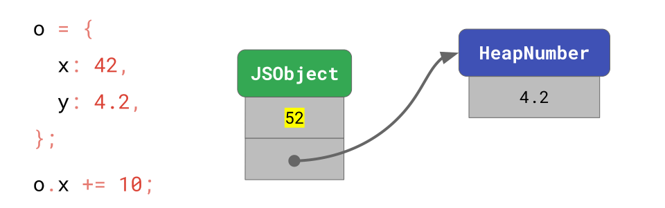
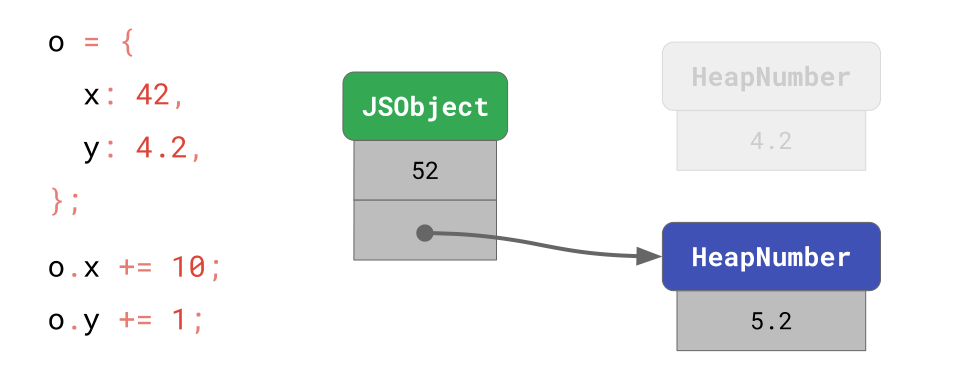
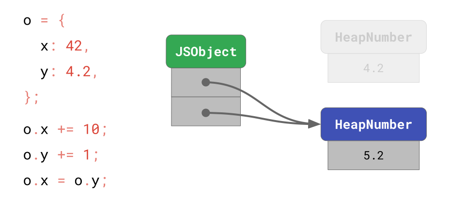
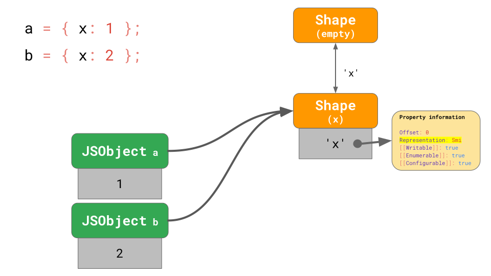
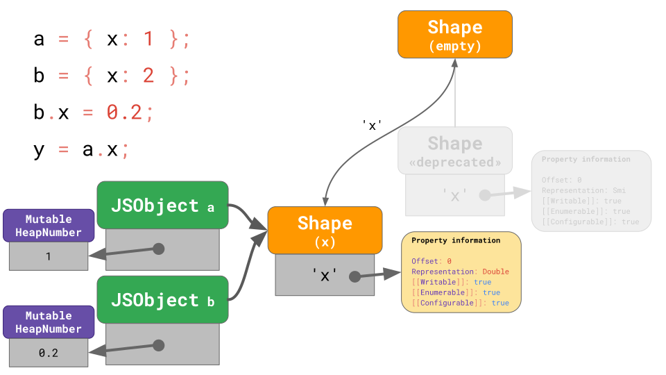
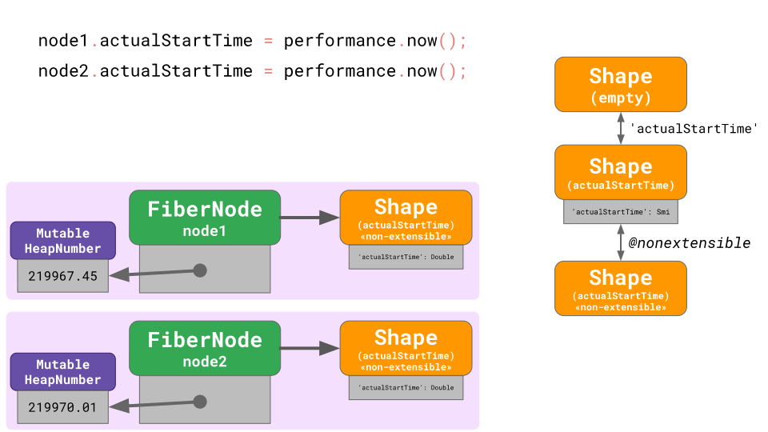
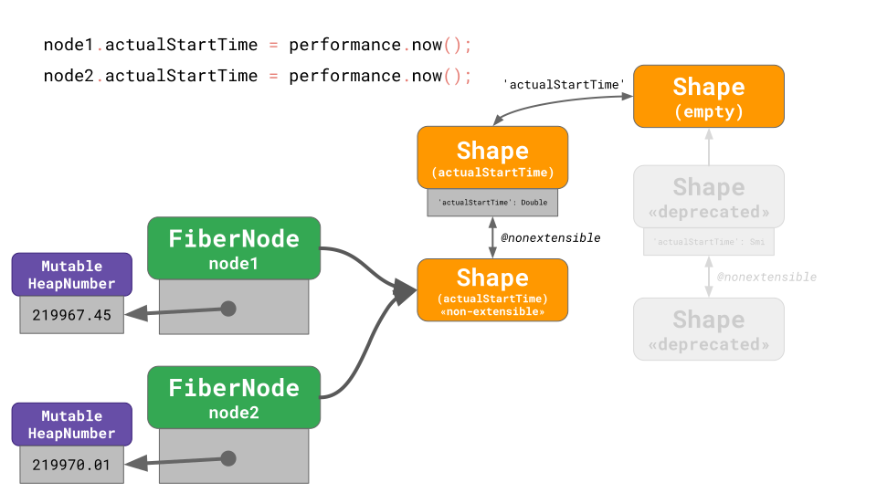

# Smi — Small Integer

`Smi`即`Small Integer`，其指范围在`-2**30 ~ 2**30-1`之内(包括)的**整数**。其在内存中不存在实体(即不会申请内存空间)，并且其互相之间的计算非常高效(这意味着它与其他类型的数值进行计算会变得相对低效)，并且当一个`Smi`类型值变更为其他类型的值时，会产生切换(迁移)的开销。

如果你想避免写代码在运行时带来底层的性能负担，那么在初始化一个值时，最好指定其类型，并在之后不进行类型跨越。浏览器对一个值的初始化在底层会做表现形式的初始化，并针对其启动一些优化，中途更改其类型会带来过渡的开销。即使同一个类型的`Javascript`值，在底层也可能有几个表现形式，在我们有所了解的情况下，要尽量避免它们在这些表现形式间的切换，比如最初我们使用了一个`Smi`，之后将其转化为其他值：

```js
let x = { a: 1 } // Smi
x.a = 0.1 // HeapNumber
```

非`Smi`的数值，我们称之为`HeapNumber`。在上述代码中，我们应该尽量保持其`Smi`到`Smi`、`HeapNumber`到`HeapNumber`的变换。
假如我要使用`HeapNumber`，那么我应该在初始化时将其声明为`HeapNumber`:

```js
let x = { a: 0.1 }
x.a = 0.2
```

此时某些引擎会做优化，在底层中仅仅将其内部值进行替换，而不是在内存中创建一个新的实体。

---

上述就是对`Smi`的小小总结，如果你想深入了解，你可以阅读下面的译文。

## The story of a V8 performance cliff in React(React 在 V8 引擎下性能下降的故事)

[在前面](https://mathiasbynens.be/notes/shapes-ics)，我们讨论了 JavaScript 引擎如何通过使用形状(`Shapes`)和内联缓存(`Inline Caches`)优化对象和数组访问，我们还特别研究了引擎是[如何提升对原型属性访问的速度](https://mathiasbynens.be/notes/prototypes)。这篇文章描述了`V8`是如何为各种`JavaScript`值选择最优的内存表示，以及这对形状机制的影响——所有这些都有助于解释[最近`React`核心中`V8`的性能下降](https://github.com/facebook/react/issues/14365)的原因。

### Javascript Types(Javascript 类型)

每一个`Javascript`值(目前)都是以下八个值中的一个：`Number`、`String`、`Symbol`、`BigInt`、`Boolean`、`Undefined`、`null`与`Object`


除了某个类型的值例外，这些类型在`JavaScript`中可以通过`typeof`操作符观察到：

```js
typeof 42 // → 'number'
typeof 'foo' // → 'string'
typeof Symbol('bar') // → 'symbol'
typeof 42n // → 'bigint'
typeof true // → 'boolean'
typeof undefined // → 'undefined'
typeof null // → 'object' 🤔
typeof { x: 42 } // → 'object'
```

`typeof null`返回了`object`，而不是`null`，即使`Null`本身就是一种类型。要知道为什么，假设所有的`Javascript`类型都分为了两个集合：

-   对象`objects`(即对象类型)
-   原始值`primitives`(即任何非对象值)

因此，`null`表示“该对象没有值”，而`undefined`表示“没有值”。(即两者是包含关系，如下图)


遵循这一思路，Brendan Eich 设计了`JavaScript`。秉承`Java`的精神，他让右侧的所有值(即所有对象和空值)`typeof`返回`object`。这就是为什么 `typeof null === 'object'`，尽管规范中有一个单独的`null`类型。


### Value representation(值的表现形式)

`Javascript`引擎必须能够在内存中表示任意的`Javascript`值。然而，值得注意的是`JavaScript`值的类型与`JavaScript`引擎在内存中表示该值的形式是分开的。

```js
typeof 42 // → 'number'
```

这里有许多方式在内存中去表示一个整数值(比如`42`)

| 表现形式                                                 | bits                                                                            |
| -------------------------------------------------------- | ------------------------------------------------------------------------------- |
| 二进制补码 8 位(`two’s complement 8-bit`)                | 0010 1010                                                                       |
| 二进制补码 32 位(`two’s complement 32-bit`)              | 0000 0000 0000 0000 0000 0000 0010 1010                                         |
| 压缩二进制编码的十进制`packed binary-coded decimal`(BCD) | 0100 0010                                                                       |
| 32 位 IEEE-754 浮点数(`32-bit IEEE-754 floating-point`)  | 0100 0010 0010 1000 0000 0000 0000 0000                                         |
| 64 位 IEEE-754 浮点数(`64-bit IEEE-754 floating-point`)  | 0100 0000 0100 0101 0000 0000 0000 0000 0000 0000 0000 0000 0000 0000 0000 0000 |

`ECMAScript`将数字标准化为`64`位的浮点值(`64-bit floating-point values`)，即我们熟知的双精度浮点类型(`double precision floating-point`)或浮点`64`(`Float64`)。但这并不意味着`Javascript`引擎在任何时候都以浮点`64`的形式存储数字——这样做会非常的低效！引擎可以选择其他的表现形式，只要用户观察到的行为和浮点`64`一样精准即可。

大多数数字在`Javascript`真实场景中的应用，碰巧是[合法的数组索引](https://tc39.es/ecma262/#array-index)，即整数数值范围在 0~2<sup>32</sup>-2 之内的数值。

```js
array[0] // 最小的合法数组索引
array[42]
array[2 ** 32 - 2] // 最大的合法数组索引
```

`Javascript`会为这类数字选择一个在内存中最佳的表现形式来优化这些通过索引访问数组的代码。为了让处理器执行内存访问操作，这些数组索引必须以二进制补码的形式提供。将数组索引表示为浮点`64`会很浪费，因为每次有人访问数组元素时，引擎都必须在浮点`64`和二进制补码之间来回转换。

`32`位二进制补码的表现形式不仅仅对数组操作有用。通常，**处理器执行整数运算比浮点运算快得多**。这也是为什么在下个例子中，第一个循环的速度很轻易的就比第二个循环快两倍。

```js
for (let i = 0; i < 1000; ++i) {
    // fast 🚀
}

for (let i = 0.1; i < 1000.1; ++i) {
    // slow 🐌
}
// 实测，大多数情况下前者快于后者
```

运算操作也是如此，下一段代码中的模运算的快慢性能取决于你是否处理整数。

```js
// Fast 🚀 如果 `value` 和 `divisor` 是整数
// slow 🐌 反之.
const remainder = value % divisor
```

如果两个操作数都表示为整数，`CPU`可以非常高效地计算结果。`V8`对于*除数*是`2`的幂的情况有额外的快速路径(`fast-paths`)。对于表示为浮点数的值，计算要复杂得多，也会花费更多的时间。

因为整数运算的执行速度通常比浮点运算快得多，所以引擎似乎总是可以对所有整数和整数运算的所有结果使用二进制补码。 不幸的是，这将违反`ECMAScript`规范！ `ECMAScript`对浮点`64`进行了标准化，因此**某些整数运算实际上会产生浮点数**。 在这种情况下，`Javascript` 引擎产生正确的结果很重要。

```js
// Float64 has a safe integer range of 53 bits. Beyond that range,
// you must lose precision.
// 浮点64有53位的安全整数范围，超过这个范围其会丢失精度
2 ** 53 === 2 ** 53 + 1 // → true

// Float64 supports negative zeros, so -1 * 0 must be -0, but there’s no way to represent negative zero in two’s complement.
// 浮点64支持负0，所以-1 * 0 为 -0，但是在二进制补码中没有-0
;-1 * 0 === -0 // → true

// Float64 has infinities which can be produced through division by zero.
// 浮点64有Infinity，可以通过除以0得到
1 / 0 === Infinity // → true
;-1 / 0 === -Infinity // → true

// Float64 also has NaNs.
// 浮点64也有NaN
0 / 0 === NaN
```

尽管左侧的值都是整数，但右侧的值都是浮点数。 这就是为什么使用`32`位二进制补码无法正确执行上述操作的原因。`JavaScript`引擎必须特别小心以确保整数运算适当地回退以产生复杂(`fancy`)的`Float64`结果。

对于`31`位有符号整数范围内的小整数，`V8`使用一种称为`Smi`的特殊表示。 任何不是`Smi`的东西都表示为`HeapObject`，它是内存中某个实体的地址。对于数字，我们使用一种特殊的`HeapObject`，即所谓的 `HeapNumber`，来表示不在`Smi`范围内的数字。

```js
;-Infinity // HeapNumber
;-(2 ** 30) - 1 // HeapNumber
;-(2 ** 30) // Smi
;-42 // Smi
;-0 // HeapNumber
0 // Smi
4.2 // HeapNumber
42 // Smi
2 ** 30 - 1 // Smi
2 ** 30 // HeapNumber
Infinity // HeapNumber
NaN // HeapNumber
```

就如上述结果一样，一些`Javascript`数值被表示为`Smi`，其他的被表示为`HeapNumber`。`V8`对于`Smi`有特别的优化，因为小整数在实际的`Javascript`项目中太常用了。`Smi`不需要在内存中分配为专用实体，并且通常可以启用快速整数运算。

这里重要的一点是，即使是具有相同`JavaScript`类型的值要做优化，也可以在底层以完全不同的方式表示。

#### `Smi` vs. `HeapNumber` vs. `MutableHeapNumber`

下面是它的工作原理。假设你有以下一个对象：

```js
const o = {
    x: 42, // Smi
    y: 4.2 // HeapNumber
}
```

`x`的值`42`可以编码为`Smi`，因此它可以存储在对象本身内部。 另一方面，值`4.2`需要一个单独的实体来保存该值，并且该对象指向该实体。


现在让我们运行下面的代码段：

```js
o.x += 10 // → o.x 现在是 52
o.y += 1 // → o.y 现在是 5.2
```

在这个例子中，`x`的值会就地进行替换式更新，因为新值`52`同样也在`Smi`范围内。



而`y = 5.2`不符合`Smi`的要求且不同于之前的值`4.2`，所以`V8`必须分配一个新的`HeapNumber`实体去赋值给`y`



`HeapNumber`是不可变(`mutable`)的，这就支持了某些优化。比如。当我们将`y`的值赋值为`x`:

```js
o.x = o.y // → o.x 现在就是 5.2
```

...我们可以直接将`y`的引用(`HeapNumber`)链接到`x`而不是重新为`x`创建一个同样的实体。



`HeapNumber`不可变的一个缺点就是经常更新`Smi`范围之外的值会变得很慢，比如下面这个例子：

```js
// 创建一个HeapNumber实例
const o = { x: 0.1 }

for (let i = 0; i < 5; ++i) {
    // 创建一个额外HeapNumber实例
    o.x += 1
}
```

第一行代码会创建一个初始值为`0.1`的`HeapNumber`实例。之后循环会将其值变为`1.1`、`2.1`、`3.1`、`4.1`和最终的`5.1`，一共创建`6`个`HeapNumber`实例，其中`5`个会在本次循环后成为垃圾。


为了避免这个问题，`V8`同样提供了一种就地替换更新非`Smi`值的方法作为优化。当一个数字字段持有的值超过了`Smi`的范围，`V8`会在形状(`Shape`)上标记这个字段为一个`Double`，然后分配一个所谓的`MutableHeapNumber`来保存编码为浮点`64`的实际值。


当这个字段值发生变化时，`V8`就不需要去分配一个新的`HeapNumber`，而是直接就地更新这个`MutableHeapNumber`


然而这种方式还是有一个问题。由于`MutableHeapNumber`的值可变，那么它们就不能作为引用被传递。


比如，如果你将`o.x`赋值给其他变量`y`，你肯定不会希望`o.x`的值改变时，`y`的值也改变——这就违反了`Javascript`规范！所以当`o.x`被访问时，在其赋值给`y`之前，其必须被重新包装为常规的`HeapNumber`

对于浮点值，`V8`像上述的一样在幕后进行“包装”处理。但是对于小整数使用`MutableHeapNumber`这种方式就太鸡肋了，使用小整数更高效。

```js
const object = { x: 1 } // → 不会为object包装x

object.x += 1 // → 直接更新object中x的值
```

为了避免这种低效，我们需要做的是将小整数的形状标记为`Smi`，当其更新的值符合`Smi`范围时，就地更新其值即可。


### Shape deprecations and migrations(形状的弃用和迁移)

所以如果一个字段初始化时包含一个`Smi`，但之后的值超过了`Smi`的范围呢？在下面这个例子中，初始化时，下面两个对象的`x`字段都包含了同样的形状(`Shape`)`Smi`：

```js
// → 下面对象都有一个 x字段 形状为Smi
const a = { x: 1 }
const b = { x: 2 }

b.x = 0.2 // → 现在`b.x`的形状为`Double`

y = a.x
```

最开始两个对象都指向同一形状(`Shape`)，即`x`字段表现为`Smi`：



当`b.x`变更为`Double`表现形式时，`V8`会分配一个新的形状用于为`x`提供`Double`的表现形式，并且这个形状会回退指向一个空形状。`V8`同样会分配一个`MutableHeapNumber`为`x`维护这个`0.2`的值。之后，我们将对象`b`指向这个新的形状(即刚刚创建的)并变更当前对象的插槽指向刚刚分配的在位移`0`位置(`offset 0`)的`MutableHeapNumber`。最后，我们将旧的形状标记为已弃用并从过渡树中移除对其的引用。这些过渡都是`x`从空形状到新创建形状中完成的。


我们这时不能完全的将旧的形状移除，因为它仍被对象`a`使用并且遍历内存以找到指向旧形状的所有对象并急切地更新它们的成本太高了。取而代之的是，`V8`对其进行懒处理：对`a`的任何属性访问或赋值首先将其迁移到新形状。 这个思想是最终使已弃用的形状无法访问并让垃圾收集器将其删除。



如果更改表示的字段不是链中的最后一个，则会出现更棘手的情况：

```js
const o = {
    x: 1,
    y: 2,
    z: 3
}

o.y = 0.1
```

在这种情况下，`V8` 需要找到所谓的分裂形状(`split shape`)，其指代引入相关属性之前链中的最后一个形状。 这里我们改变了`y`，所以我们需要找到最后一个没有`y`的形状，在我们的例子中就是仅引入`x`的形状。


从分割形状开始，我们为`y`创建一个新的过渡链，它重播所有以前的过渡，但`y`被标记为`Double`表示形式。 我们对`y`使用这个新的转换链，将旧的子树标记为已弃用。 在最后一步中，我们将实例`o`迁移到新形状，现在使用`MutableHeapNumber`来保存`y`的值。 这样，新对象不会走旧路径，一旦对旧形状的所有引用都消失了，树的已弃用形状部分就会消失。

### Extensibility and integrity-level transitions(可扩展性和完整性级别的过渡)

`Object.preventExtensions()`防止对象添加新的属性。如果你去添加一个新的属性，那么其会抛出一个异常。(非严格模式下，不会抛出异常并默默的失败)

```js
const object = { x: 1 }
Object.preventExtensions(object)
object.y = 2
// TypeError: Cannot add property y;
//            object is not extensible
```

`Object.seal()`也会做`Object.preventExtensions()`同样的事情，但它同时还会标记所有属性无法被配置(`no-configurable`)，这意味着你不能删除或更改它们的可枚举性(`enumerability`)、可配置性(`configurability`)、可写性(`writability`)。

```js
const object = { x: 1 }
Object.seal(object)
object.y = 2
// TypeError: Cannot add property y;
//            object is not extensible
delete object.x
// TypeError: Cannot delete property x
```

`Object.freeze()`也会做`Object.seal()`同样的事情，并且其还会重写其可写性防止现存属性的值发生更改。

```js
const object = { x: 1 }
Object.freeze(object)
object.y = 2
// TypeError: Cannot add property y;
//            object is not extensible
delete object.x
// TypeError: Cannot delete property x
object.x = 3
// TypeError: Cannot assign to read-only property x
```

让我们来考虑一下下面这个具体的案例：这里有两个都仅有一个`x`属性的对象，并且我们将第二个对象的可扩展性关闭。

```js
const a = { x: 1 }
const b = { x: 2 }

Object.preventExtensions(b)
```

它开始就像我们已经知道的那样，从空形状过渡到一个拥有属性`x`(表现形式为`Smi`)的新形状。 当我们将`b`的可扩展性关闭时，我们会执行一个到标记为不可扩展的新形状的特殊过渡。 这种特殊的过渡不会引入任何新属性——它实际上只是一个标记。


注意，此时我们就不能就地替换`x`属性的形状了，因为它正在被一个可拓展的对象`a`使用。

### The React performance issue(React 的性能问题)

现在让我们用我们刚刚所学的知识来例假[最近`React #14365`问题](https://github.com/facebook/react/issues/14365)。当`React`团队分析一个实际的应用时，他们发现了一个奇怪的`V8`性能下降的问题。下面是其报告的一个简化版本：

```js
const o = { x: 1, y: 2 }
Object.preventExtensions(o)
o.y = 0.2
```

最开始我们有一个对象，并有两个字段的形状都是`Smi`表现形式。之后我们阻止这个对象的拓展，然后强制第二个字段的表现形式为`Double`

正如我们之前了解到的，这大致创建了以下配置：


两个属性都被标记为`Smi`表现形式，最后的过渡是将其形状标记为不可扩展。

现在我们需要将`y`变更为`Double`的表现形式，这意味着我们需要去找到分裂形状的起点。在这个例子中，他就是引用`x`的这个形状。但是此时`V8`懵了，因为分裂形状是可拓展的，但是整体形状是标记为不可扩展的。在这种情况下`V8`不知道去进行过渡。所以其干脆放弃了，取而代之的创建了一个单独的形状，它不连接到当前的形状树，也不与其他对象共享。把它想象成一个孤立的形状(`orphaned shape`)：


当这发生在大量对象上的时候就会非常糟，因为它渲染了一个没有什么用的形状系统

在`React`的例子中，是这样的：每一个`FiberNode`节点都有一些字段用于在打开分析时，保存一些时间戳。

```js
class FiberNode {
    constructor() {
        this.actualStartTime = 0
        Object.preventExtensions(this)
    }
}

const node1 = new FiberNode()
const node2 = new FiberNode()
```

这些字段(比如`actualStartTime`)在初始化时被赋予值`0`或`-1`，因此以`Smi`的表现形式开始。但之后，会通过[`performance.now()`](https://w3c.github.io/hr-time/#dom-performance-now)存入浮点类型的时间戳，因为它们超出了`Smi`的范围，导致它们的表现形式转化为`Double`。除此之外，`React`还禁止`FiberNode`节点进行拓展。

最初，上述的情况看起来像这样：


这里有两个实例共享一个形状树，一切都进展顺利。但之后，当你存储一个真实的时间戳时，`V8`在寻找分裂形状时懵了 😳：



`V8`将一个新的孤立的形状赋值给`node1`，之后`node2`也一样，这就导致形成了两个孤立的形状，并且它们之间没有交集。大多数真实的`React`应用可不止`2`个节点，而是成百上千个这样的`FiberNode`节点。你可以想象，`V8`此时的性能可能不会好受。

好消息是，我们在[`V8 v7.4`修复了这个性能下降的问题](https://chromium-review.googlesource.com/c/v8/v8/+/1442640/)，同时我们[正在研究如果让表现形式的转换更廉价来解决剩余的性能下降问题](https://bit.ly/v8-in-place-field-representation-changes)。通过这些处理，`V8`现在能够像现在这样正确的处理：


首先，这两个`FiberNode`节点指向这个标记为不可扩展的形状，此时`actualStartTime`字段标记为`Smi`。当第一次对`node1.actualStartTime`赋值发生时，一个新的过渡链会被创建，之前的会被标记为废弃。


注意可扩展性过渡现在是如何在新链中重新上映的。



在`node2.actualStartTime`赋值后，两个节点都引用了这个新的形状，并且这个在过渡中废弃的形状会被垃圾回收 ♻️ 掉。

> 注意：你可能会觉得形状的废弃和迁移过程很复杂，事实也正是如此。事实上，我们怀疑它在正在的应用场景中产生的问题(在性能、内存使用和复杂性方面)要多于它带来的收益，特别是自从[指针压缩](https://bugs.chromium.org/p/v8/issues/detail?id=7703)后，我们不能再用它在对象中存储内联(`in-line`)双值(`double-valued`)字段。所以[我们打算移除`V8`的形状弃用机制](https://bugs.chromium.org/p/v8/issues/detail?id=9606)。你可能觉得废弃它会变得很有趣。(You could say it’s [\*puts on sunglasses\*](https://www.urbandictionary.com/define.php?term=*Puts%20on%20Sunglasses*) being deprecated. [YEEEAAAHHH…](https://www.urbandictionary.com/define.php?term=*Puts%20on%20Sunglasses*))

`React`团队通过确保所有的`time`和`duration`字段最开始以`Double`的表现形式来初始化来缓解了他们[这个问题](https://github.com/facebook/react/pull/14383):

```js
class FiberNode {
    constructor() {
        // 最开始就让 其表现形式为Double
        this.actualStartTime = Number.NaN
        // 之后你可以初始化你所需的值
        this.actualStartTime = 0
        Object.preventExtensions(this)
    }
}

const node1 = new FiberNode()
const node2 = new FiberNode()
```

除了`Number.NaN`之外，任何不在`Smi`范围内的浮点类型的值都可以使用。包括`0.000001`、`Number.MIN_VALUE`、`-0`和`Infinity`。

值得指出的是，具体的`React Bug`是`V8`特有的。一般来说，开发人员不需要针对特定版本的`Javascript`引擎进行优化。不过，当事情不顺利的时候，有个处理方法还是不错的。

时刻注意`Javascript`引擎在内部进行了一些特殊的处理，如果可以的话，你可以尽量通过不混用不同类型的值来帮助它。比如，不要初始化一个数值类型字段的值为`null`，这样会禁用对这个字段表现形式追踪带来的好处，同时它也有利于你的代码可读性：

```js
// Don’t do this!
class Point {
    x = null
    y = null
}

const p = new Point()
p.x = 0.1
p.y = 402
```

一句话，**写可读性高的代码，性能不会差到哪去(write readable code, and performance will follow!)**！。

### Take-aways(结论)

在这篇深入的文章中，我们已经涵盖了以下内容：

-   `Javascript`区分了原始值和对象，并且`typeof`不一定准确
-   同样的`Javascript`值类型，在底层的表现形式可能不同
-   `V8`在努力的为每个属性找到最优的表现形式
-   我们讨论了`V8`如何处理形状的废弃与迁移，包括扩展的过渡

基于这些知识，我们确定了一些实用的`JavaScript`编码技巧，可以帮助提高性能:

-   始终以相同的方式来初始化对象，这样形状的处理可以变得高效
-   使用合理的初始化值，这样有助于`Javascript`引擎对其表现形式的选择

---

Posted by Benedikt Meurer ([@bmeurer](https://twitter.com/bmeurer)) and Mathias Bynens ([@mathias](https://twitter.com/mathias)).

译文自[The story of a V8 performance cliff in React](https://v8.dev/blog/react-cliff)
